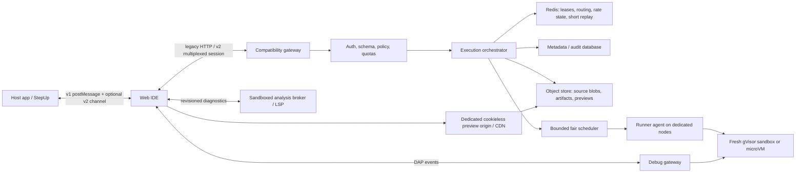

# Browser Coder Architecture Refactor Blueprint

**Status:** Under active implementation on branch `full_refactor`  
**Version:** 2.0 (v1.1 assessment retained verbatim below; verification and execution added)  
**Original assessment date:** 2026-07-29  
**Implementation start:** 2026-07-30  
**Scope:** Frontend workbench, workspace persistence, embedding, analysis, execution, interactive sessions, graphics, debugging, previews, language extensibility, security, operations, migration, and the Step-Up production-consumer contract

> **How to read this document.**
> Sections 1–31 are the original v1.1 assessment, kept **unchanged** so the historical analysis stays auditable.
> Sections 32–34 are the implementation record and supersede sections 1–31 wherever they conflict:
> - **[§32 Verification ledger](#32-verification-ledger)** — every v1.1 claim re-checked against the code, with corrections. Read this before trusting any line number or risk in §1–31.
> - **[§33 Scaled execution plan](#33-scaled-execution-plan)** — what is actually being built, what is deliberately deferred, and why.
> - **[§34 Implementation log](#34-implementation-log)** — append-only, one entry per commit.

## Navigation

- **Baseline and direction:** [1. Executive decision](#1-executive-decision), [2. Requirements](#2-non-negotiable-requirements), [3. Principles](#3-design-principles), [4. Compatibility ledger](#4-current-compatibility-ledger), [5. Current status](#5-current-implementation-status), [6. Risk register](#6-risk-register), [7. Target system](#7-target-system-architecture), [8. Contracts](#8-canonical-contracts)
- **Subsystem designs:** [9. Workspace/save](#9-browser-workspace-and-continuous-save-design), [10. Frontend](#10-frontend-application-architecture), [11. Fast run/connection](#11-fast-run-and-the-persistent-connection), [12. Languages](#12-language-and-version-architecture), [13. Analysis](#13-analysis-problems-navigation-and-code-intelligence), [14. Debug](#14-debug-architecture), [15. Graphics](#15-turtle-and-future-graphics-protocol), [16. Caching](#16-caching-and-reproducibility), [17. Security](#17-security-architecture-and-threat-model), [18. Resilience](#18-resilience-and-failure-semantics)
- **Platform and migration:** [19. Operations](#19-scheduling-capacity-and-operational-architecture), [20. Observability](#20-observability-slos-and-operational-proof), [21. Repository](#21-target-repository-structure), [22. API evolution](#22-compatibility-and-api-evolution), [23. Phases](#23-phased-implementation-plan), [24. Tests](#24-test-strategy-and-release-gates), [25. Rollout](#25-rollout-rollback-and-data-migration)
- **Execution guide:** [26. 30/60/90 backlog](#26-first-306090-day-execution-backlog), [27. Feature matrix](#27-feature-preservation-and-destination-matrix), [28. ADRs/open questions](#28-architecture-decisions-to-record), [29. Definition of done](#29-definition-of-done), [30. Critical path](#30-recommended-critical-path)
- **Production consumer audit:** [31. Step-Up contract and migration](#31-step-up-production-client-contract-and-migration-plan)

---

## 1. Executive decision

Browser Coder should not be rewritten as a different product. Its current public behavior is valuable and is already integrated elsewhere. The right strategy is a compatibility-first strangler refactor:

1. Freeze the existing HTTP, URL-mode, preview, and StepUp contracts in executable tests.
2. Correct the few current paths that can lose data or cross security boundaries without changing their external shape.
3. Establish one revisioned workspace model in the browser.
4. Keep the current API as a façade while moving execution into isolated runner sandboxes.
5. Add a versioned live-session protocol underneath the current buffered and interactive endpoints.
6. Replace language-specific switches and regex intelligence with trusted language adapters, LSP, and DAP.
7. Cache immutable inputs and build artifacts, never ordinary execution observations.
8. Roll out by integration, mode, and language behind feature flags, with a tested rollback at every phase.

The existing project is a strong feature prototype and compatibility surface. It is not yet a hostile multi-tenant execution platform. Its main architectural problem is not the number of features; it is that features which now require durable state, streaming, isolation, and language intelligence are still attached to a request/response execution core and mutable browser globals.

The recommended product shape is:

- a local-first IDE that acknowledges exactly what is saved locally and remotely;
- a compatibility API/control plane with no language runtimes;
- immutable, revision-bound workspace snapshots;
- fresh gVisor sandboxes or microVMs for user workloads;
- a distributed, resumable session channel for terminal, Turtle, analysis, and debug;
- a trusted language plugin SDK backed by exact toolchain images;
- a dedicated untrusted preview origin;
- measurable reliability and security invariants.

No design can literally be “bullet-proof.” This plan makes the boundaries explicit, removes single-point assumptions, bounds every untrusted resource, and defines tests and gates that provide evidence for the claims.

---

## 2. Non-negotiable requirements

### 2.1 Compatibility

The refactor must preserve, until a consumer explicitly migrates:

- all existing public HTTP paths;
- both `/api/run` request shapes;
- current result fields and ordinary compile/runtime result behavior;
- interactive NDJSON event names and stdin/close paths;
- existing preview publication and issued preview URLs;
- current URL parameters and aliases;
- current StepUp message names and directions;
- Step-Up's current iframe launch, synchronous `/api/run`, sandbox, programming-task, viewer, and inline-snippet integration shapes;
- standalone, snippet, project/full, embedded, readonly, locked-structure, no-output, hidden-file, HTML/CSS preview, buffered run, interactive input, and Turtle behavior;
- the six executable language IDs and their current version IDs;
- HTML and CSS editor/preview languages;
- local IndexedDB restoration for standalone workspaces;
- the current ability for the host application to obtain code, files, and run results.

Compatibility means preserving contracts at the façade, not preserving unsafe internals.

### 2.2 Data integrity

- An acknowledged edit must never disappear after reload, crash, rename, move, search/replace, host synchronization, or deployment.
- "Acknowledged locally" means the edit's revision has committed to the IndexedDB journal; text still only queued in memory must remain visibly `Saving...`.
- An older asynchronous completion must never replace a newer document revision.
- Multi-file and structural mutations must be atomic or recoverable.
- No operation may silently overwrite a path collision.
- “Saved locally,” “queued for host sync,” and “acknowledged by host” must be distinct states.
- Execution, analysis, and debug must name the exact workspace revision they used.

### 2.3 Execution semantics

- Every ordinary Run action represents a new execution.
- Random, time, UUID, stdin, filesystem, and other nondeterministic behavior must remain fresh.
- A run must use the editor contents visible at the instant Run was requested, without waiting for a slow database reread.
- Buffered, interactive, Turtle, and debug modes must use one canonical language build/run plan.
- Failure must have an explicit reason; a signal, timeout, output cap, OOM, or lost worker must never be converted to exit success.

### 2.4 Security

- Untrusted code, dependencies, diagnostics tools, debuggers, and previews are all hostile inputs.
- The control plane must not execute user code or contain language runtimes.
- Every workload receives a fresh isolation boundary, identity, filesystem, cgroup, and network policy.
- Default runtime network access is denied.
- Source, stdin, stdout, debug values, secrets, and tokens are not logged by default.
- Frontend policy hides or disables actions for product behavior; authorization is always enforced on the server.

### 2.5 Extensibility

- Adding a language or version must not require new switches throughout the core.
- Capabilities are explicit: syntax, diagnostics, completion, format, build, run, stdin, graphics, debug, and dependencies.
- Exact toolchain availability controls what the catalog advertises.
- New protocol fields are additive and versioned.
- Storage, host integration, analysis, and execution use interfaces so local, StepUp, and future cloud implementations can coexist.

---

## 3. Design principles

1. **Compatibility is a tested boundary.** Legacy APIs become adapters over new internals.
2. **One source of truth per concept.** A document has one authoritative working copy and monotonic revision.
3. **Exact bytes matter.** Never trim or normalize source for identity, saving, compilation, or cache keys.
4. **Immutable snapshots cross process boundaries.** Runners never operate on mutable browser state.
5. **Isolation, not regex, is the security boundary.** Pattern checks may provide policy feedback, not containment.
6. **Capabilities replace language and mode branching.**
7. **Commands replace scattered event handlers.** Buttons, menus, shortcuts, and host messages share the same policy and operation.
8. **Cache work products, not observed executions.**
9. **Bound everything.** Bytes, files, paths, events, processes, time, memory, disk, inodes, queues, reconnect buffers, and history all have explicit limits.
10. **Do not silently fall back to different semantics.** Missing compilers, analyzers, versions, or sandboxes return a clear unavailable result.
11. **Retry only idempotent work.** Never automatically run nondeterministic user code twice after a worker may have started it.
12. **Prefer a modular monolith for trusted control logic, with hard physical security boundaries.** Gateway and orchestrator may initially deploy together; runners must not.
13. **Measure before claiming scale.** Capacity numbers follow reproducible load results, not configuration comments.

---

## 4. Current compatibility ledger

This ledger is the minimum golden-test suite before implementation begins.

### 4.1 URL and mode contracts

| Input | Current meaning to preserve |
|---|---|
| `mode=snippet` or no mode | Focused snippet workbench; currently the default |
| `mode=project` | Alias of the internal full/project workbench |
| `mode=full` | Same current internal behavior as project |
| `embed=1` | Enables host/iframe behavior |
| `readonly=1` | Readonly editor and locked structure by initial policy |
| `nooutput=1` | Current no-output policy and layout |
| `hacklab=1` | Enables current Hack Lab styling/behavior |
| `reportspath=` | Step-Up currently sends `/coder/reports`; Browser Coder does not consume it and opens a hardcoded `/reports/` path that the Step-Up proxy rewrites |
| `lang=` | Initial language ID |
| `version=` | Initial version ID |
| `uilang=` | Initial UI language |

The `project` and `full` alias is implemented in `src/app/config.ts:5-14`. Do not split their behavior accidentally during refactoring.

### 4.2 StepUp v1 messages

Inbound:

- `stepup:init`
- `stepup:set-code`
- `stepup:get-code`
- `stepup:set-files`
- `stepup:get-files`
- `stepup:run`
- `stepup:set-readonly`
- `stepup:show-output`
- `stepup:clear-output`

Outbound:

- `ide:ready`
- `ide:code-change`
- `ide:code-response`
- `ide:files`
- `ide:run-result`

The v1 bridge remains supported. A v2 bridge adds acknowledgement and ordering; it does not rename or remove v1 messages.

Step-Up also sends `stepup:paint-blank-hints` as a fallback when it cannot directly reach the iframe's Monaco DOM. Browser Coder does **not** currently implement that message. This attempted extension must be captured as an unsupported v1 fixture, then implemented additively as a bounded, exact-origin Monaco-decoration command (or a negotiated v2 decorations capability) before Step-Up is moved cross-origin. It must not be mistaken for already-working Browser Coder behavior.

V1 golden fixtures must also freeze these payload and timing semantics:

- `stepup:init` first applies optional `readonly`, `lockStructure`, `allowRun`, `allowSearchReplace`, and `panels`; it loads `files` only outside snippet mode, otherwise accepts `code`, can set `output`, emits `ide:ready`, and schedules `autoRun` after roughly 200 ms only when running is allowed.
- `stepup:set-readonly` is actually a dynamic policy update and accepts the same optional policy fields, not only `readonly`.
- `stepup:get-code` returns current editor text but currently reports the URL language/version; `ide:code-change` does the same after a roughly 300 ms debounce.
- `ide:ready` reports the normalized internal mode, so both incoming `project` and `full` currently report `full`, along with URL language/version.
- `stepup:get-files` returns a synthetic path `"main"` in snippet mode and an async workspace snapshot otherwise; the project snapshot includes persisted hidden support files even though the explorer omits them.
- structural workspace notifications emit `ide:files` after roughly 500 ms when embedded and writable.
- embedded startup sends `ide:ready` immediately and retries near 100 ms and 500 ms; `stepup:init` also produces a ready notification.
- the first `ide:ready` currently can precede workspace initialization. Step-Up initializes a frame only once and gives up after 15 seconds, so this ordering can clear or replace the host payload after it was sent. The v1 adapter may keep duplicate ready visibility for old hosts, but its usable-ready event must be sent only after initialization can accept commands, and host commands must be ordered behind that barrier.
- Step-Up sends `language`, `version`, `mode`, and `entry_point` in `stepup:init`; current Browser Coder behavior is controlled by the URL for the first three and ignores the entry point. Preserve parsing tolerance, but do not perpetuate the ignored semantics in v2.
- `stepup:set-files` currently ignores an empty file array, destructively clears before sequential replacement, does not acknowledge completion, opens the first visible supplied file, and discards per-file `readonly` metadata. These are characterized defects, not target semantics.
- `stepup:show-output` accepts either a single `output` string or `stdout`/`stderr`/`exitCode`, plus current Turtle data.
- `ide:run-result` currently has exactly `stdout`, `stderr`, `exitCode`, and `durationMs`.

The v1 compatibility adapter preserves these observable shapes while serializing asynchronous commands internally. V2 reports the active document's explicit language/version and uses acknowledgements rather than timing retries.

### 4.3 HTTP surface

| Route | Compatibility rule |
|---|---|
| `GET /health` | Keep path and a compatible top-level status; add new live/readiness paths |
| `POST /api/previews` | Keep legacy `html` and current `files` publication shapes |
| `GET /preview/:id` | Preserve already-issued façade URLs; redirect active content to the untrusted origin |
| `GET /preview/:id/*` | Preserve asset lookup, but redirect active documents/assets so they never execute with IDE-origin authority |
| `GET /api/languages` | Preserve current language/version IDs and fields |
| `GET /api/starter/:language/:version` | Preserve `{code}` response |
| `POST /api/run` | Preserve single- and multi-file requests and response fields |
| `POST /api/run/interactive` | Preserve JSON compile result or NDJSON start stream |
| `POST /api/run/interactive/:id/stdin` | Preserve line-input compatibility |
| `POST /api/run/interactive/:id/close` | Preserve stop behavior |
| `GET /api/stats` | Keep route; protect or reduce sensitive detail |
| report read routes | These are operational security-test artifacts, not learner reports. Move them to a separate authenticated admin/operations control plane; keep an end-user path only as a non-sensitive tombstone/redirect during a measured migration if traffic requires it. |
| `POST /api/reports/run-tests` | Remove from the end-user IDE authority. If retained for operations, require administrative authorization, CSRF protection, audit, single-flight/cooldown/job limits, bounded/redacted output, and a separate network/origin boundary. |

`POST /api/run` currently accepts:

```json
{"language":"python","version":"python3","code":"print('hello')"}
```

or:

```json
{
  "language": "python",
  "version": "python3",
  "files": [
    {"path":"main.py","content":"from helper import value\nprint(value)","isMain":true},
    {"path":"helper.py","content":"value = 42"}
  ],
  "entryPoint": "main.py"
}
```

The legacy result remains:

```json
{
  "stdout": "42",
  "stderr": "",
  "exitCode": 0,
  "durationMs": 123,
  "cached": false,
  "turtleData": null,
  "phase": "run"
}
```

Compile and runtime errors currently normally use HTTP 200 with a nonzero `exitCode`; keep that distinction at v1.

Interactive v1 events remain:

- `session`
- `stdout`
- `stderr`
- `waiting`
- `ping`
- `exit`

### 4.4 Product behavior

- Closing a tab does not delete its file.
- `X_HIDDEN_` files/folders stay persisted and are available to execution while remaining absent from ordinary student navigation.
- Hidden files are a presentation convention, not a confidentiality boundary.
- Embedded projects currently open one visible file and collapse folders.
- The active file chooses the legacy project entrypoint/language/version.
- Legacy project execution currently filters the snapshot to the active language.
- Step-Up supplies an explicit `entry_point`, per-file `readonly`, `allowed_extensions`, and a runnable policy, but current Browser Coder does not consistently enforce them. Golden tests must distinguish observed behavior from intended Step-Up configuration; corrections roll out through negotiated capability/policy flags rather than appearing as silent changes.
- Selecting a language opens an unchanged starter or creates another starter instead of rewriting modified code.
- HTML/CSS use shareable preview publication.
- Native buffered/interactive Turtle output is rendered only on successful completion; broken programs suppress partial drawings. Host-supplied `stepup:show-output` currently renders supplied Turtle data regardless of its supplied `exitCode`.
- English and Hebrew UI/keyword help remain.
- File/folder operations, import, ZIP export, search/replace, go-to-definition fallback, run-selection, and callable execution remain available while their internals migrate.

---

## 5. Current implementation status

### 5.1 Repository profile

- `server.mjs`: 4,634 lines combining API, policy patterns, execution, compilation, sessions, previews, reports, health, and static serving.
- `index.html`: 1,543 lines with roughly 1,300 lines of inline presentation/style concerns.
- Frontend: 41 TypeScript files and 9,859 physical lines.
- Ten frontend files, totaling 3,917 lines, use `@ts-nocheck`. They include execution, interactive input, search, explorer operations/tree, layout, workspace initialization, sidebar policy, StepUp, and the run panel.
- `src/features/explorer/tree.ts` and `operations.ts` form a dependency cycle.
- The runtime singleton in `src/app/runtime.ts:8-25` acts as a service locator for editor, storage, tabs, models, language, and workspace notifications.
- Feature modules frequently register listeners during import and depend on bootstrap ordering.
- Language configuration exists in JSON, but server execution remains hardcoded in several switches; `runner` configuration is not the runtime source of truth.

### 5.2 What already works

The refactor must build on, not discard:

- Monaco editing, syntax coloring, themes, completion/diagnostics for JavaScript and TypeScript;
- local IndexedDB workspaces;
- files, folders, nested explorer, drag/drop, import, tabs, rename, delete, ZIP export;
- full-project search/replace with regex/case/word options;
- full/snippet/project/embedded layouts and policy flags;
- six executable languages: JavaScript, TypeScript, Python, Java, PHP, and C#;
- HTML/CSS preview support;
- single- and multi-file run requests;
- interactive stdin through a live NDJSON response plus input requests;
- Python Turtle emulation and canvas rendering;
- compile/lint steps for several languages;
- StepUp code/files/run/output communication;
- immutable preview IDs and atomic preview-directory publication;
- hidden support files;
- keyword help in English and Hebrew;
- heuristic definition/import/callable features that can remain as fallbacks during LSP migration.

### 5.3 Current frontend data flow

There are three mutable copies of a document:

1. IndexedDB `StoredFile`;
2. `Tab.file`;
3. Monaco `ITextModel`.

None is consistently authoritative. Run and search try to compensate by preferring different copies in different paths. This is the root cause of most save and operation races.

Current run flow in `src/features/execution.ts:110-360`:

1. Read the active tab/model.
2. Route HTML/CSS to preview.
3. Inspect active TypeScript Monaco markers.
4. Save the active tab in project mode.
5. Collect persisted files plus live open models.
6. Filter to the active language.
7. Infer whether stdin is needed with language regexes.
8. Choose buffered `/api/run` or interactive NDJSON.
9. Render text or final Turtle data.

The “Run and Debug” panel contains a separate execution path, so run behavior is already drifting by entry point.

### 5.4 Current backend data flow

1. Express parses and manually validates a request.
2. Regex patterns decide whether source appears safe.
3. Source is written under one API-process temp root.
4. The API process launches the installed language runtime as a child.
5. Compile/run output is buffered or forwarded to the start response.
6. Successful ordinary output may be cached for 30 minutes.
7. State exists in process-local Maps.
8. The same container serves APIs, previews, reports, and untrusted execution.

This is a black-box run model with streaming additions, rather than a session platform.

---

## 6. Risk register

### 6.1 P0: address before or alongside extraction

These changes can keep the same external contracts. They are not feature removals.

| Risk | Evidence | Failure |
|---|---|---|
| Turtle path confused deputy | `server.mjs:785-813`, called at `1288-1295`, `1345-1352`, and through interactive `4036-4125` | A Python program can print `__TURTLE_FILE__:<path>`; the API reads/parses the named JSON using its own privileges and attempts to delete it. Turtle files are also unbounded. |
| Turtle marker bypasses output limits | `server.mjs:4036-4095`, initialized at `4283` | Interactive stdout beginning with `__TURTLE_` accumulates in unbounded `pending`/`turtleLines` before the ordinary output budget, allowing memory exhaustion without counting toward `maxOutput`. |
| Stored same-origin preview script | Wrapper at `server.mjs:3103-3125`; direct active assets at `3306-3330`, `3710-3739`; frontend URL at `src/features/live-preview.ts:129-170` | Direct `/preview/:id/index.html` navigation executes user HTML on the IDE/API origin. Script-capable SVG/other active formats require the same treatment. The iframe wrapper is bypassable; `allow-popups-to-escape-sandbox` worsens it. |
| User code shares the API security domain | `server.mjs:2225-2235`, `4265-4271`; runtimes installed in `Dockerfile.production` | A language escape becomes an API/control-plane compromise and can see other processes/mounts/jobs. |
| C# project files can invoke MSBuild commands in the API container | Multi-file validation/writes at `server.mjs:1366-1405`, `2136-2154`, `3804-3860`, interactive `4161-4199`, `2814-2831` | Arbitrary names/content are scanned only as C# source. Auto-imported `Directory.Build.targets`/`.props` XML can use MSBuild tasks such as `Exec`, bypassing C# regex policy and launching commands with API-container authority. |
| Network isolation claim is false | Compose network is named `internal` but lacks `internal: true` | Runtimes can have bridge/NAT egress if language filtering is bypassed. |
| Execution cache changes semantics | `server.mjs:1018-1023`, `1275-1302`, `1317-1359` | Whitespace-distinct programs collide; random/time/UUID results repeat; concurrent Run actions share one execution. |
| Multi-replica interactive routing fails | process-local Maps at `server.mjs:3968-3970`; Nginx `least_conn` | The output stream remains on replica A while stdin/close is preferentially routed to B and returns 410. |
| Autosave can replace newer text | `src/tabs.ts:506-548` | Save A completes after edit B, replaces the tab with A, and marks it clean. |
| Preview/report/control data is reachable from the execution container | shared container/user and writable mounts | A runtime escape can corrupt or read control data. |
| Proxy/CORS enforcement is bypassable | `server.mjs:3435`, `3523-3534`, `3550-3567`; Nginx appends forwarded addresses | A supplied forwarded private IP can bypass limits; disallowed origins are echoed with credentials on non-preflight requests. |
| Public report test trigger amplifies work | `server.mjs:4437-4465` | One anonymous request starts hundreds of internal executions; status is replica-local. |
| Step-Up grants the IDE its authenticated application origin | Step-Up production proxies Browser Coder under `/coder/`; sandbox iframes are not sandboxed, while several task iframes combine `allow-scripts` and `allow-same-origin` | A Browser Coder frontend, preview, dependency, or execution-origin compromise can exercise Step-Up DOM/storage/session authority. A sandbox attribute with both tokens does not isolate same-origin active content. |
| Step-Up exposes operational security tests as learner “Hack Lab” | Both student and instructor sandboxes send `hacklab=1`; Browser Coder opens the security reports UI and exposes anonymous test launch/status/output routes | End users can trigger a resource-heavy operational suite and observe terminal output. This is not a learner compatibility feature and must leave the end-user plane. |
| Step-Up client results can be presented as authoritative | The programming submission path preserves client `last_run`; server execution can be skipped, fail, or omit multi-file projects | A user-controlled result can be displayed as if verified by the service. Store provenance and never promote client observations to authoritative evaluation. |

Node’s documentation explicitly states that its permission model is not a security boundary against malicious code: <https://nodejs.org/api/permissions.html>. Docker requires the network-level `internal` attribute for an externally isolated Compose network: <https://docs.docker.com/compose/how-tos/networking/>.

### 6.2 P1: correctness and resilience

| Finding | Evidence and effect |
|---|---|
| Dirty rename/move can restore stale storage content | `src/tabs.ts:437-455`, `src/features/explorer/operations.ts:568-575` replace the full tab object. |
| Version change can edit the wrong model | `src/features/workspace-init.ts:126-155` awaits, then writes the editor’s current model; the user may have switched tabs. |
| Starter comparison discards meaningful whitespace | `src/tabs.ts:610-627` compares trimmed content. |
| Host project replacement is destructive and non-atomic | `src/tabs.ts:98-165` clears first, then recreates sequentially. |
| Duplicate paths silently collapse | non-unique IDB indexes in `src/storage.ts:85-101`; snapshot `Map` in `src/features/workspace.ts:15-30`. |
| Folder rename/move spans transactions | descendant paths and folder record are written separately in `src/storage.ts:210-275`, `470-514`. |
| Export may miss live edits | ZIP export reads stored records instead of the canonical live snapshot. |
| Search/replace is sequential and resets models | a failure may leave a partial workspace; `model.setValue()` does not create a proper grouped workspace edit. |
| Run policy is not uniformly enforced | CSS hides the button, while shortcuts/panel paths can still invoke execution. |
| StepUp checks origin but not `event.source` | `src/integrations/stepup.ts:130-139`; outbound messages can fall back to `*` at `stepup-bus.ts:34-37`. |
| Step-Up and Browser Coder readiness can lose initialization | Browser Coder emits `ide:ready` before asynchronous workspace initialization; Step-Up sends init only once and marks a frame initialized after a 15-second fallback. The host payload can be accepted and then overwritten, or a late usable ready can be ignored. |
| Step-Up project policy is accepted but not applied | `entry_point`, per-file `readonly`, `allowed_extensions`, `runnable`, and some `stepup:init` fields are ignored or only visually enforced. A project may run the wrong file, allow forbidden edits/extensions, or still run via a shortcut. |
| Step-Up project pull/replace has no correlation | v1 `stepup:get-files` waits on an uncorrelated `ide:files`; the host times out after 1.5 seconds, while replacement has no completion acknowledgement. An unsolicited/stale snapshot can satisfy a request, a timeout can save old bytes, and restore/save races cannot be fenced. |
| Step-Up programming autosave can clear a newer dirty state | Its task editor uses one `saveInFlight` flag and clears `draftDirty` when an older request succeeds. An edit made during an in-flight save may receive no follow-up save. |
| Step-Up sandbox snapshot sync is destructive and unfenced | Its service deletes current lesson rows and global personal rows before reinserting a full client snapshot; saves/restores have no revision, epoch, or idempotency key. Concurrent tabs, lessons, delayed requests, or restore can erase newer and even cross-lesson personal work. |
| Step-Up exit flush is not a durability protocol | Sandbox snapshots are debounced; exit uses an unchecked `sendBeacon` containing the whole workspace. The last editor event may not yet be in the host snapshot, large payloads can exceed practical beacon limits, and failure is unknowable. |
| Step-Up task identity is positional | Multipart responses are matched to mutable task configuration by array index. Reordering or editing task parts can attach code/results to the wrong part. |
| Consumer/service limits drift | Programming tasks allow up to 50 files/10 MiB, sandbox storage can approach 300×256 KiB, while Browser Coder execution caps total code around 750 KiB. Content can save successfully but fail only at run time; import paths can silently drop/truncate data. |
| Step-Up storage contract exceeds/invalidates its representation | Sandbox policy permits 256 KiB files while a MySQL `TEXT` column is much smaller; byte `substr` truncation can split UTF-8. Valid advertised content can corrupt, truncate, or fail after a destructive sync. |
| Per-file policy is round-tripped with untrusted content | Saved response files contain path/content while task readonly/extension intent lives in mutable config and is not rejoined consistently. Reload can unlock support files; a client-supplied `readonly:false` must never alter policy. |
| Embedded instance amplification | Up to 20 task parts plus viewers, solutions, inline snippets, and a hidden runner can instantiate full IDEs; visited frames are not disposed. A future always-on WebSocket/LSP/DAP per iframe would amplify memory/connections for one page and classroom. |
| Model URIs do not represent workspace paths | `src/features/editor-core.ts:14-24`; multi-file resolution and rename are incoherent. |
| TS/JS compiler defaults are global | `src/components/monaco-config.ts:31-61`; mixed versions affect one another. |
| Signal/output limit can become success | Buffered `server.mjs:2242-2264` sends SIGTERM without marking killed, coerces null exit to zero, and does not stop on stderr overflow. Interactive close uses SIGKILL but `server.mjs:4310-4314`, `4366-4370` likewise maps a null signal exit to zero. |
| Only the immediate process is killed | child processes can survive; no cgroup teardown exists. |
| Buffered disconnect does not cancel | server work continues after the client disappears. |
| Java single-file jobs collide | `server.mjs:1995-2030` uses shared `<temp>/<ClassName>.java/.class`. |
| All jobs share one temp root | Node read allowance covers the entire root; cross-job artifacts coexist. |
| Temp cleanup aborts on its first directory | `server.mjs:2847-2858` uses `unlinkSync` for old entries under one outer catch; the always-present `_csharp_template` directory (`1257-1260`) can raise `EISDIR`, aborting the sweep before stale job/session directories are reaped. |
| Path validation is duplicated/incomplete | duplicate names, prefix conflicts, NUL, reserved files, case/Unicode collisions, and generated-output collisions remain. |
| Interactive capacity has a check/reserve race | limits are checked before async preparation and recorded only after spawn. |
| Interactive compilation can outlive the proxy request | `server.mjs:4230-4302` prepares/compiles before registering a session or flushing response headers. Java preparation can consume its full 30-second compiler timeout (`2474-2477`, `2781-2784`) while `nginx/nginx.conf:170-174` also permits only 30 seconds including overhead; multi-file TypeScript transpilation (`2596-2636`) is synchronous without its own wall timer. The client can receive a 504 while preparation continues and no session ID exists to cancel. |
| Health ignores sessions and dependencies | `/health` uses buffered active load only and treats saturation as liveness failure. |
| Shutdown does not drain | `server.mjs:4594-4607` closes HTTP then force-exits without terminating/reconciling jobs. |
| UTF-8/output fidelity is lossy | chunks use independent `.toString()` and buffered output is trimmed. |
| Turtle is final replay, not live | shim emits one atexit payload; drawing appears after exit. |

### 6.3 P1: language/version truthfulness

- The run routes accept `version`, but current execution dispatch does not validate it or use it to select a runtime/compiler plan in either buffered or interactive mode.
- Java 11 and 17 are advertised, but only JDK 17 is installed and no `--release 11` is used.
- C# 10/.NET 6 and C# 12/.NET 8 are advertised, but all projects target `net8.0`.
- JavaScript ES targets all execute on Node 20; the target label is editor metadata, not an exact runtime.
- TypeScript versions execute with fixed ES2022 and `strict:false` in the backend transpiler.
- Python and PHP versions are the current Alpine packages, not pinned language profiles.
- Interactive preparation also drops the field before execution, making the drift especially visible there.
- PHP, C#, TypeScript, and Python options differ across single, multi, buffered, and interactive implementations.
- Multi-file TypeScript emits CommonJS sibling `.js` files, but production jobs live beneath the gateway package whose `package.json` sets `"type":"module"`; Node can interpret the generated `.js` as ESM and fail on emitted `require`/`exports`. Development tests do not reproduce that package boundary.
- Java project launch derives the class by stripping `.java` from the workspace path; nested `src/Main.java` and declared packages do not become the required fully qualified binary name, so compilation can succeed and launch fail.
- Python’s custom preflight flattens scopes and is a heuristic, not equivalent to Pyright/Ruff.
- `transpileModule` is not a semantic TypeScript project typecheck.
- Current security patterns block many legitimate library and language features, so “all libraries” is not a current capability.
- Step-Up emits display values such as `ES2022`, `5 Strict`, `3`, `17`, `8`, and `12`, while Browser Coder expects canonical IDs such as `es2022`, `ts5-strict`, `python3`, `java17`, `php8`, and `csharp12`. Current selection often silently falls back to the first option, and the API accepts but ignores `version`.
- Checked-in Step-Up content also requests Python `3.11` and Java `21`, while the Step-Up authoring UI exposes C# `11`; none has a truthful current Browser Coder profile. These must become real profiles or explicit unavailable results; mapping them dishonestly to a different toolchain is forbidden.

### 6.4 P1: operations and quality

- The only deployment workflow builds and deploys on every main push without typecheck, tests, sandbox tests, scans, staging, canary, or rollback gates.
- Production defaults to mutable `latest`, not the built immutable SHA.
- The external autoscaler cannot operate as shipped: its image lacks expected project files and `bc`, targets the wrong service form, ignores queue settings, and is not enabled in the production deployment.
- `SmartExecutor.autoScale()` only logs; the `ProcessPool` and its circuit breakers are unused.
- `maxQueueSize` is configured but no queue exists.
- capacity is derived from `os.totalmem()` rather than container/cgroup budgets.
- C# warmup can synchronously block startup for 120 seconds while readiness starts much earlier.
- global Nginx `limit_conn 20` per IP conflicts with classroom NAT and advertised interactive caps.
- `PREVIEW_MAX_FILES` is implemented per publication, but production raises it to 50,000 under a 512 KiB byte cap, allowing inode/event-loop amplification. `PREVIEW_MAX_STORAGE_BYTES` and `PREVIEW_PUBLISHES_PER_MINUTE` are configured but not implemented; per-publication and tenant/global quotas must be distinct.
- default Compose asks for two API replicas while previews default under per-container `TMPDIR` with no shared preview volume; publish on replica A/read on B can 404 and restart loses issued URLs. Production Compose's named volume avoids this only on that single shared host and still needs global lifecycle coordination.
- `/api/stats` and report status are public/process-local.
- TLS port 443 is mapped but Nginx only listens on 80 in the checked configuration.
- X-Frame-Options `SAMEORIGIN` conflicts with cross-origin embedding claims.
- origin-specific responses are cached without `Vary: Origin`.
- Step-Up's `/coder/` proxy relies on brittle response-body `sub_filter` rewriting for root-relative assets, APIs, origin allowlists, reports, and link literals; it does not establish the WebSocket upgrade/buffering/timeout contract needed by v2.
- Step-Up uses one `BROWSER_CODER_URL` concept for a public iframe origin and an internal server-to-server runner URL; host-dependent helper behavior can send those flows to different Browser Coder routes/builds, including a raw plain-HTTP IP.
- the Step-Up production deployment path does not consistently select its production Compose override and can treat frontend-build or health failures as warnings, so a partial or incompatible consumer rollout can appear successful.

### 6.5 Test credibility

- Advertised language, stress, feature, and aggregate test entry files are missing.
- Missing suites can print “not yet implemented” and still let the aggregate shell script succeed.
- The standalone `_test_suite.mjs` is not in CI; in this audit it produced 111 passes and 4 failures because TypeScript was not installed. Live integration tests were skipped because no server was running.
- Security corpora are duplicated.
- The committed latest report is stale relative to the current corpus.
- Security runners count any non-2xx, including 500/429/404, as a blocked attack.
- Current attack tests primarily test regex rejection, not containment, egress, mounts, `/proc`, cgroups, process trees, cross-job data, preview origin, or production sandbox escape.
- `docker-compose.test.yml` builds the development Dockerfile, whose non-root `USER app` line is commented out, and lacks production read-only/tmpfs/security/resource/network settings. These tests can execute submissions as root in a different, egress-capable profile, so they neither validate production containment nor provide a safe hostile-code test environment.
- Step-Up tests fake `CodeRunner` and cover sanitizer fragments, but do not exercise the real proxy, postMessage lifecycle, project entrypoints, cross-origin behavior, save/restore concurrency, authoritative-result provenance, WebSocket upgrade, or Browser Coder contract.

---

## 7. Target system architecture



### 7.1 Initial deployable boundaries

Avoid unnecessary microservice sprawl:

1. **Web IDE**
2. **Gateway + orchestrator** as one trusted deployable initially
3. **Runner agent** as a separate process and node security boundary
4. **Analysis workers** isolated from the control plane
5. **Preview service/origin**
6. **Redis, metadata DB, and object storage**

The session gateway can begin inside gateway/orchestrator and split only when connection load or independent scaling requires it.

The hard boundary is non-negotiable: user runtimes, language servers, and debuggers do not execute inside the public API/control-plane container.

### 7.2 Responsibilities

#### Web IDE

- authoritative local working copies;
- commands, keybindings, menus, and capability policy;
- local durability and host-sync outbox;
- Monaco models and real workspace URIs;
- Problems, terminal, graphics, and debug views;
- v1 compatibility adapters and v2 clients;
- offline editing and reconnect.

#### Compatibility gateway

- exact v1 request/response mapping;
- URL/embed launch compatibility;
- typed schema validation;
- authentication and authorization;
- origin and tenant policy;
- idempotency and request IDs;
- rate/size/quota admission;
- v2 session upgrade;
- no toolchains or child execution.

#### Orchestrator

- canonical snapshot registration;
- session state machine;
- fair scheduling;
- language capability resolution;
- worker assignment, leases, and fencing;
- retry policy;
- cancellation and drain;
- terminal result assembly;
- metadata and audit records without source values.

#### Runner agent

- verifies trusted adapter and image digest;
- creates/destroys the isolation boundary;
- materializes a read-only source snapshot;
- applies cgroup, namespace, syscall, filesystem, and network controls;
- starts trusted command arrays without a shell;
- streams bounded events;
- kills the whole cgroup;
- reaps abandoned sandboxes after restart.

#### Analysis broker

- revision-aware LSP/compiler/linter orchestration;
- sandboxed language servers;
- cancellation of obsolete work;
- normalized diagnostics;
- no authority to run arbitrary commands supplied by requests.

#### Preview service

- distinct cookieless origin, preferably a different registrable domain;
- immutable manifest/blob serving;
- no IDE/API cookies or storage;
- CSP sandbox on HTML even for direct navigation;
- tenant/global quotas, TTL, abuse controls, and lifecycle deletion.

---

## 8. Canonical contracts

### 8.1 Workspace content, execution request, and resolved plan

Do not mix user-authored workspace identity with server-authoritative policy/toolchain resolution.

```ts
interface WorkspaceSnapshot {
  snapshotId: string;          // SHA-256/Merkle-derived immutable identity
  workspaceId: string;
  workspaceEpoch: number;
  commitId: string;
  revision: number;
  files: Array<{
    path: string;              // canonical relative POSIX path
    blobHash: string;          // hash of exact bytes
    byteLength: number;
    kind: 'regular';           // symlinks, hardlinks, devices, sockets forbidden
    contentKind: 'text' | 'binary';
    mode: '0644' | '0755';     // normalized allowlist, not arbitrary host bits
    mediaType?: string;
    languageHint?: string;
  }>;
  treeHash: string;
}

interface ExecutionRequest {
  clientCommandId: string;
  workspaceId: string;
  workspaceEpoch: number;
  snapshotId: string;
  entryPoint: string;
  requestedLanguageId: string;
  requestedLanguageVersion: string;
  projectProfileId: string;
  mode: 'run' | 'interactive' | 'debug';
  deterministicProfileId?: string;
}

interface ResolvedExecutionPlan {
  planId: string;
  snapshotId: string;
  entryPoint: string;
  languageId: string;
  languageVersion: string;
  adapterDigest: string;
  toolchainImageDigest: string;
  dependencyLayerHashes: string[];
  policyVersion: string;
  resourceProfile: string;
  commandPlanHash: string;
}
```

The browser creates the immutable content snapshot from exact source bytes. Entrypoint, language, version, and profile are requested separately. The trusted control plane validates them, derives dependency manifests/lockfiles from snapshot files, applies tenant policy, and produces the resolved plan. A client cannot select an image digest, adapter, command, resource limit, or policy version.

Client hashes are deduplication hints, not trusted identity. While streaming each uploaded blob, the service counts bytes and computes the hash, compares claimed length/hash, authorizes every reference to an already stored blob, canonical-sorts encoded path/type/mode/hash records, and recomputes the tree hash and `snapshotId`. Hash mismatch, root mismatch, unauthorized cross-tenant reference, duplicate canonical path, or ambiguous serialization fails before plan resolution. The Merkle serialization format and domain-separation prefixes are versioned test vectors.

Text bytes preserve BOM, EOL, trailing whitespace, and final newline exactly. Editor decoding/encoding is explicit. Binary blobs are supported for approved preview/project assets but are not opened as source text; unsupported import formats fail clearly. Symlinks, hardlinks, devices, sockets, and reserved generated paths are rejected.

Generated JS, class files, `bin/obj`, packages, logs, and graphics never modify the content snapshot. Cache keys for build/analysis combine the content identity with the server-resolved plan identity.

### 8.2 Diagnostic

```ts
interface Diagnostic {
  workspaceId: string;
  workspaceEpoch: number;
  workspaceRevision: number;
  snapshotId: string;
  treeHash: string;
  documentId: string;
  textRevision: number;
  analysisId: string;
  toolDigest: string;
  positionEncoding: 'utf-8' | 'utf-16' | 'utf-32';
  uri: string;
  range: {
    start: { line: number; character: number };
    end: { line: number; character: number };
  };
  severity: 'error' | 'warning' | 'information' | 'hint';
  phase: 'syntax' | 'semantic' | 'type' | 'lint' | 'build' | 'policy';
  code?: string;
  source: string;
  message: string;
  related?: Array<{ uri: string; range: unknown; message: string }>;
  fixes?: Array<{
    title: string;
    editId: string;
    expectedWorkspaceRevision: number;
    expectedDocumentRevisions: Record<string, number>;
  }>;
}
```

Diagnostics for an older workspace epoch/revision are stored for telemetry if needed but never applied to the current model. Project semantic/type/build diagnostics require the exact analyzed tree hash; document-only syntax diagnostics may use the exact document revision. Range conversion is explicit through `positionEncoding`.

### 8.3 Execution session

```text
RECEIVED
  -> VALIDATING
  -> POLICY_CHECK
  -> SNAPSHOT_READY
  -> ADMITTING
  -> QUEUED
  -> LEASED
  -> PROVISIONING
  -> RESOLVING_DEPENDENCIES? 
  -> ANALYZING?
  -> BUILDING?
  -> STARTING
  -> RUNNING
  <-> WAITING_INPUT
  <-> PAUSED_DEBUG
  -> FINALIZING
  -> terminal
```

`?` stages are optional and cache hits may skip them. Each expensive stage starts only after its resource-class capacity/lease is reserved; analysis/build never happens before admission as it does in the current interactive path. A dependency/analysis/build stage may use a separate fenced worker attempt, but its terminal outcome is reconciled into the one session record.

| From -> to | Owner / durable record | Retry boundary |
|---|---|---|
| `RECEIVED -> VALIDATING -> POLICY_CHECK -> SNAPSHOT_READY` | Gateway/orchestrator; durable idempotency lookup, no worker lease | Safe to repeat pure validation; rejection is pre-admission |
| `SNAPSHOT_READY -> ADMITTING -> QUEUED` | Scheduler atomically records quota/queue reservation and `(tenant, clientCommandId) -> sessionId` | `QUEUED` is the accepted-session boundary; ambiguous client response resolves to this session |
| `QUEUED -> LEASED` | Scheduler assigns worker/resource lease plus fencing token | Safe to reassign only before a worker accepts the lease |
| `LEASED -> PROVISIONING` | Runner accepts lease and records attempt/sandbox ID | Retry only if reconciliation proves no tool process began |
| Optional dependency/analysis/build stages | Fenced worker attempt; event ingress records stage result | Retry only when the adapter certifies the plan hermetic/idempotent; package scripts are not assumed safe |
| `BUILDING?/PROVISIONING -> STARTING -> RUNNING` | Runner records process/cgroup start before acknowledging | No automatic retry after process start may have occurred |
| `RUNNING <-> WAITING_INPUT/PAUSED_DEBUG` | Runner/session owner under same fence | Commands resume the same attempt; never create a replacement run |
| `* -> FINALIZING -> terminal` | Authoritative event ingress atomically writes one terminal record and releases/reconciles reservations | Terminal is immutable; late fenced events are rejected |

All other transitions are invalid and audited. Every state entry has a deadline; expiry maps to a typed terminal reason.

Terminal reasons:

```text
exited
signaled
validation_error
version_unavailable
queue_timeout
dependency_error
analysis_error
compile_error
startup_error
policy_denied
cancelled
timeout
idle_timeout
cpu_limit
memory_limit
pid_limit
disk_limit
output_limit
sandbox_error
worker_lost
infrastructure_error
```

Every transition records `sessionId`, workspace epoch/snapshot revision, attempt, worker lease, fencing token, timestamp, and reason. `exited` carries an integer exit code; `signaled` carries signal plus whether it resulted from user cancellation or a resource policy. A worker whose lease is stale cannot publish late events. Exactly one authoritative terminal record is persisted.

### 8.4 Session event envelope

```ts
interface SessionEvent<T> {
  protocolVersion: 2;
  sessionId: string;
  workspaceId: string;
  workspaceEpoch: number;
  snapshotId: string;
  sequence: number;
  attempt: number;
  fencingToken: string;
  timestamp: string;
  workspaceRevision: number;
  type:
    | 'session.started'
    | 'state.changed'
    | 'stdout'
    | 'stderr'
    | 'diagnostics.updated'
    | 'input.available'
    | 'graphics.batch'
    | 'graphics.snapshot'
    | 'debug.event'
    | 'resource.warning'
    | 'session.exited';
  payload: T;
}
```

Sequence is per session. Reconnect requests events after the last acknowledged sequence. A replay gap is explicit; it is never silently ignored.

`type` discriminates a schema; `T` is not arbitrary JSON. Stream payloads are binary-safe:

```ts
interface StreamPayload {
  stream: 'stdout' | 'stderr' | 'pty';
  transport: 'pipes' | 'pty';
  encoding: 'binary-frame' | 'base64-json';
  byteLength: number;
  bytes: Uint8Array | string;
  truncated: boolean;
}

interface SessionExitedPayload {
  reason: TerminationReason;
  exitCode: number | null;
  signal: string | null;
  replayComplete: boolean;
  outputTruncated: boolean;
  durationsMs: {
    queue: number;
    provision: number;
    dependency: number;
    analysis: number;
    build: number;
    run: number;
    total: number;
  };
}
```

The normal WebSocket representation is a bounded binary frame with a length-prefixed schema-versioned metadata header plus raw bytes; JSON/base64 is a compatibility/debug fallback. Frame length is checked before allocation.

The runner/other producers send fenced producer-order records to one authoritative session-event ingress. That ingress validates ownership/schema/budgets, atomically assigns the single global session sequence, persists exactly one terminal record, and then publishes to gateways. This is what makes reconnect-to-any-gateway possible; the browser connection itself is not the durable event owner.

---

## 9. Browser workspace and continuous-save design

The browser must have one authoritative working copy for each document. IndexedDB is the durable repository, Monaco is the editing surface, and tabs are views. None of them may carry competing mutable copies of the same file.

### 9.1 State ownership

```text
WorkspaceStore
  owns nodes, documents, revisions, and workspace epoch
        |
        +--> ModelRegistry projects documents into Monaco models
        +--> PersistenceCoordinator checkpoints revisions to IndexedDB
        +--> HostSyncService sends acknowledged revisions to an embedding host
        +--> SnapshotService freezes exact revisions for run/analyze/debug/export
        +--> Explorer and tabs render IDs and selectors only
```

Tabs store `documentId`, editor group, pin state, and view state. They never store a copied `StoredFile`. Monaco model URIs use workspace paths, for example `browser-coder://<workspace-id>/src/main.ts`.

Monaco model URIs are immutable. A committed rename/move therefore causes `ModelRegistry` to create a replacement model with the new URI, transfer exact text/language/view state, reattach editors, send LSP file-operation plus close/open notifications, and only then dispose the old model. Do not claim an in-place URI mutation. Monaco's private undo-stack internals are not a supported migration mechanism; preserve the structural operation in workspace history and make the text-undo tradeoff an explicit acceptance test.

```ts
interface WorkingCopy {
  documentId: string;
  text: string;
  textRevision: number;
  persistedRevision: number;
  journaledRevision: number;
  hostAcknowledgedRevision: number;
  languageId: string;
  languageVersion: string;
  encoding: 'utf-8';
  eol: 'lf' | 'crlf';
  state: 'clean' | 'dirty' | 'saving' | 'save-error' | 'conflict';
}

interface WorkspaceState {
  workspaceId: string;
  workspaceEpoch: number;
  workspaceRevision: number;
  nodesById: ReadonlyMap<string, WorkspaceNode>;
  documentsById: ReadonlyMap<string, WorkingCopy>;
}
```

`workspaceEpoch` changes when an authoritative workspace is replaced or a storage migration is activated. `workspaceRevision` changes after every accepted content or structural command. `textRevision` is monotonic per document. Async results can update status only when their captured epoch and revision are still current.

### 9.2 Exact autosave algorithm

Autosave is a durability protocol, not a debounce that writes a mutable object:

1. A Monaco edit synchronously updates the corresponding working copy and increments both `textRevision` and `workspaceRevision`.
2. The persistence coordinator immediately queues an exact edit/journal record with its base and resulting revision. It may micro-batch adjacent changes for no more than a measured small window, initially 25-50 ms.
3. `journaledRevision` advances only after the IndexedDB transaction completes. Until then the UI says `Saving...`; this is the precise local durability acknowledgement boundary.
4. A per-document writer schedules a full checkpoint after 300-500 ms of inactivity.
5. A maximum uncheckpointed interval, initially two seconds, forces a checkpoint during continuous typing.
6. The queued checkpoint captures immutable `{documentId, revision, exactText, metadata}`.
7. One read-write transaction performs compare-and-put on `{workspaceEpoch, writerFencingToken, persistedRevision}` and accepts the checkpoint only when it is not older than the stored revision.
8. Only `IDBTransaction.oncomplete` advances `journaledRevision`/`persistedRevision`; request-level `onsuccess` is insufficient. `abort` or `error` rejects the operation. A completion never replaces current in-memory text.
9. If edits occurred while the write was pending, the queue immediately writes the newest revision and may skip superseded checkpoints only after every edit is represented by a committed journal record.
10. A failed journal or checkpoint keeps the document dirty, exposes a persistent error, and retries with bounded exponential backoff.
11. "Saved locally" is shown only when `textRevision <= journaledRevision`; "checkpointed" may be an internal/diagnostic state. Host status is shown separately.

There is one writer queue per document and one serialized workspace-command queue for path/tree changes. This preserves parallel saving of unrelated documents while ordering mutations to the same object.

Explicit flush boundaries are:

- Run, Analyze Now, Debug, preview publication, download, and ZIP export.
- Tab close and workspace switch.
- Rename, move, delete, import, and host workspace replacement.
- `visibilitychange` to hidden and `pagehide`.
- A host `get-code` or `get-files` request.

These are not all blocking barriers. Run is a **snapshot boundary**: it freezes the current in-memory revision immediately and starts/accelerates journal/checkpoint work in parallel; it never waits for a full IndexedDB scan. Export, Ctrl/Cmd+S confirmation, tab/workspace close, destructive replacement, and host responses that promise durable state are **durability barriers**: they await the relevant transaction's `oncomplete` or return an explicit save failure. Thus Run remains responsive without falsely claiming that an uncommitted browser write is durable.

Browser unload APIs are best effort. The recovery journal, frequent checkpoints, and host outbox are the real guarantees; an unload handler is only an additional flush attempt.

### 9.3 IndexedDB schema

Use a new physical database/schema generation (for example, an isolated `BrowserCoderDB-v3-<workspace-id>` selected through a small registry database), rather than destructively upgrading the current `BrowserCoderDB` in place. It contains these stores:

| Store | Purpose |
|---|---|
| `workspaceMetadata` | Active epoch, committed root, schema version, timestamps |
| `nodes` | Stable file/folder IDs, parent IDs, names, tombstones |
| `documents` | Current checkpoint metadata and content/blob reference |
| `documentCheckpoints` | Bounded previous revisions for recovery |
| `editJournal` | Newer operations not yet incorporated into a checkpoint |
| `openEditors` | Tab/editor-group membership only |
| `viewStates` | Monaco cursor, selection, scroll, folding |
| `localHistory` | Reversible structural and bulk operations |
| `hostOutbox` | Ordered host-sync messages awaiting acknowledgement |
| `migrationMetadata` | Source version, checksums, phase, and rollback pointer |

Every file and folder uses `crypto.randomUUID()` as its identity. Paths are derived from parent/name relationships and indexed for lookup. Sibling uniqueness is enforced inside the same transaction as create, rename, or move.

Canonical path rules are shared with the server:

- relative POSIX path semantics;
- normalized Unicode according to one documented policy;
- no empty, `.` or `..` segment;
- no NUL, slash inside a segment, device name, or reserved internal name;
- explicit case sensitivity independent of the client operating system;
- bounded segment bytes, total path bytes, depth, file count, file bytes, and workspace bytes;
- no path that is both a file and a directory prefix.

The UI may propose a collision-free name, but the repository transaction is authoritative. A collision never silently replaces content.

### 9.4 Atomic workspace commands

All mutations use commands:

```ts
type WorkspaceCommand =
  | CreateNode
  | RenameNode
  | MoveNodes
  | DeleteNodes
  | RestoreNodes
  | ApplyWorkspaceEdit
  | ImportArchive
  | ReplaceWorkspace;
```

A command validates policy, paths, current base revision, and quotas before one transaction changes the tree and affected document metadata. It produces an inverse command or recovery checkpoint. Explorer buttons, shortcuts, drag/drop, search/replace, import refactoring, and StepUp all call the same command service.

Before a structural/bulk commit, every affected dirty working-copy revision is journal-durable. The structural transaction records the command, base/result epoch and revisions, exact affected content references, tree changes, and inverse/recovery data before exposing the new state. Delete first creates a tombstone in a bounded recycle bin containing exact content/blob references, not only node metadata.

Search/replace is one `ApplyWorkspaceEdit`, with exact expected document revisions, a preview, one application-level inverse operation, and all-or-nothing persistence. "One undo unit" refers to workspace history; Monaco cannot provide one native undo stack across multiple models. Import rewriting also produces a reviewable `WorkspaceEdit`; it does not directly mutate files through regex callbacks.

`ReplaceWorkspace` is staged:

1. Validate and hash all incoming nodes and bytes.
2. Write them under a new epoch/commit ID.
3. Verify counts and the tree hash.
4. Save the previous root in local history.
5. Atomically switch the active-root pointer.
6. Dispose/remap Monaco models after commit.

A quota error or crash before step 5 leaves the current project intact.

### 9.5 Multiple tabs and storage pressure

Use Web Locks for a single writer lease per local workspace and `BroadcastChannel` for revision notifications. A second browser tab is read-only by default and may explicitly take ownership. Lease takeover writes a recovery checkpoint and uses a fencing token; stale writers cannot commit.

At initialization:

- call `navigator.storage.estimate()` and surface available space;
- request `navigator.storage.persist()` where supported;
- warn before imports that approach configured workspace or quota limits;
- compact acknowledged journal entries and prune old checkpoints by byte budget, never merely by item count;
- keep at least the current and last known-good committed workspace;
- never discard unsynced edits merely to free cache space.

### 9.6 Embedded persistence and host synchronization

Local durability and host durability are separate:

```text
edited -> journaled locally -> checkpointed locally
       -> queued for host -> acknowledged by host
```

StepUp v1 initially keeps its observable timing and messages. Internally, it reads from `WorkspaceStore` and serializes incoming operations so duplicate listeners and overlapping `set-files` calls disappear.

`legacy-ephemeral-host` remains host-authoritative and is explicitly excluded from the local crash-durability SLO because its random database is currently deleted best-effort on unload. Do not silently claim stronger durability while keeping that lifecycle. In `host-synchronized` v2, derive the repository key from authenticated `{hostOrigin, instanceId, workspaceId}`, retain the journal/outbox through crashes, and delete it only after host acknowledgement plus the configured recovery/retention window.

StepUp v2 adds:

- stable host `instanceId` and workspace ID;
- stable task/part ID and task-configuration revision where the workspace belongs to a programming response;
- protocol/capability negotiation;
- request and command IDs;
- base `{workspaceEpoch, commitId, workspaceRevision}` and resulting identity;
- acknowledgements and an ordered local outbox;
- a `clientMutationId`/idempotency key that survives retry and lets the host return the already-committed result;
- maximum payload/file/count limits;
- `event.source === window.parent`, exact origin, and nonce validation;
- optional `MessageChannel` transfer after the handshake;
- explicit conflict response when the host's base revision is stale;
- atomic authoritative replacement, including an empty tree, with a completion acknowledgement and resulting hash/count/revision;
- exact-revision `flush` used before submit/navigation instead of relying on `pagehide`, timing guesses, or an unchecked large beacon.

If unacknowledged local changes meet a host replacement, the client preserves the local commit, stages the host commit, and either performs a base-revision merge or reports a conflict. It never clears first and hopes delivery succeeded.

The Step-Up sandbox is not one undifferentiated tree. Its intended model contains at least:

- a lesson-scoped, restorable material mount;
- an owner-scoped personal mount shared across lessons;
- session/editor metadata such as active document, entry point, language profile, and panel state.

Give each writable mount its own stable ID, revision, fencing token, uniqueness constraint, retention policy, and authorization. Restoring lesson material atomically advances that mount's epoch and fences older saves; it does not delete or rewrite personal files. A full client snapshot may be accepted only through a server transaction/CAS that validates every path and quota before switching roots. Prefer deltas or per-mount commits after v2 adoption, but keep a checked v1 full-snapshot adapter temporarily.

The end-to-end durability chain spans Monaco → Browser Coder journal → bridge outbox → Step-Up request → Step-Up database commit → acknowledgement. A save indicator may claim host durability only for the revision named in the host acknowledgement. If an edit occurs while a request is in flight, the coordinator leaves the newer revision dirty and immediately schedules the next sync; completion of the older request cannot clear it.

### 9.7 Storage migration

Do not upgrade the existing database in place with destructive cursor rewrites:

1. Open the old schema read-only.
2. Copy into a separate v3 physical database under a new inactive commit.
3. Validate file counts, exact-byte hashes, tree structure, tab mapping, hidden-node behavior, and starters.
4. Record migration completion.
5. Atomically switch the active database/commit pointer in the registry.
6. Keep the old database untouched for at least one stable release or an explicit retention window.

Migration is resumable and idempotent. On verification failure, the app opens the old implementation and reports telemetry without deleting anything.

Rollback after users edit v3 cannot simply reopen the untouched pre-migration database, because that would discard post-cutover work. Before activation, ship an N-1-compatible rollback build that can read a signed/checksummed v3 emergency snapshot. The rollback procedure exports the newest committed v3 revision plus every unacknowledged host-outbox record, verifies them, down-converts content/tree/tabs/outbox into a *new* legacy-compatible recovery database, and switches the registry pointer; it never overwrites the original database. Test this forward-aware rollback before canary. Avoid indefinite dual-writing between schemas.

The migration also:

- handles `blocked`/`versionchange` and instructs older browser tabs to close or become read-only before activation;
- persists an idempotent mapping from legacy file/folder IDs to UUIDs;
- remaps parent IDs, active/open editors, view state, expanded folders, ordering, settings, and theme;
- quarantines canonical path/case/Unicode collisions for user recovery instead of merging or overwriting them;
- tests a crash after every numbered step and an edit-after-cutover followed by downgrade;
- makes an old, epoch-unaware client refuse writes once the registry advertises the new epoch.

---

## 10. Frontend application architecture

This does not require changing the visual design or adopting a frontend framework. The important change is explicit ownership and lifecycle.

### 10.1 Composition and dependency direction

`main.ts` becomes a small composition root. It constructs services, starts them in dependency order, and disposes them. Feature modules receive interfaces rather than reading the mutable runtime singleton. Importing a module must not register global DOM listeners.

```text
bootstrap
  -> parse and validate launch config
  -> open/migrate workspace repository
  -> construct workspace + persistence
  -> construct Monaco platform
  -> construct commands and capability policy
  -> construct host, analysis, session, debug, preview services
  -> bind views and keybindings
  -> announce ready
```

Every registration returns a disposable. Tests can create two workbenches sequentially without accumulated listeners.

### 10.2 Modes are profiles, not branches

Define a `WorkbenchProfile`:

```ts
interface WorkbenchProfile {
  layout: 'snippet' | 'project';
  embedded: boolean;
  hackLab: boolean;
  uiLocale: string;
  canEditText: boolean;
  canChangeStructure: boolean;
  canRun: boolean;
  canDebug: boolean;
  canSearch: boolean;
  canReplace: boolean;
  canPublishPreview: boolean;
  canCloseEditors: boolean;
  outputVisibility: 'visible' | 'hidden';
  visiblePanels: ReadonlySet<PanelId>;
  persistence: 'standalone' | 'legacy-ephemeral-host' | 'host-synchronized';
}
```

Legacy query parameters map to an initial profile in one adapter. `project` and `full` continue mapping to the same profile. A separate revisioned `CapabilityPolicyState` applies dynamic host updates such as `stepup:set-readonly` without accidentally rebuilding unrelated layout, search/replace, output, or Hack Lab choices. Profiles and dynamic policy control commands as well as visibility. A hidden button, keyboard shortcut, command palette entry, host message, run panel, and API call therefore cannot disagree.

Frontend policy is product behavior, not authorization. The server separately verifies tenant/user/session capability.

### 10.3 Command-centered UI

Use a command registry for:

- run file/project/selection/callable;
- start debug, stop, interrupt, EOF;
- file/folder create, rename, move, delete, restore;
- save/flush, import/export;
- find, replace, go to definition, format, apply code action;
- preview and Turtle controls.

Each command declares `isVisible`, `isEnabled`, required capabilities, and handler. Menus, buttons, keybindings, StepUp, and accessibility actions execute the same command ID. This removes policy bypasses and duplicate implementations such as the current Run and Debug panel.

Every invocation includes an actor: `user-ui | host-v1 | host-v2 | system`. Readonly/structure restrictions apply to student/user commands, but do not accidentally block an authenticated authoritative host from synchronizing `set-code`/`set-files`. Host authority is still limited by signed launch/server policy; actor is not a client-selectable bypass. Preserve the current rule that closing an editor does not delete its file, and represent editor closing separately from content/structure mutation.

### 10.4 Proposed frontend tree

```text
src/
  app/
    bootstrap.ts
    composition-root.ts
    lifecycle.ts
    legacy-launch-config.ts
  contracts/
    host-v1.ts
    host-v2.ts
    api-v1.ts
    session-v2.ts
  platform/
    commands/
    configuration/
    events/
    logging/
    storage/
  workspace/
    domain/
    store/
    persistence/
    history/
    snapshots/
    migration/
  editor/
    monaco-host/
    models/
    languages/
    view-state/
  analysis/
    problems-store.ts
    language-clients/
    code-actions/
  execution/
    session-service.ts
    legacy-transport.ts
    websocket-transport.ts
    run-coordinator.ts
  terminal/
  graphics/
  debugging/
  preview/
  search/
  explorer/
  embedding/
    legacy-stepup-bridge.ts
    stepup-v2-bridge.ts
  ui/
    workbench/
    panels/
    status/
```

Dependency rule: `ui -> application services -> domain ports`; infrastructure implements ports. `workspace/domain` does not import Monaco, IndexedDB, DOM, transport, or StepUp.

### 10.5 Performance rules

- Keep Monaco models only for open, pinned, analyzed, or recently used files; use a byte-based LRU with pin counts.
- Cache a document hash by exact `textRevision`; compute large hashes and regex searches in workers.
- Virtualize explorer, search results, Problems, terminal output, variables, and large lists.
- Search has cancellation/generation IDs; stale results are discarded.
- Apply edits through Monaco edit operations, preserving undo and selection, rather than `setValue`.
- Do not rebuild every tab DOM node on every keystroke.
- Batch status and preview invalidations per animation frame or short scheduler tick.
- Dispose language clients, models, observers, timers, sockets, and subscriptions on workspace/profile change.
- Measure startup, input latency, model memory, search latency, and long tasks in representative large projects.

### 10.6 TypeScript/JavaScript Monaco migration

Monaco's built-in TypeScript/JavaScript worker defaults are global to the browser worker; they cannot truthfully model multiple exact compiler/version projects by changing settings whenever a tab opens.

During migration:

1. Freeze current global behavior in v1 tests.
2. Stop changing global compiler defaults on ordinary tab activation; scope the legacy defaults to the active legacy workspace profile.
3. Give every model a real workspace URI and synchronize it with one project/version-specific language client.
4. Move authoritative TypeScript/JavaScript project intelligence to isolated project language services/LSP-compatible workers pinned to the selected tool digest.
5. Keep Monaco tokenization and cheap local suggestions, but mark global-worker diagnostics non-authoritative when they cannot match the project version.
6. Test two workspaces/embedded instances and mixed JS/TS files so opening one version cannot rewrite another's diagnostic configuration.

Define one reversible virtual-URI to sandbox-`file:` URI mapper for language servers that reject custom schemes. It canonicalizes paths, never exposes host paths, and is shared by diagnostics, definitions, edits, breakpoints, and source maps.

---

## 11. Fast run and the persistent connection

Keep one authenticated, logical WebSocket open while the active IDE needs server features. Do not keep a mutable user container open merely to make Run feel fast.

### 11.1 Connection responsibilities

The connection multiplexes:

- workspace manifest and missing-blob synchronization;
- incremental analysis document changes;
- execution/session events;
- stdin, EOF, signals, and terminal resize;
- graphics batches and snapshots;
- DAP requests/events;
- capability and policy updates.

It uses short-lived access tokens, heartbeat, token refresh, bounded channels, flow-control windows, and exponential reconnect with jitter. Visibility-aware idle mode may pause nonessential analysis while retaining or cleanly resuming sessions.

Each create command has a stable `clientCommandId`. The durable mapping `(tenantId, clientCommandId) -> sessionId` is retained through terminal-state/idempotency retention; an ambiguous response is resolved by returning/querying the existing session. This provides at-most-once session creation from the client's perspective. It does not imply that an execution can be transparently replayed after any analyzer, compiler, package script, debugger, or runtime may have started.

Control commands such as stop, EOF, and resize have deduplicated command IDs. Stdin is different because identical lines/bytes can be intentionally entered repeatedly: each input stream has monotonically increasing byte/chunk offsets, the server acknowledges the highest contiguous offset, rejects gaps, and applies each accepted range once. A reconnect resends only ranges the resume response proves missing; it never blindly repeats uncertain input.

Events carry sequence numbers and are retained in a bounded per-session ring. Reconnect supplies `lastAcknowledgedSequence`. If the gap expired, the server sends `replay.unavailable` and a state snapshot; the client never pretends output is complete.

The reverse proxy must have an explicit WebSocket location using HTTP/1.1 `Upgrade` and mapped `Connection: upgrade`, response buffering disabled, and read/idle timeout longer than the heartbeat interval but shorter than the declared abandoned-connection policy. The current Nginx configuration clears `Connection`, so v2 is not deployable until this changes. Test upgrade, long idle heartbeat, reconnect, drain, maximum frame/body size, and slow-client backpressure through the real production proxy.

The legacy interactive route also needs an exact Nginx location with the same calculated project body limit as `/api/run`, streaming buffer/compression behavior, and a read timeout safely above a newly bounded preparation deadline. Today it falls under the generic 1 MiB/30-second route while `/api/run` has a 3 MiB special case. Add 413, preparation-timeout, client-disconnect, and 504/no-orphan tests.

### 11.2 Fast Run path

```text
click Run
  -> freeze in-memory WorkspaceSnapshot at revision R
  -> compute/reuse exact content hashes by document revision
  -> send manifest and only missing blobs
  -> validate policy and select language adapter
  -> enqueue in the appropriate fair resource class
  -> claim a pre-pulled clean sandbox slot
  -> attach immutable source and cached dependency/build layers
  -> start process and stream the first event
```

Latency improvements that preserve semantics:

- pre-pull and verify signed toolchain images;
- maintain a bounded pool of clean, resettable sandbox shells, never user interpreter state;
- cache exact source blobs, dependency layers, compiler outputs, and analysis;
- precompute hashes on edit without blocking the UI;
- keep the gateway connection and authentication warm;
- reserve quick interpreted and interactive capacity separately from large builds;
- preload common trusted adapter metadata.

Every sandbox is freshly isolated for the execution. A warm slot is sanitized infrastructure, not another user's process, writable layer, HOME, `/tmp`, network namespace, or environment.

### 11.3 Session ownership and UI race prevention

`RunCoordinator` assigns a local operation ID before network activity. Output is rendered only into the matching run record. A response from an older run cannot clear or replace a newer run.

The client displays:

- snapshot revision and entrypoint;
- queued/provisioning/building/running/waiting/paused state;
- explicit termination reason;
- whether output replay is complete;
- analysis and build duration separately from runtime duration;
- resource warnings and truncation.

Closing the output panel does not implicitly cancel. Stop sends a command and waits for a terminal acknowledgement; it exposes "disconnecting" versus "terminated."

### 11.4 Terminal model

All sessions support input capability; the frontend does not choose a different backend using source regexes. Use a terminal abstraction compatible with xterm-style byte/ANSI behavior:

- line and raw input modes;
- UTF-8 streaming decoder across chunk boundaries;
- EOF, interrupt, terminate, and optional suspend;
- rows/columns resize;
- ordered stdout/stderr/PTY events;
- bounded, virtualized scrollback by bytes and lines;
- copy, search, screen-reader support, and safe link handling;
- reconnect/replay status.

Transport is negotiated separately from input capability:

- `pipes` preserves current v1 stdout/stderr separation, buffering, and non-TTY program behavior;
- `pty` is an opt-in v2 terminal/debug capability and may change color, buffering, prompts, echo, line endings, and signal behavior;
- a compatibility adapter never silently changes a pipe-based legacy run into a PTY.

Legacy rendering remains literal text (ANSI is not interpreted), keeps separate stdout/stderr, line input, current client-side input echo, and current exclusion of echoed input from the aggregated `ide:run-result`. V2 events declare `transport`, stream mapping, ANSI interpretation, and echo mode.

The server closes stdin immediately for a legacy buffered request unless the contract explicitly provides input. An input heuristic may remain only as a legacy UI hint.

---

## 12. Language and version architecture

Language support is a trusted plugin system operated by the service owner. User requests select a declared language/version/capability; they never provide commands, images, compiler flags, or shell fragments.

### 12.1 Adapter manifest

```yaml
schemaVersion: 1
planSchemaVersions: [1]
id: python
displayName: Python
extensions: [py]
aliases: [python3]
adapterDigest: "registry.example/adapters/python@sha256:..."
versions:
  "3.12":
    imageDigest: "registry.example/python@sha256:..."
    analysisImageDigest: "registry.example/python-analysis@sha256:..."
    compatibilityAliases: [python3]
    support:
      status: stable
      deprecatedAfter: null
    capabilities:
      analyze: true
      format: true
      build: false
      run: true
      interactive: true
      debug: true
      graphics: [turtle-v2]
      dependencies: pip-lock
    resourceProfiles:
      run: interpreted-small-v1
      debug: interactive-medium-v1
entrypoint:
  extensions: [py]
```

The adapter implements typed functions such as `validateSnapshot`, `createAnalysisPlan`, `createBuildPlan`, `createRunPlan`, `createDebugPlan`, and `parseDiagnostics`. Plans contain fixed executable paths and argument arrays. They are not shell strings. Gateway-side manifest parsing is declarative only; any parsing of hostile source, project manifests, or tool output occurs in isolated analysis/build workers.

One adapter plan is used by buffered, interactive, and debug transports. Transport affects session lifetime and event delivery, not toolchain, compiler, dependency, or security semantics.

### 12.2 Capability matrix

The initial implementation targets:

| Language | Syntax/type/semantic analysis | Format/lint | Build/run | Debug | Dependency ecosystem |
|---|---|---|---|---|---|
| JavaScript | TypeScript language service or standards-compatible JS LSP | ESLint/Prettier policy | Exact Node image | Node debug adapter | npm lockfile/mirror |
| TypeScript | TypeScript project service and `tsc --noEmit` | ESLint/Prettier | Exact TS + Node image | Node debug adapter with source maps | npm lockfile/mirror |
| Python | Pyright plus parser checks | Ruff/formatter policy | Exact CPython image | `debugpy` adapter | hashed lock via internal PyPI mirror |
| Java | JDT language server and `javac` | configured formatter/linter | exact JDK with `--release` | Java debug adapter | Maven/Gradle lock strategy and mirror |
| PHP | maintained PHP language server/static analyzer plus `php -l` | configured formatter | exact PHP image | Xdebug adapter | Composer lockfile/mirror |
| C# | Roslyn/.NET analyzers | .NET format/analyzers | exact SDK/target framework | approved .NET debug adapter | NuGet lockfile/mirror |
| HTML/CSS | HTML/CSS language services | formatter/lint policy | preview pipeline | browser-devtools debugging later | approved static assets |

Tool selection and licenses require an architecture decision record before implementation. The table specifies responsibilities, not permission to redistribute a particular binary.

### 12.3 Exact versions

Advertise only versions backed by an immutable, tested image digest. The selected version controls:

- runtime and compiler;
- standard library;
- target/release flags;
- analyzer configuration;
- debugger compatibility;
- dependency ABI;
- cache identity.

A public "version" ID is a language profile, not always a runtime number. Its resolved manifest separates:

- `toolchainVersion` and image digest;
- `sourceTarget`/language level;
- `runtimeApiProfile`/standard-library surface;
- compiler/transpiler options and strictness;
- debugger/analyzer compatibility.

For example, JavaScript `es5`/`es2015`/`es2020`/`es2022` are source/API targets, while current TypeScript IDs mix compiler major, emit target, and strictness. Either enforce each profile with parser/compiler/library gates, or explicitly mark the old ID as a legacy alias retaining its documented current Node 20 behavior. Merely printing `node --version` or pinning one TypeScript image is insufficient. Conformance includes accepted/rejected syntax and standard-library feature fixtures for every profile.

A missing version is `version_unavailable`; it never silently runs on the host default. The current version IDs remain available through compatibility mappings until consumers migrate, even if their old behavior maps to a documented legacy toolchain profile.

The gateway validates requested language/version against the signed active catalog before admission. Unknown ID, deprecated-but-still-supported, temporarily unavailable image, and tenant-disallowed version are distinct stable results. V1 maps them into its compatible error envelope; no current path may accept then ignore the `version` field.

Step-Up has a separate display/storage namespace. Freeze this compatibility map before changing either repository:

| Step-Up value | Browser Coder compatibility resolution |
|---|---|
| JavaScript `ES2022`, `ES2020`, `ES2015`, `ES5` | `es2022`, `es2020`, `es2015`, `es5` |
| TypeScript `5 Strict`, `5`, `ES2020`, `ES2015` | `ts5-strict`, `ts5`, `ts-es2020`, `ts-es2015` |
| Python `3` | `python3` |
| Java `17`, `11` | `java17`, `java11` |
| PHP `8` | `php8` |
| C# `12` | `csharp12` |
| Python `3.11`, Java `21`, C# `11` | No truthful current match; provision exact profiles or report unavailable with migration guidance |

Matching is case- and whitespace-normalized only through this explicit table; it is never “select the first version.” Persist and emit `requestedVersion`, `resolvedProfileId`, `resolutionKind` (`exact`, `legacy_alias`, `deprecated`, `unavailable`), and catalog digest. First deploy resolution telemetry and make Step-Up's authoring/import validators catalog-aware; then migrate stored content and enforce unavailable errors when the Step-Up UI can explain them. During the transition, any deliberately retained legacy-default behavior is a named, tenant-scoped mapping with an owner and expiry—not a hidden dropdown fallback—and may not be used as authoritative version evidence.

### 12.4 Language detection

Detection is advisory and never overrides an explicit user choice. Score signals in order:

1. exact extension and project manifest;
2. shebang or declared workspace language;
3. parser success and language-service confidence;
4. content heuristics only as a final suggestion.

The UI explains the suggestion and allows a persistent per-file override. Ambiguous code remains in the selected/plain-text mode; it is not sent to multiple expensive compilers automatically.

### 12.5 Multi-language workspaces

Replace "only files matching the active language" internally with an explicit project profile and build graph:

- a legacy profile exactly reproduces the current active-language filter;
- a language project profile selects files using its manifest/adapter;
- a web profile combines HTML, CSS, JavaScript, TypeScript, and assets;
- future polyglot profiles define trusted build DAG nodes and artifact edges.

The entrypoint and profile are carried by the execution request and bound to the immutable snapshot by the resolved plan. An adapter may read only declared snapshot inputs and write to a separate build directory. Generated output can never overwrite source blobs.

Entrypoint resolution is language-aware and occurs in the isolated adapter stage. For Java projects, require/resolve an explicit main class and validate its fully qualified binary name against declared packages and compiled output; never launch by merely stripping `.java` from a path. Conformance covers nested source roots, packages, duplicate main classes, and missing/ambiguous entrypoints.

Every generated build directory has an adapter-owned module/project boundary independent of the gateway repository. For TypeScript, either emit a coherent ESM graph or place an explicit trusted CommonJS package boundary around CommonJS output; never inherit a parent `/app/package.json` module type. Test inside the exact production image/layout.

### 12.6 Dependencies and "all libraries"

Literal unrestricted support for every library conflicts with reproducibility and security. The best-practice contract is broad ecosystem support through controlled capability profiles:

- lockfile required for remote packages;
- internal npm, PyPI, Maven, Composer, and NuGet mirrors;
- resolver/build sandbox egress only to the appropriate mirror;
- runtime egress denied by default;
- integrity/hash verification and immutable content-addressed layers;
- package, file, expanded-byte, install-time, and native-build limits;
- install scripts disabled by default and enabled only for vetted packages/profiles;
- SBOM, malware screening, vulnerability and license policy;
- explicit profiles for native extensions, subprocesses, filesystem access, graphics, or network;
- dependency cache scoped by ecosystem, exact lock hash, architecture, toolchain digest, and policy version.

An educational network-enabled exercise is a separately authorized capability with destination allowlists, DNS and byte/time quotas, anti-SSRF controls, and auditable policy. It is never the default runtime.

### 12.7 Plugin onboarding

A new language is accepted only after:

- manifest/schema validation and signed image verification;
- license and supply-chain review;
- single-file and project fixtures;
- compile, syntax, runtime, stdin, cancellation, timeout, output, Unicode, and path tests;
- cross-job read/write, egress, process, fork-bomb, and resource-containment tests;
- diagnostics range/encoding conformance;
- debug conformance when advertised;
- load baseline and resource-profile approval.

Core gateway/orchestrator switches must not change. Catalog generation, UI capability exposure, and compatibility output come from the manifest registry.

---

## 13. Analysis, Problems, navigation, and code intelligence

Syntax coloring is a local editor concern; trustworthy diagnostics and project intelligence are revisioned language-service concerns. They should complement each other.

### 13.1 Two-tier analysis

Tier 1 runs in the browser for instant feedback:

- Monaco tokenization and bracket/indent behavior;
- cheap parser/syntax checks where a maintained browser implementation exists;
- formatting-on-type and lexical completion;
- local path and manifest validation.

Tier 2 runs in isolated analysis workers:

- syntax, semantic, type, lint, and build diagnostics;
- project-aware completion, hover, definitions, references, symbols, rename, formatting, and code actions;
- import/module resolution against the exact workspace and dependency lock;
- incremental document synchronization over the persistent connection.

The protocol should use or closely wrap the [Language Server Protocol](https://microsoft.github.io/language-server-protocol/) instead of inventing different shapes for each language. LSP workers are still untrusted workload processors: malicious source and dependencies can exploit parsers, so they receive their own resource, filesystem, and network isolation and are not embedded in the gateway.

### 13.2 Revision correctness

Each document open/change notification carries document version and workspace revision. A diagnostic batch names:

- workspace ID and epoch;
- workspace revision/tree hash;
- document URI and text revision;
- language/version/tool digest;
- analysis phase and analysis ID.

`ProblemsStore` accepts a batch only if it matches the current epoch and document revision. Results from revision R may be cached, but they cannot place markers on revision R+1.

The service debounces semantic analysis while preserving cancellation:

- syntax diagnostics: target 100-300 ms after an edit;
- project semantic diagnostics: target under two seconds for the defined reference workspace;
- full lint/build: explicit command or idle budget;
- newer changes cancel or supersede queued older work.

### 13.3 Problems model

The Problems panel groups by file, severity, source, and phase. Each item has a stable diagnostic ID, exact UTF-16/UTF-8 range conversion, code, source, message, related locations, and zero or more version-bound fixes.

The status bar derives its error/warning count from `ProblemsStore`; it is not hardcoded. Selecting a problem opens the correct model/URI and range. Applying a fix is a validated `WorkspaceEdit` with expected document revisions.

Run policy is explicit:

- parser or compiler errors required by the selected adapter can block Run;
- lint warnings do not block by default;
- a user may choose "run despite stale/nonblocking diagnostics";
- the run request always performs authoritative snapshot validation/build, so client markers are never trusted as the only gate;
- a build diagnostic belongs to the run record and can also be published into Problems for the matching revision.

### 13.4 Navigation, search, and formatting

- Use LSP definition/reference/rename for supported languages.
- Keep the existing heuristic navigator behind a `legacyHeuristics` capability for unsupported files; do not register it ahead of a real language provider.
- Preserve keyword help and localization as a separate documentation provider.
- File/text search uses a worker or server index for large workspaces, cancellation tokens, full paths, and bounded regex execution.
- V1 regex search keeps JavaScript `RegExp` syntax, including currently supported constructs, but executes in a cancellable worker with a hard time/byte budget so catastrophic expressions cannot freeze the UI. A safer restricted engine such as RE2 changes lookaround/backreference semantics and may be offered only as an explicit v2 mode; never switch engines silently.
- Replace-all previews edits and commits one atomic `WorkspaceEdit`.
- Formatting identifies its tool/version and preserves a single undo boundary.
- Indentation and EOL settings are per document/workspace and are never inferred by trimming source.

Golden search fixtures cover captures and replacement tokens (`$1`, `$&`, `$$`), lookaround, backreferences, zero-length matches, Unicode, CRLF/LF, case/whole-word options, cancellation, and application-level undo.

---

## 14. Debug architecture

Use the [Debug Adapter Protocol](https://microsoft.github.io/debug-adapter-protocol/) between the frontend debug service and trusted language debug adapters. The gateway authenticates and multiplexes DAP messages; the adapter and debuggee execute inside the same isolated job boundary or a tightly defined paired boundary.

### 14.1 Initial user experience

Support, by language capability:

- source, function, conditional, hit-count, and log breakpoints;
- continue, pause, step over, step into, step out, restart where safe, and stop;
- threads, call stack, scopes, variables, watch expressions, hover evaluation;
- exception/break-on-error configuration;
- debug console;
- source maps and generated-to-source path mapping;
- persisted breakpoints keyed by stable document ID plus line remapping.

Unavailable features are hidden or marked unsupported from negotiated capabilities; they are not emulated with source rewriting.

### 14.2 Security controls

Debugging grants deeper observation and evaluation, so it has stricter limits:

- only the owning authenticated user/host instance can issue commands;
- no debugger port is exposed publicly or to neighboring jobs;
- DAP paths are mapped through canonical snapshot URIs, never arbitrary host paths;
- variable trees have depth, child-count, string-byte, and total-response limits;
- evaluate requests have time, memory, output, and side-effect policy;
- expressions are logged only as metadata/hash by default, never values or source;
- pause duration and total debug session lifetime are bounded;
- disconnect policy explicitly chooses terminate or keep-running; default is terminate;
- all commands carry sequence and session fencing token;
- restart creates a clean sandbox and the same immutable snapshot unless the user explicitly captures a new revision.

### 14.3 Delivery order

Start with one compiled and one interpreted language after the execution-session foundation is stable. A sensible pilot is Python plus JavaScript/TypeScript, but select based on actual product usage. Each additional language passes the same breakpoint, stepping, variable, exception, termination, reconnect, and containment suite.

Debugging does not ship as a second direct `/api/run` path. The existing "Run and Debug" panel is rewired to `ExecutionSessionService` and `DebugService`.

---

## 15. Turtle and future graphics protocol

Graphics must be a typed side channel. User stdout must never name a host path or instruct trusted code to read/delete a file.

### 15.1 Immediate safe compatibility implementation

Before the full protocol:

- allocate one service-chosen graphics output target inside the unique job directory;
- pass its already-open file descriptor or exact relative name to the trusted Turtle shim;
- never parse a user-supplied path from stdout;
- open without following symlinks and verify ownership/type;
- cap bytes before reading and parse incrementally;
- count marker/control bytes against a dedicated hard cap before appending to `pending`/`turtleLines`; an unterminated or oversized marker cannot bypass the ordinary output budget or grow process memory;
- validate schema, operation count, coordinate ranges, string lengths, colors, and polygon points;
- delete the entire unique job directory through the sandbox lifecycle, not a stdout-selected path;
- remove the marker line only when emitted by the trusted shim on the dedicated control descriptor.

This preserves current success-only replay behavior while closing the present confused-deputy path.

### 15.2 V2 live channel

The runner exposes a dedicated inherited file descriptor or local socket to the trusted graphics shim. It carries length-prefixed, versioned messages:

```ts
interface GraphicsBatch {
  protocolVersion: 2;
  sessionId: string;
  sequence: number;
  sceneRevision: number;
  operations: GraphicsOperation[];
}
```

Initial operations include clear, viewport, pen move/line, polyline/polygon, circle/arc, fill, text, sprite/cursor state, and frame/flush. Binary or complex assets use separately validated content hashes, not embedded unlimited data.

The runner validates and forwards bounded batches. The client applies them to a deterministic scene reducer and paints at most once per animation frame. Rendering may move to `OffscreenCanvas` when available, but the reducer remains testable without a browser.

Backpressure policy is explicit:

- coalesce cursor-only moves where semantically safe;
- never reorder drawing operations;
- cap operations/bytes per batch and per session;
- emit `resource.warning` before the hard cap;
- terminate graphics output, not necessarily the program, according to exercise policy;
- retain periodic bounded scene snapshots for reconnect;
- virtualize or compact old operations once represented in a snapshot.

### 15.3 Compatibility policies

Declare graphics completion behavior in the run profile:

- `successOnlyReplay`: current behavior; suppress drawing when execution fails.
- `liveDiscardOnError`: display live, then clear/mark invalid on failure.
- `livePreserveOnError`: keep partial drawing and show the error.

Native buffered/interactive legacy Turtle uses `successOnlyReplay` until a consumer opts into a live policy. Host-authoritative v1 `stepup:show-output` is a separate compatibility rule: it currently renders supplied Turtle data even when the supplied `exitCode` is nonzero, and its adapter must preserve that behavior.

`GraphicsSnapshot` and the legacy translator cover the full current presentation state: background, width/height, tracer, speed, custom polygons/shapes, cursor appearance/visibility, stamps, clear/reset/bookkeeping operations, and cursor-only scenes. Fixtures cover those cases plus failed host-supplied output. Do not reduce legacy `TurtleData` to only line/polygon operations.

The protocol is generic enough for charts, canvas exercises, robot simulators, or other structured visual output; Python Turtle is one adapter.

---

## 16. Caching and reproducibility

The current normalized-source output cache must be removed from ordinary execution. Whitespace is program text in Python and can be meaningful elsewhere; random, time, process state, environment, input, and filesystem observations are not cacheable merely because source bytes match.

### 16.1 Cache policy

| Object | Default | Required key/scope |
|---|---|---|
| Language catalog/starters | Cache | catalog/tool version and locale |
| Exact source blobs | Cache | SHA-256 of exact bytes; tenant authorization on references |
| Workspace Merkle manifest | Cache | exact ordered paths, modes, and blob hashes |
| Toolchain image | Cache | signed immutable digest and architecture |
| Dependency layer | Cache | lock hash, toolchain, architecture, policy |
| Compiler artifact | Cache only for certified hermetic plans | exact snapshot inputs, flags, image, dependencies, architecture, policy |
| Diagnostics | Cache | exact snapshot/document revision, analyzer digest/config |
| Preview blobs | Cache | exact bytes with metadata authorization and lifecycle |
| Ordinary run stdout/stderr/result | Do not cache | each Run is fresh |
| Concurrent execution request | Do not single-flight | duplicate clicks can intentionally produce different results |
| Explicit deterministic exercise | Opt-in only | frozen seed/time/input/env/filesystem/network plus full build key |

Cache keys include schema and policy versions so a security/configuration change invalidates prior artifacts. Store sizes and evict by bytes, object count, age, cost, and tenant quota. Validate artifact hashes before use.

### 16.2 Safe single-flight

Single-flight is allowed only for certified idempotent/hermetic work:

- fetching/verifying the same toolchain;
- resolving the same immutable dependency lock;
- compiling the same exact snapshot with the same certified plan;
- analyzing the same revision with a certified isolated tool plan.

It is not allowed across execution start. If two users request Run, they may share an immutable compiler artifact but receive two fresh runtime sandboxes.

Exact keys alone do not make a compiler, analyzer, or package script deterministic. If hermeticity is not established, perform that phase fresh for each Run. A sandbox mounts only explicitly authorized cache objects by verified digest, never an enumerable cross-tenant cache directory. Treat cached artifacts as untrusted runner input, verify provenance/hash, and design authorization/error timing so a caller cannot use hash-existence probes as a cross-tenant oracle.

### 16.3 Reproducible builds

Record with every artifact:

- adapter and image digests;
- exact source tree hash;
- dependency lock and layer hashes;
- command argument arrays and relevant environment allowlist;
- architecture and sandbox policy;
- compiler exit reason and diagnostics;
- provenance/signature.

Do not include secrets or arbitrary host environment. Cache hits produce metrics and trace links, but compatibility responses retain current fields unless v2 is negotiated.

---

## 17. Security architecture and threat model

### 17.1 Protected assets

- tenant/user identity and authorization;
- source code, hidden files, stdin, output, debug values, and dependencies;
- host application origin and message channel;
- API/control-plane availability and secrets;
- other users' jobs, previews, snapshots, and caches;
- runner nodes, cloud metadata, internal services, mirrors, and object storage;
- integrity of diagnostics, results, reports, and audit events.

### 17.2 Adversaries

Assume malicious anonymous and authenticated users can submit:

- arbitrary source and project trees;
- fork bombs, infinite loops, huge output, decompression/path attacks;
- runtime and compiler exploits;
- malicious packages and parser/LSP/debugger inputs;
- crafted preview HTML/JS;
- forged StepUp messages and origins;
- timing/race requests across replicas;
- data intended to poison logs, metrics, caches, or another user's artifacts.

The browser itself may crash or run in multiple tabs; hosts may send stale or duplicate commands; workers and networks may fail at any point.

### 17.3 Authentication and authorization

Introduce a signed, short-lived launch token for embedded and standalone integrations. Claims include tenant, user/anonymous session, host instance, allowed origins, workspace, mode capabilities, language/version allowlist, resource class, and expiry.

The gateway verifies signature, issuer, audience, time, nonce/session binding, and server-side tenant policy. It authorizes every run, stdin, close, replay, debug, preview, snapshot, and host action by owner and tenant. Object IDs are high entropy but never serve as authorization.

During migration, unauthenticated legacy access may remain only in an explicitly low-trust profile with strict quotas and no sensitive retained data. CORS and UI policy are not authentication.

### 17.4 Runner isolation

Node's permission mechanism can reduce accidental access but explicitly is not a security guarantee against malicious code, so it is not the sandbox boundary ([Node.js Permissions documentation](https://nodejs.org/api/permissions.html)).

Use defense in depth:

- runners on dedicated nodes/accounts, separate from gateways, databases, and secrets;
- a fresh [gVisor](https://gvisor.dev/docs/architecture_guide/intro/) sandbox by default or a [Firecracker microVM](https://firecracker-microvm.github.io/) for the highest-isolation profile;
- non-root user and user/PID/mount/network/IPC/UTS namespaces;
- read-only immutable root and source snapshot;
- unique bounded writable build, HOME, and tmpfs;
- no host mounts, Docker socket, service-account token, SSH agent, cloud credentials, or metadata route;
- cgroup v2 CPU, memory, PID, I/O, and wall-time enforcement;
- file-size, descriptor, process, stack, core, and address-space limits where applicable;
- restrictive seccomp plus AppArmor/SELinux profile;
- default-deny egress and ingress;
- kill the entire cgroup on completion, cancellation, disconnect policy, or limit;
- agent restart reaper for every unknown/stale sandbox;
- signed images, minimal packages, SBOM, scanning, patch SLA, and digest allowlist.

Docker Compose's `internal: true` creates an externally isolated network, whereas merely naming a network "internal" does not ([Docker networking documentation](https://docs.docker.com/compose/how-tos/networking/)). Production should additionally enforce host/cloud firewall and workload policy; a Compose flag is not the whole boundary.

### 17.5 Process and resource correctness

Track compile, analysis, preparation, runtime, debug, and interactive work in one admission system. Atomically reserve the declared resource profile before expensive preparation. Limits cover:

- request body, decoded JSON, file count, per-file bytes, total snapshot bytes;
- path length/depth and archive expanded bytes/inodes;
- queue length, per-tenant queued/concurrent jobs, and admission deadline;
- CPU, wall, idle, memory, PID/thread, disk/tmpfs, inode, file, descriptor limits;
- stdout, stderr, combined event count/bytes, terminal replay, graphics, diagnostics, debug values;
- session count and lifetime.

A signal exit remains a signal termination. `null` exit code is never coerced to zero. Output-limit termination is unsuccessful and names the limit. Stream decoding preserves UTF-8 across chunks. All descendants die with the cgroup.

### 17.6 Preview isolation

User HTML/JavaScript, script-capable SVG, XML transforms, and any other browser-active format are hostile content, not normal IDE assets:

- serve it from a distinct registrable, cookieless origin with no IDE localStorage/IndexedDB or control-plane credentials;
- treat the opaque preview ID as lookup only, not authorization; private previews require a separate short-lived signed bearer grant bound to tenant/preview/audience, while intentionally public previews are explicitly marked public;
- set CSP with a `sandbox` directive on every direct active-document response, not only on an iframe wrapper;
- prohibit top navigation, opener access, downloads, popups escaping sandbox, and network by default;
- prevent service-worker registration/persistent origin authority through opaque sandbox origin, restrictive worker policy, and preferably per-preview host isolation where active same-origin behavior is ever allowed;
- allow an explicit preview capability profile to relax only necessary directives;
- apply MIME, `nosniff`, referrer, COOP/COEP/CORP, cache, and download headers intentionally;
- sanitize filenames and prevent manifest/reserved-name collision;
- limit publication rate, file count, total bytes, expanded archive bytes, and tenant/global storage;
- store immutable blobs in object storage and metadata separately;
- classify by safely determined MIME/content, then sandbox, force download, sanitize, or reject unsupported active formats; never trust the submitted extension alone.

Keep `/preview/:id` as a compatibility URL that performs an HTTP redirect to the untrusted origin for active content. Never reverse-proxy active preview documents through the IDE origin, because the browser would still grant the IDE origin. A transition path may serve inert downloads or a CSP-sandboxed opaque wrapper, but direct active assets must redirect. Already-issued previews remain readable through a time-bounded safe legacy adapter.

Publication metadata defines expiry, revocation, public/private state, and a no-referrer policy so bearer grants do not leak in downstream `Referer` headers. Revocation prevents new manifest/grant reads and object lifecycle deletes after the retention window. Test redirect chains, token leakage, service workers, nested navigation, expired/revoked grants, and legacy-preview retention.

### 17.7 Turtle, StepUp, API, and proxy controls

Immediate invariants:

- no user stdout controls trusted file reads or deletes;
- StepUp verifies parent window source, exact origin, schema, payload size, message version, and nonce;
- disallowed CORS origins receive no allow-origin credential response;
- trust only configured proxy hops and overwrite inbound forwarding headers;
- client IP is never a sole authorization or tenant identity;
- rate limits key primarily on authenticated tenant/user/session;
- all body/path/query inputs receive schema and semantic validation;
- duplicate and prefix-colliding paths fail with a stable 4xx error;
- internal errors use a correlation ID and do not expose paths, commands, environment, or stack traces.

Browser Coder itself must move from Step-Up's authenticated origin to a dedicated cookieless HTTPS IDE origin. That origin receives a narrow `frame-ancestors` CSP for approved Step-Up origins, no Step-Up cookies, no ambient Step-Up API authority, and an iframe sandbox/Permissions Policy chosen per workbench profile. `allow-scripts` plus `allow-same-origin` on content hosted at the parent origin is not isolation. Keep `/coder/` only as a temporary v1 launch/redirect façade while direct DOM dependencies are replaced; untrusted previews always use a third, separately cookieless origin.

A signed launch grant is additive to the URL contract and binds at least issuer/audience, actor, tenant, role, exact parent origin, lesson/task/part/workspace identity, allowed workbench and language profiles, command capabilities, storage mounts, resource ceilings, issued/expiry times, and `jti`/nonce. Long sessions reauthorize on material role/enrollment/revocation changes and close or downgrade safely. Student and instructor eligibility remains enforced by Step-Up on launch and by server capabilities throughout the session.

Browser launches and Step-Up's server-to-server evaluation are different trust relationships. The latter uses a separate workload identity, TLS (preferably mTLS internally), scoped service token, tenant/submission claims, idempotency key, and audit trail; a browser launch token is never accepted as a backend evaluator credential.

The production report-test trigger and its terminal/status artifacts leave the learner IDE plane entirely. If operationally retained, they live on a separate admin origin/network with administrative authorization, CSRF protection, audit, bounded/redacted output, single-flight, cooldown, resource/job limits, and retention controls. Security tests pass only on the expected denial/containment evidence, not any 5xx or timeout. A future learner “Hack Lab” is a separate sandboxed product capability; it must never reuse the platform security-test runner.

### 17.8 Secrets, logging, privacy, and audit

- Secrets come from a secret manager through workload identity, not repository/env dumps.
- Runners receive no control-plane secrets; narrowly scoped artifact credentials are mediated by the agent.
- Logs redact tokens, source, stdin/output, filenames where sensitive, debug expressions/values, and dependency credentials.
- Structured audit events record actor, tenant, action, policy decision, session/artifact ID, timestamp, and outcome.
- Audit data is append-oriented, access-controlled, retention-bounded, and region/privacy-policy compliant.
- Metrics use bounded labels; never use code, file paths, session output, or raw user IDs as metric labels.
- Provide tenant data export/deletion and object lifecycle procedures before retaining cloud workspaces.

### 17.9 P0 containment order

Before calling the current service safe for unknown users:

1. Eliminate the Turtle stdout path read/delete behavior.
2. Isolate all active preview document types on an untrusted origin or temporarily disable their direct execution.
3. Disable normalized output cache and execution single-flight.
4. Reject legacy C# MSBuild project/control inputs (or disable multi-file C#) until builds run in the isolated adapter sandbox.
5. Remove user runtimes from the API security domain, or strictly restrict access until isolated runners exist.
6. Route current interactive sessions to a singleton/sticky compatibility instance until distributed routing is implemented.
7. Use unique directories for every job and close Java/C# and generated-file collisions.
8. Correct signal, output-limit, process-tree, disconnect, and temp cleanup behavior.
9. Remove the report test launcher/status/output from the end-user IDE plane; protect the separate operations replacement.
10. Remove Browser Coder's authenticated Step-Up same-origin authority, with temporary cookie/header stripping and capability restriction only as defense in depth during migration.
11. Mark client run observations untrusted and fence destructive Step-Up host persistence before presenting either as authoritative/durable.
12. Correct CORS, proxy trust, rate-limit identity, actual network isolation, and path validation.
13. Add regression/exploit tests for every item before release.

---

## 18. Resilience and failure semantics

Resilience comes from explicit ownership, immutable inputs, leases, idempotent control commands, bounded replay, and truthful errors. It does not come from retrying everything.

### 18.1 Failure matrix

| Failure | Required behavior |
|---|---|
| Browser refresh/crash | Restore last checkpoint plus journal; show any host-unsynced status |
| IndexedDB quota/error | Keep in-memory edit and journal where possible, show persistent save error, block destructive replacement |
| Two browser tabs edit | One fenced writer; second is read-only or explicit takeover/conflict |
| Host bridge unavailable | Queue bounded outbox locally; never report host acknowledgement |
| Gateway drops before session creation acknowledgement | Reconnect and resend same command ID; deduplicate creation |
| Gateway drops during session | Reconnect to any gateway and replay from sequence; session stays on its runner |
| Runner lost before runtime starts | Requeue idempotent build/provisioning work if deadline permits |
| Runner lost after runtime may have started | Return `worker_lost`; do not silently execute again |
| Redis unavailable | Fail new distributed sessions closed or enter documented degraded mode; do not create unroutable sessions |
| Metadata DB unavailable | Reject state-changing starts; existing runner streams may drain through bounded broker state |
| Object store unavailable | Reuse already materialized content only; otherwise return infrastructure error, not empty workspace |
| LSP worker crashes | Restart from last exact snapshot with backoff; editor remains usable; mark analysis unavailable |
| Debug adapter crashes | End debug session explicitly; terminate debuggee unless policy says otherwise |
| Slow/disconnected client | Apply per-channel backpressure; spill only within bounded encrypted retention or terminate |
| Output/graphics limit | Emit warning then explicit limit termination/policy result; never report success due to signal |
| Dependency mirror down | Use verified existing layer or fail dependency resolution; never fall back to public internet |
| Preview storage unavailable | Do not issue a URL until manifest and blobs are committed |
| Deployment begins | Readiness false, stop admission, drain or hand off sessions, then terminate remaining work by policy |
| Corrupt cached artifact | Hash verification fails, quarantine object, rebuild once, alert on repetition |
| Worker lease expires | Fencing prevents late events/artifacts; reaper destroys sandbox |

### 18.2 Idempotency and retry rules

Idempotent and retryable:

- blob upload by content hash;
- snapshot manifest commit by idempotency key;
- analysis of an exact revision only when the adapter/tool plan is certified hermetic and isolated;
- dependency resolution/build of an exact plan only when package scripts/tools are disabled or certified hermetic;
- session creation before a worker has accepted the fenced lease;
- stop/EOF/resize commands by command ID;
- stdin ranges only by their acknowledged contiguous stream offsets.

Not automatically retryable:

- runtime after `RUNNING` may have begun;
- any analyzer, compiler, package script, debugger, or startup whose process may have begun unless its plan is certified hermetic and reconciliation proves retry safety;
- debug evaluate;
- external network effects in an authorized runtime;
- host overwrite without a base revision;
- preview publication if its final visibility is unknown, unless committed under a stable idempotency key.

### 18.3 Distributed session records

Store durable/replicated routing metadata:

```text
sessionId, tenantId, ownerId, snapshotId, state,
workerId, leaseId, fencingToken, lastSequence,
reconnectDeadline, hardExpiry, resourceProfile, policyVersion
```

Redis can hold hot routing, short replay, atomic quotas, and leases; a durable metadata store records lifecycle/audit. Gateway instances are stateless with respect to ownership. Nginx `least_conn` or IP affinity is not correctness.

Runner events go to the authoritative replicated session-event ingress/broker, not only through the gateway that accepted the browser. Replay data is encrypted in transit/at rest, tenant-authorized on every read, byte/time bounded, and deleted at expiry. If Redis/broker cannot durably accept the next required state/event, new session admission fails closed; an existing runner follows a bounded local-spool/termination policy and terminal reconciliation repairs any uncertain record after recovery. A periodic reconciler compares durable session state, worker leases, sandboxes, and terminal records so every accepted session eventually has exactly one terminal outcome.

### 18.4 Graceful drain

Drain is component-specific:

- **Gateway:** mark readiness false, stop new connections/admission, send a reconnect/drain event, and close WebSockets after a grace period. A WebSocket cannot be handed off, but the sandbox/session continues through the broker and the client reconnects to another gateway.
- **Orchestrator/scheduler:** stop queue claims/lease assignments, hand off leadership through the durable lease mechanism, and reconcile every accepted command before exit.
- **Runner agent:** mark capacity unavailable, refuse new leases, finish jobs allowed by the runner deadline, then emit cancellation reasons and kill remaining cgroups. Stop only after the reaper confirms cleanup.
- **Analysis worker:** cancel or checkpoint only retry-certified work; mark unavailable without taking the editor down.
- **Preview/static service:** stop new publication, finish committed blob/manifest transactions, then exit; serving can shift to another stateless instance/object store.

All components continue liveness while draining. Liveness answers "should this process be restarted?" Readiness answers "may this instance accept work?" Queue saturation must not fail liveness.

### 18.5 Backup and disaster recovery

- Metadata/audit DB uses encrypted point-in-time recovery and tested cross-failure-domain backups.
- Object storage uses versioning/immutability and lifecycle/replication appropriate to the approved RPO; database manifests never claim a blob committed until its checksum-verified object exists.
- Redis hot replay/leases are reconstructable operational state, not the sole source of workspace or audit truth.
- Encryption keys, launch signing keys, and image-signing recovery have separate rotation/escrow procedures with least privilege.
- Restore into an isolated environment, verify referential/hash integrity, then exercise session-terminal reconciliation and preview authorization before traffic.
- A browser-only legacy workspace is not server-backed; the UI must not imply cloud recovery. Host-synchronized/cloud workspaces report the last server-acknowledged revision.
- Run quarterly restore/region-or-node-loss exercises initially, and after material storage/schema changes. Measure achieved RPO/RTO against the approved target.

---

## 19. Scheduling, capacity, and operational architecture

### 19.1 Bounded fair admission

Replace the current counters and unused queue settings with one scheduler:

```text
request
  -> validate/auth/quota
  -> classify resource profile
  -> atomically reserve tenant queue slot
  -> bounded weighted-fair queue
  -> atomically claim runner capacity + lease
  -> provision/build/run
  -> terminal reconciliation releases reservation idempotently
```

Use separate resource classes for:

- lightweight analysis;
- quick interpreted run;
- compiled build/run;
- interactive terminal;
- debug;
- dependency resolution/native build;
- preview publication.

Fairness keys are tenant then user/session. Configure per-tenant running, queued, long-lived-session, CPU-minute, output, and storage quotas. Anonymous users receive a smaller profile. Queue entries have an admission deadline and return an explicit overload response with `Retry-After`.

Capacity is derived from declared per-profile CPU/memory/PID/disk reservations and measured headroom on dedicated runner nodes. Never infer safe concurrency from `os.totalmem()` inside a container.

Reservations are expiring leased records, not in-process counters. Normal completion releases them idempotently, and a reconciler recovers reservations after scheduler/gateway/worker process loss only after lease/fencing and sandbox state prove the old owner cannot continue.

### 19.2 Warm pools without state leakage

Warm only trusted infrastructure:

- pre-pulled immutable images;
- verified read-only runtime layers;
- empty sandbox shells that pass a reset/attestation check;
- dependency and compiler caches mounted read-only;
- adapter processes only if the isolation technology guarantees a fresh workload boundary.

Never reuse:

- a user's interpreter/VM process;
- writable overlay, HOME, `/tmp`, package cache, environment, namespace, or network identity;
- debug adapter or LSP state across tenants unless the worker is explicitly multi-tenant-safe and isolated per workspace.

Pool sizes follow recent demand with minimum/maximum bounds and are drained when image or policy digests change.

### 19.3 Backpressure

Backpressure exists at every boundary:

- HTTP body parsers reject over limits before allocation where possible.
- Snapshot upload negotiates missing blobs and byte quotas.
- Queue admission is bounded and fair.
- Runner event streams use per-channel windows.
- Runner pipes are always boundedly drained so a full pipe cannot deadlock or change program behavior. When client/broker capacity is exhausted, the agent either drains-and-discards with an explicit truncation event or terminates according to the declared output policy; it never pauses reading indefinitely.
- Terminal, graphics, diagnostics, and debug each have separate byte/event budgets so one channel cannot starve the others.
- Object-store multipart uploads have size, part-count, checksum, and deadline limits.

No unbounded `Map`, string concatenation, DOM child list, report output, or replay list is permitted in a long-lived process.

### 19.4 Service topology

Start with the fewest deployables that preserve security boundaries:

1. **Web app/static assets** - CDN/static hosting.
2. **Gateway + orchestrator modular monolith** - auth, legacy/v2 adapters, policy, snapshots, scheduling, sessions.
3. **Runner agent** - dedicated runtime nodes; launches isolated sandboxes.
4. **Analysis worker** - may share runner infrastructure but uses separate profiles/pools.
5. **Preview service/origin** - no IDE credentials or control APIs.
6. **Redis-compatible hot state** - routing, leases, quotas, replay.
7. **Relational metadata/audit store**.
8. **Object storage/CDN** - immutable blobs, build artifacts, previews.
9. **Internal dependency mirrors**.

Do not split every package into a network service. Add a service boundary only for independent scaling, failure isolation, data ownership, or security.

---

## 20. Observability, SLOs, and operational proof

### 20.1 Initial service-level objectives

These are proposed starting objectives and must be recalibrated after Phase 0 baselines:

| User journey | Proposed objective |
|---|---|
| Static IDE availability | 99.95% monthly |
| Gateway/session-control availability | 99.9% monthly |
| Locally acknowledged save durability | No known acknowledged-edit loss; p95 journal commit under 100 ms and p95 idle checkpoint under 500 ms when storage is healthy |
| Host v2 sync acknowledgement | p95 under 2 seconds when host is connected |
| Warm quick-run admission | p95 under 250 ms before sandbox provisioning |
| Warm interpreted time to first output | p95 under 1.5 seconds for reference fixture |
| Cold end-to-end start | Establish per-language/profile p95 in Phase 0; canary may not regress the approved baseline by more than 10% |
| Interactive command round trip | p95 under 250 ms excluding program computation |
| Input acknowledgement | p95 under 250 ms and zero accepted offset gaps/duplicates |
| Reconnect and state recovery | p95 under 3 seconds within replay window |
| Eligible reconnect replay gap | Under 0.1% of reconnects whose requested sequence is within retention |
| Syntax diagnostics | p95 under 500 ms for reference project |
| Project semantic diagnostics | p95 under 2 seconds for reference project |
| Queue deadline expiry | Under 1% for authenticated standard tier at planned load |
| Preview publication | 99.9% success and p95 under 2 seconds for the reference manifest |
| Session terminal-event completeness | 99.99%; every accepted session gets one explicit terminal state |
| Sandbox cleanup | p99 under 60 seconds after terminal state; zero past the hard reaper deadline |
| Metadata/object recovery | Initial target RPO <= 5 minutes and RTO <= 60 minutes, subject to product/data-residency approval |
| Cross-tenant data exposure | Zero tolerated |
| Orphan sandboxes beyond reaper SLA | Zero sustained; page immediately |

For every SLI, record numerator, denominator, event source, window, latency start/stop, deadline, allowed exclusions, and owner. Define the reference browser/device, region, project sizes, language fixtures, dependency state, and warm/cold distinction so numbers are reproducible. Host-sync success and latency are measured only while both sides report connected, but disconnects remain a separate availability metric.

Zero data exposure, no acknowledged-edit loss, and eventual exactly-one terminal reconciliation are release invariants, not statistical SLOs. A canary advances only after the larger of 24 hours or an agreed minimum representative volume (initially 1,000 sessions for a common profile), with 100% compatibility fixtures, no invariant failure, no material error-rate increase, and no p95 regression beyond the declared budget.

### 20.2 Metrics

Bounded-label metrics include:

- request count/latency/status by route template and API version;
- auth/policy denials by stable reason;
- snapshot bytes/files/dedupe ratio and validation failures;
- queue depth/age/admission rejection by resource class and tenant tier, not tenant ID;
- sandbox provisioning/start/cleanup duration and failure reason;
- executions by language/version profile, state, termination reason, warm/cold;
- compile/analyze/run duration separately;
- CPU, memory peak, PID peak, disk/inode peak, output/event bytes;
- active interactive/debug/analysis sessions and reconnect/replay gaps;
- Redis/DB/object-store/mirror latency/error/saturation;
- IndexedDB save/journal/host-sync latency and client quota errors through privacy-safe telemetry;
- preview publish bytes/files/quota/expiry;
- cache hit/miss/corruption/eviction by cache class;
- event-loop lag, heap/RSS/cgroup usage, open descriptors, and worker lease health.

Never label by raw user, workspace, path, source, session ID, package name, or error message. Use traces/log correlation IDs for high-cardinality investigation under access controls.

### 20.3 Tracing and logs

One trace follows:

```text
client command
 -> gateway validation/auth
 -> snapshot/blob sync
 -> scheduler queue
 -> runner lease/provision
 -> analysis/build
 -> runtime/events
 -> artifact/finalization
 -> compatibility response
```

Propagate trace IDs, not credentials, into trusted components. Runners emit sanitized structured lifecycle events. User output travels on a data channel and is not copied into ordinary logs.

### 20.4 Alerts and runbooks

Use multi-window error-budget burn alerts for availability/latency SLOs, plus immediate alerts for:

- cross-tenant authorization anomaly;
- sandbox escape/forbidden syscall or egress evidence;
- orphan sandbox/reaper failure;
- artifact hash/signature failure;
- missing terminal events;
- queue age beyond deadline;
- Redis lease split-brain/fencing rejection spike;
- save-error or migration-failure regression;
- preview-origin header regression;
- unusual report-test or administrative activity.

Each alert links to a versioned runbook with diagnosis, containment, rollback, evidence preservation, and escalation ownership. Exercise incident response and restore procedures, not only application unit tests.

### 20.5 Health endpoints

- `/live`: process/event loop is functioning; no dependency or saturation check that would cause a restart storm.
- `/ready`: instance can accept its declared work; false during drain or loss of required dependencies.
- `/health`: keep legacy compatible status, derived from real readiness components.
- internal detailed health: authenticated and not public; includes dependency and pool status without secrets.

Interactive/analysis/debug work is included in capacity and metrics. Health cannot report idle merely because buffered `activeExecutions` is zero.

---

## 21. Target repository structure

```text
apps/
  web/
    src/
    public/
    tests/
  gateway/
    src/
      bootstrap/
      http/legacy/
      http/v2/
      websocket/
      auth/
      policy/
      orchestration/
      sessions/
      previews/
      reports/
    tests/
  preview-service/
    src/
    tests/

workers/
  runner-agent/
    src/
      leases/
      sandbox/
      processes/
      events/
      artifacts/
      reaper/
    tests/
  analysis-agent/

packages/
  api-contracts/
  event-protocol/
  execution-domain/
  workspace-domain/
  workspace-snapshot/
  diagnostics/
  policy-engine/
  language-sdk/
  language-catalog/
  observability/
  configuration/
  test-kit/

languages/
  javascript/
    manifest.yaml
    adapter/
    images/
    conformance/
  typescript/
  python/
  java/
  php/
  csharp/
  html/
  css/

security/
  threat-model/
  policy/
  attack-corpus/
  sandbox-conformance/
  preview-conformance/

infra/
  local/
  compose/
  kubernetes/
  sandbox/
  network/
  storage/
  observability/

tests/
  contracts/
  browser-e2e/
  language-conformance/
  session-conformance/
  sandbox-security/
  preview-origin/
  performance/
  chaos/
  disaster-recovery/

docs/
  architecture/
  adr/
  api/
  operations/
  security/
```

### 21.1 Boundary rules

- `api-contracts`, `event-protocol`, and domain packages contain no Express, DOM, database, Docker, or language runtime imports.
- Legacy behavior lives only in `apps/gateway/src/http/legacy`, `apps/web/src/app/legacy-*`, and explicit legacy adapters.
- Language packages depend on `language-sdk`; core orchestration never imports a concrete language adapter directly.
- Runner packages contain no public API authorization policy or host integration.
- Gateway/control-plane production image contains no user language compiler/runtime.
- Security attack fixtures have one canonical source and are reused in local, CI, staging, and production-validation jobs; a failed infrastructure dependency cannot be counted as containment.
- Generated schemas/clients are build outputs, not hand-edited copies.

### 21.2 Migration without a big-bang move

Do not reorganize all files first. Create boundaries as code is extracted:

1. Add contracts and characterization tests beside the current app.
2. Extract pure path/snapshot/result/session domain modules.
3. Route old functions through them.
4. Move frontend state into workspace services.
5. Introduce adapters while preserving old entry files as delegators.
6. Move deployable roots only when build/test boundaries are stable.

Large mechanical moves before behavior is characterized make review and rollback harder. Each pull request should separate pure moves from semantic changes where practical.

---

## 22. Compatibility and API evolution

### 22.1 V1 facade rule

The existing endpoints and StepUp names remain. A compatibility controller:

1. validates the legacy request with its documented limits;
2. maps it to a canonical snapshot/session command;
3. waits or streams using the new session protocol;
4. translates terminal reasons, diagnostics, graphics, and output into the current response/event shape;
5. preserves legacy trimming/field quirks only where golden tests prove consumers depend on them;
6. emits deprecation/compatibility telemetry without exposing it to user output.

No language execution logic remains in the facade.

### 22.2 Additive V2 surface

V2 should provide:

- capability/catalog discovery;
- workspace/blob snapshot upload and commit;
- one WebSocket session protocol;
- execution/analyze/debug/preview commands;
- structured diagnostics and typed terminal reasons;
- stdin bytes, EOF, signal, resize;
- sequence acknowledgement and replay;
- idempotency keys and trace IDs;
- explicit API/protocol version negotiation.

Publish OpenAPI/JSON Schema for HTTP and a schema registry for WebSocket events. Changes are additive within a major version. Consumers pin a major protocol and receive a published support window.

### 22.3 StepUp v2 handshake

```text
parent -> stepup:v2:hello
  {protocol, requestId, instanceId, requestedCapabilities, hostNonce}

IDE verifies origin + parent source + schema and intersects requests
with signed launch/server policy

IDE -> ide:v2:hello
  {protocol, requestId, grantedCapabilities,
   workspaceEpoch, commitId, workspaceRevision,
   hostNonce, ideChallenge}

optional MessageChannel transferred
```

A parent-provided nonce is correlation, not authentication. Bind the channel to exact trusted origin/source and either a signed launch-token nonce or an IDE challenge response carried through the authenticated host integration. Subsequent messages have `requestId`, `commandId`, base epoch/commit/revision, payload, and acknowledgement/error. The host can request an exact revision or subscribe to deltas. V1 remains active for integrations that never send the v2 hello.

### 22.4 Authentication transition

Roll out signed launch tokens additively:

1. accept optional tokens and record valid/legacy usage;
2. require them for new high-risk capabilities such as dependency network, debug, persistence, and private previews;
3. provide integration libraries/examples and key rotation guidance;
4. enforce for selected tenants behind a flag;
5. retain a tightly limited anonymous playground profile if product requirements need it.

Do not reinterpret a current URL parameter as trusted authorization.

### 22.5 Compatibility test fixture

For every legacy case, save:

- exact request/message;
- expected status, headers, fields, event order, and output bytes/normalization;
- selected language/version and entrypoint;
- expected Turtle/preview behavior;
- expected mode/policy visibility;
- whether the behavior is a frozen requirement or an intentionally corrected security defect.

Security corrections such as blocking a Turtle-selected host path or isolating preview JavaScript are explicitly marked as allowed compatibility changes: the feature remains, the unsafe cross-boundary effect does not.

### 22.6 Step-Up lifecycle and project compatibility

The v1 bridge is installed early enough to validate and queue host messages, but `ide:ready` means the workspace repository, editor model, policy/command registry, outbound bridge, and run handler can all accept work. Early `stepup:init` is queued and applied once; initialization cannot clear it afterward. Repeated legacy ready notifications may remain for old hosts, but all name the same ready generation.

Honor already-supplied project intent additively, but only after the host negotiates the intended surface semantics:

- resolve snake-case `entry_point` and future canonical `entryPoint` to the same validated file;
- require `entrypointStrategy=host-fixed|active-document|manifest`: programming tasks use `host-fixed`, while Step-Up sandbox preserves active-document Run; do not suddenly treat the sandbox's current first-file initialization hint as a fixed executable;
- retain and enforce `files[].readonly` across storage, snapshots, search/replace, rename/move/delete, imports, and execution;
- negotiate an `allowed_extensions`/path policy and enforce it both in every workspace command and on the server snapshot;
- split the ambiguous Step-Up `runnable` concept into `canRunInteractively`, `verifyOnSubmit`, `canRunInReview`, `canDebug`, and `canAnalyze`, while the v1 adapter preserves each observed screen's present behavior;
- make an explicit atomic replacement capable of producing an empty workspace; do not reinterpret the current ignored empty array without a Step-Up compatibility flag or acknowledgement.

These changes fix authored Step-Up features that are currently ignored. Roll them out per integration with capability negotiation, fixtures, telemetry, and a kill switch. Do not freeze “first file happens to run” or “readonly support file is editable” as desirable behavior.

### 22.7 Step-Up server evaluation compatibility

Keep the current synchronous, single-file `POST /api/run` request/response for the existing `CodeRunner` during migration, including its 30-second client bound and nonzero-exit result shape. The façade must not automatically retry when execution may have begun.

Add a distinct authenticated evaluation API/client for immutable single- or multi-file snapshots, explicit entry point, exact language profile, resource policy, and an idempotency identity derived from `{tenant, submissionId, attemptId, stablePartId, snapshotHash, evaluationPolicyVersion}`. This idempotency returns the same accepted evaluation job/result after a lost acknowledgement; it does **not** cache or deduplicate ordinary user Run commands, which always create fresh executions.

Step-Up should persist the submission first, then evaluate runnable parts asynchronously with bounded parallelism and explicit `pending`, `verified`, `failed`, and `unavailable` states. A Browser Coder outage must not erase or reject the submitted answer. Verified results are immutable records containing snapshot hash, requested/resolved toolchain, runner/policy digests, terminal reason, diagnostics/output references, and provenance. Browser `ide:run-result`/`last_run` is only an untrusted preview observation and can never grade or impersonate this record.

---

## 23. Phased implementation plan

The durations below are planning ranges for a small experienced team, not promises. Run workstreams in parallel only after their shared contracts are stable. A phase is complete when its exit gate passes, not when its calendar window ends.

### Phase 0 - Freeze reality and establish evidence (1-2 weeks)

Deliverables:

- inventory all public URL parameters, StepUp messages, HTTP bodies/responses, NDJSON events, preview behaviors, language/version IDs, modes, shortcuts, and hidden-file rules;
- capture the Step-Up consumer repository at a named commit and turn its sandbox, programming editor, viewer/solutions, instruction snippets, server evaluation, content-pack import, and `/coder` proxy flows into a cross-repository contract matrix;
- distinguish source fixtures from production usage: instrument actual mode/type/language/version/project-size/message/timeout use before retiring anything, without recording source or user output;
- reconcile every launch site through one Step-Up embed helper; inventory any raw `baseUrl()` construction, HTTP/mixed-content URL, same-origin DOM access, target-origin mismatch, and duplicate inline-snippet scanner;
- inventory persisted Step-Up content against the signed Browser Coder catalog and produce a non-mutating report for aliases, unavailable profiles, non-first entry points, readonly files, and extension policies;
- convert the compatibility ledger into executable golden tests;
- repair the package-lock/package manifest mismatch and produce a clean reproducible build;
- either restore the advertised missing test files or remove inaccurate commands/docs;
- make the test runner distinguish dependency unavailable, infrastructure failure, expected denial, and actual sandbox containment;
- separate dev-API functional tests from hostile sandbox conformance; the latter must run in a disposable isolated environment against the exact production runner image and policy digest, and fail if observed UID, mounts, network, cgroup, or security profile differs;
- record baseline traffic mix, project sizes, latency, errors, timeout/output rates, concurrency, and runtime distribution;
- record end-to-end save latency and unsynced-close rates across Browser Coder, the bridge, and Step-Up, plus sandbox multi-tab/lesson collisions and evaluation-outage behavior;
- write threat model and initial data classification;
- choose stable correlation IDs and termination-reason vocabulary;
- add architecture decision records (ADRs) for isolation, stores, broker, object storage, versioning, preview origin, and language tooling;
- document current deploy/rollback and take a verified data backup.

Exit gate:

- all current supported feature/mode fixtures are represented;
- all Step-Up integration classes have an owner, frozen fixture, current-vs-intended classification, and migration route; checked-in fixtures are not presented as production-frequency evidence;
- known test failures have an owned explanation;
- clean build and deterministic CI are possible;
- baseline report is reproducible;
- hostile-code tests prove they are running the intended non-root production runner/policy profile rather than the development API image;
- no claim of security or scale relies only on current comments/docs.

Rollback: documentation/tests only; no user behavior changed.

### Phase 0A - Immediate containment, exposure restriction, and data-loss repair (1-3 weeks, highest priority)

This phase cannot make same-container execution safe for hostile code. Until Phase 2 establishes a physical runner boundary, disable unknown-user execution or confine it to an explicitly approved, authenticated low-trust profile with time-bounded risk acceptance. Network flags, regex filters, and process limits do not close the shared-control-plane P0.

Backend/security:

- enforce the temporary execution exposure restriction at the server, with owner and expiry;
- replace Turtle stdout-selected file handling with the service-owned bounded target;
- disable ordinary execution output cache and execution single-flight while retaining response fields;
- use a unique root for every compile/run/preview operation;
- fix signal/null-exit/output-limit/stderr-limit and entire-process-tree termination;
- close buffered stdin and cancel work on disconnect according to contract;
- reserve and track interactive preparation before compilation, cancel it on disconnect, and make the proxy timeout exceed the bounded legacy preparation timeout until v2 can acknowledge session creation immediately;
- protect/disable production report test launching;
- remove report execution/status/terminal output from learner and instructor IDE capabilities; place any retained operations surface behind the separate admin control plane;
- correct CORS rejection, proxy trust, forwarded headers, and rate-limit identity;
- replace the product-capacity use of global per-IP connection limits with authenticated tenant/user/session quotas; retain only a separately justified high emergency IP abuse ceiling so classrooms behind one NAT are not capped at 20 IDEs;
- enforce canonical duplicate/prefix/reserved path validation;
- until isolated builds exist, make the legacy C# adapter accept only `.cs` source inputs and reject/reserve user project/control files such as `*.csproj`, `Directory.Build.props`, `Directory.Build.targets`, `.props`, and `.targets`; generate project files only from trusted adapter templates;
- make the runtime network actually isolated and set container/process resource limits;
- isolate every active preview document type (including HTML and script-capable SVG/XML) on a distinct origin; if infrastructure is not ready, prevent direct active content and permit only inert/download responses or a CSP-sandboxed opaque wrapper;
- make preview manifests/blobs shared and durable across replicas, or constrain publication/serving to one compatibility instance until object/shared storage is active;
- route interactive start/stdin/close through one singleton compatibility instance or verified sticky session path until Phase 3.
- support a configured external base path/origin so Step-Up no longer depends on response-body `sub_filter`; add an explicit WebSocket/stream proxy contract before v2 traffic is enabled.

Frontend/data:

- add per-document revision checks around existing async save completion;
- never assign persisted content over a live dirty model after save, rename, or move;
- capture model/tab identity before version-switch awaits and reject stale completion;
- remove `trim()` from starter-modification identity;
- flush live models into export/snapshot operations;
- serialize and stage `set-files` before clearing/replacement;
- remove duplicate Monaco content listeners;
- require `event.source === window.parent` for StepUp v1, derive/store an exact allowed target origin for same- and cross-origin parents, and never send host data to `*`;
- enforce `allowRun` and structure policy through all current command paths;
- queue early host commands and emit usable `ide:ready` only after workspace and commands are ready;
- implement safe exact-origin blank-hint decorations before removing Step-Up's direct iframe-DOM fallback;
- add revision guards and a guaranteed follow-up save to the Step-Up programming draft path;
- stop destructive/unfenced Step-Up sandbox writes: introduce per-mount revisions/CAS, idempotency, transactional validation, restore epochs, and a database uniqueness/data migration;
- mark all browser-supplied run results as untrusted preview data; never substitute them for server verification;
- split public embed URL/origin from authenticated internal API configuration and eliminate raw-HTTP production service calls.

Exit gate:

- repeated random/time code produces fresh runs;
- an edit made during an in-flight save survives reload;
- dirty rename/move and rapid tab/version switching do not overwrite text;
- failed host replacement leaves the old workspace usable;
- Turtle output cannot cause reads/deletes outside its job;
- no directly navigated active preview format can access IDE-origin cookies/storage/APIs;
- two simultaneous same-name Java runs cannot collide;
- output cap, timeout, signal, OOM, and cancellation never report success;
- public users cannot launch the report suite;
- no learner or instructor launch grant can read operational terminal output or execute the security suite;
- invalid paths/bodies are stable 4xx responses;
- an MSBuild control-file fixture cannot execute or reach `dotnet` under the legacy multi-file C# path;
- multi-replica interactive traffic is either correctly routed or deliberately constrained;
- more than 20 authorized clients behind one NAT can connect through production Nginx while per-tenant/session quotas still hold;
- unknown users cannot reach the shared-control-plane executor.
- early `stepup:init` survives initialization and a non-first host entry point runs the intended file;
- a newer Step-Up draft/sandbox revision cannot be cleared or overwritten by an older save, restore, tab, or lesson request;
- no Browser Coder iframe receives Step-Up cookies or same-origin authority for the first external-origin canary cohort.

Rollback: each change is feature-flagged or independently revertible, except security boundary fixes, which roll back to feature disablement rather than the unsafe implementation. The shared-control-plane execution risk remains open until Phase 2 and is tracked as such; Phase 0A only makes it unreachable to unapproved cohorts.

### Phase 1 - Revisioned frontend workspace and modular shell (3-6 weeks)

Sequence:

1. Introduce workspace/domain types, stable IDs, revisions, and selectors behind current `TabManager` APIs.
2. Add `ModelRegistry`; tabs begin referencing IDs while legacy fields are mirrored read-only.
3. Add per-document `PersistenceCoordinator`, journal, save state, flush, and quota UI.
4. Add transactional workspace commands and canonical path validation.
5. Route explorer, search/replace, import/export, version switching, preview, and execution snapshots through the store.
6. Add local history/recycle bin and atomic staged replacement.
7. Add cross-tab writer lease.
8. Migrate IndexedDB using inactive commit + checksum + rollback.
9. Replace runtime singleton reads with injected interfaces feature by feature.
10. Introduce command registry and route all shortcuts/buttons/StepUp actions through it.

Exit gate:

- one authoritative working copy per document;
- no copied mutable file object in tabs;
- save race/property tests pass under artificial latency/failure;
- every structural/bulk mutation is atomic or recoverable;
- export, host response, preview, analysis, and Run name the same exact revision;
- legacy modes and StepUp v1 browser tests pass unchanged;
- old database remains recoverable;
- memory/input/search baselines do not regress beyond agreed budgets.

Rollback: keep the old repository reader, registry activation pointer, and a pre-shipped rollback build that can down-convert the latest verified v3 commit into a new legacy-format database. Reopening only the pre-migration database would lose edits made after cutover and is forbidden. Do not dual-write indefinitely; during normal operation, either old or new store owns a workspace epoch.

### Phase 2 - Canonical backend pipeline and isolated runner (5-10 weeks)

Sequence:

1. Extract request-independent path, snapshot, diagnostics, result, termination, policy, and session domain packages.
2. Stabilize minimum versioned language-manifest/adapter and execution-plan schemas needed by the pilot.
3. Implement adapters while still invoking the legacy local executor in test/staging.
4. Make buffered and interactive paths call the same `plan -> analyze -> build -> run` pipeline.
5. Establish minimal durable session/idempotency records, atomic admission/capacity reservations, worker registry, leases/fencing, authoritative event ingress, and terminal reconciliation.
6. Define the internal authenticated runner protocol and build one isolated sandbox implementation.
7. Move one interpreted and one compiled/transpiled profile through the new adapter/runner as pilots.
8. Remove every runtime/compiler from the gateway image. Until Phase 4, route nonpilot profiles only to a physically separate restricted legacy pool for preapproved cohorts, or disable them; they never remain in the control plane.
9. Add sandbox conformance, attack corpus, resource, cgroup-kill, egress, cross-job, and reaper tests.

Exit gate:

- gateway image cannot execute supported user languages;
- every pilot run uses a fresh isolated boundary and immutable snapshot; nonpilot profiles are disabled or isolated in the explicitly restricted pool;
- no new-runner sandbox reads API/other-job data, reaches prohibited egress, survives cancellation, or escapes resource limits in the conformance environment;
- buffered/interactive use identical adapter semantics;
- pilot language golden tests pass through the new runner and nonpilot compatibility tests pass only in their separately restricted pool;
- a runner loss has a truthful terminal reason and fencing rejects late output;
- accepted pilot sessions already use durable idempotency, admission, leases, event ingestion, and terminal reconciliation; they do not wait for Phase 3.

Rollback: route a language/profile back only to a separately restricted legacy pool for preapproved authenticated tenants covered by the temporary risk decision; otherwise disable execution for that profile. Do not reinstall runtimes into the gateway or re-expose shared-control-plane execution to unknown users.

### Phase 3 - Distributed sessions and persistent transport (4-8 weeks)

Sequence:

1. Extend Phase 2's durable job/session primitives to multi-gateway routing, long-lived ownership, replay retention, and distributed quotas.
2. Add v2 WebSocket handshake, capability negotiation, command dedupe, event sequences, acknowledgement, replay, and state snapshots.
3. Move stdin, EOF, signals, resize, terminal output, and cancellation onto session commands/events.
4. Implement reconnect to any gateway.
5. Add graphics batches/snapshots and retain legacy final Turtle mapping.
6. Translate legacy NDJSON/stdin/close endpoints over v2 sessions.
7. Add readiness/drain and rolling-upgrade session tests.
8. Remove singleton/sticky compatibility constraint after proof.

Exit gate:

- sessions work through at least two gateways without affinity;
- reconnect preserves ordering or explicitly reports a replay gap;
- duplicate create/stop/EOF commands are safely deduplicated and stdin byte offsets are applied exactly once without gaps;
- backpressure limits slow clients;
- deploy/drain does not orphan sandboxes or silently lose accepted sessions;
- current legacy interactive frontend still works.

Rollback: old and new session protocols coexist; new creation can be disabled while existing v2 sessions drain.

### Phase 4 - Language SDK, exact versions, and dependencies (5-10 weeks)

Sequence:

1. Extend the Phase 2 versioned manifest/plan schema into the full SDK, conformance harness, signed catalog, support/deprecation metadata, and remaining capabilities without breaking pilot adapters.
2. Build immutable images for every advertised legacy version mapping.
3. Migrate all languages and remove central switches.
4. Add exact version enforcement and stable unavailability errors.
5. Deploy internal mirrors, lockfile resolution, dependency layers, SBOM and policy.
6. Add explicit capability profiles for native/subprocess/network needs.
7. Onboard a sample seventh language without changing core orchestration.

Exit gate:

- catalog reflects deployable digests rather than configuration wishes;
- version tests prove runtime/compiler behavior;
- dependency installs are reproducible and runtime-offline by default;
- core has no per-language execution branch;
- each advertised capability passes conformance.

Rollback: disable a catalog version/capability by signed configuration; keep prior N-2 image digests available during the rollback window.

### Phase 5 - LSP analysis and Problems experience (6-12 weeks)

Sequence:

1. Add `ProblemsStore`, revisioned diagnostic contracts, and UI.
2. Deploy analysis-worker isolation and LSP transport.
3. Pilot TypeScript/JavaScript and Python.
4. Route definition/reference/rename/completion/hover/format/code actions through language clients.
5. Add remaining languages according to usage.
6. Demote regex providers to explicit fallback.
7. Add full-project analysis budgets, cancellation, and cache.

Exit gate:

- stale diagnostics/fixes cannot apply to newer revisions;
- syntax, type, semantic, lint, and build sources are distinguishable;
- reference-project latency meets agreed SLO;
- LSP crash/malicious-project tests preserve editor availability and isolation;
- current keyword help and unsupported-language navigation remain available.

Rollback: language capability flags disable a faulty server and reactivate the legacy fallback without affecting editing or execution.

### Phase 6 - Debugging and richer graphics (4-8 weeks for platform, then 2-4 per language)

Sequence:

1. Add frontend debug state, breakpoint store, DAP transport, and bounded variable model.
2. Implement one interpreted and one compiled/runtime pilot.
3. Add reconnect, exception, source-map/path, and termination tests.
4. Roll language by language.
5. Enable live graphics policies only for opted-in consumers.

Exit gate:

- breakpoint/step/stack/scope/watch/exception flows pass conformance;
- debug ownership, evaluation, response size, timeout, and port-isolation tests pass;
- Stop always kills the debuggee cgroup;
- legacy Run and Turtle behavior are unchanged for non-opted users.

### Phase 7 - Production hardening and legacy retirement (continuous)

- dedicated untrusted preview service/object lifecycle;
- canary and automated rollback;
- chaos, soak, failover, backup/restore, and incident exercises;
- capacity models and cost controls;
- key/image/dependency rotation;
- privacy retention/export/deletion;
- retire a legacy path only after measured zero usage, a published migration window, consumer sign-off, and a rollback period.

---

## 24. Test strategy and release gates

### 24.1 Test layers

**Unit and property tests**

- revisions, stale completion rejection, writer coalescing;
- path canonicalization, Unicode/case collisions, prefix conflicts;
- state machines, termination mapping, quotas, cache keys;
- command policy and inverse/recovery operations;
- schema parsing and bounded event buffers.

**Contract tests**

- every HTTP v1 request/response/status/header;
- NDJSON event order and stdin/close behavior;
- all URL modes and aliases;
- StepUp v1/v2 messages and security handshake;
- the Step-Up launch helper, exact target/source checks, iframe query strings, synchronous evaluator client, and `/coder` legacy proxy;
- all six Step-Up language display namespaces and exact alias/unavailable resolution;
- all three programming-part types across snippet/project/full, editor/viewer/solution roles, and single/multi-file payloads;
- preview URL and legacy redirects;
- language catalog/starter/version identifiers.

**Browser end-to-end tests**

- edit/reload/crash recovery;
- edit during save, rename, move, version switch, tab switch;
- quota failure and storage denial;
- multi-tab lease/conflict;
- atomic search/replace/import/host replacement;
- modes, readonly/locked/nooutput, shortcuts, hidden files;
- multiple simultaneous/lazy Step-Up iframes, delayed/repeated ready, reload, decoration fallback, and teardown;
- host-fixed entry point, readonly support files, allowed extensions, authoritative empty replace, and per-screen legacy run policy;
- programming draft edit-during-save, exact submit flush, offline/page-close state, and Browser Coder outage;
- sandbox two-tab/two-lesson concurrency, personal/material mount isolation, restore fencing, stale CAS, oversized workspace, and reconnect;
- run newest revision, stale response isolation;
- interactive EOF/interrupt/reconnect;
- Turtle legacy and live policies;
- preview origin cannot access IDE storage/API.

**Language conformance**

For every language/version/capability:

- starter, Unicode, syntax/compile/runtime errors;
- single and project, entrypoint, imports/packages;
- stdout/stderr ordering and exact whitespace;
- stdin, EOF, timeout, cancellation, output cap;
- random/time freshness;
- diagnostic ranges;
- actual runtime/compiler version;
- dependency lock and offline runtime;
- debug/graphics when advertised.

**Sandbox security**

Run against the exact signed production runner image and policy digest in a disposable isolated environment. First attest expected non-root UID, mounts, namespaces, cgroup limits, seccomp/LSM, and network policy; abort rather than testing the development API/root profile when they differ.

- read outside source/work/tmp boundaries;
- cross-job and previous-job residue;
- symlink/hardlink/proc/sys/device attempts;
- network/DNS/metadata/internal-service egress;
- fork/thread/process bombs;
- CPU/memory/disk/inode/file/descriptor/output exhaustion;
- signals/daemon/orphan/process-tree survival;
- runtime/compiler/package/LSP/debugger exploit corpus;
- Turtle path/control-channel injection;
- malicious paths, archives, dependencies, and cache artifacts.

Passing means the expected boundary held and the platform remained healthy. A timeout, 500, unavailable Docker daemon, or missing compiler is not proof.

**Performance and resilience**

- cold/warm start by language/profile;
- fair-queue contention and noisy tenant;
- large workspace save/search/analysis;
- interactive output/input and slow-client backpressure;
- multi-gateway reconnect/replay;
- rolling deploy/drain;
- runner/Redis/DB/object-store/mirror failure;
- long soak and leak/orphan detection;
- backup restore and region/node loss exercise.

### 24.2 CI/CD pipeline

Required sequence:

1. formatting, lint, strict TypeScript, dependency lock verification;
2. unit/property and schema compatibility tests;
3. build reproducible frontend/control-plane/runner/language images;
4. generate SBOM and provenance; scan dependencies/images/secrets;
5. contract/browser/language integration matrix;
6. privileged isolated sandbox-security environment;
7. preview-origin and host-message tests;
8. deploy compatible Browser Coder and Step-Up artifacts behind their real proxy/origin topology and run the cross-repository consumer suite;
9. performance smoke with regression budgets;
10. sign immutable images/artifacts;
11. deploy ephemeral environment and run smoke;
12. promote the same digest to canary;
13. evaluate SLO/error/security gates;
14. progressive production promotion or automatic rollback.

Never rebuild a mutable `latest` tag between environments. Deployment records the exact frontend, gateway, runner, language-image, schema, and policy digests.

### 24.3 Required regression scenarios from the audit

At minimum, create named tests for:

- `save_A_completion_cannot_overwrite_edit_B`;
- `dirty_rename_and_move_preserve_model_bytes`;
- `version_switch_does_not_write_to_new_active_tab`;
- `whitespace_only_edit_is_user_modified`;
- `set_files_failure_keeps_previous_workspace`;
- `duplicate_path_and_file_directory_prefix_rejected`;
- `zip_export_uses_live_revision`;
- `stepup_requires_parent_source_and_exact_origin`;
- `stepup_ready_after_workspace_and_commands`;
- `stepup_early_init_is_queued_and_not_cleared`;
- `stepup_delayed_ready_does_not_mark_empty_frame_initialized`;
- `stepup_known_version_alias_resolves_exact_profile`;
- `stepup_unsupported_python311_java21_csharp11_never_fallback`;
- `stepup_host_entrypoint_wins_after_tab_switch`;
- `stepup_sandbox_active_document_run_is_not_pinned_to_first_file`;
- `stepup_viewer_reattaches_configured_project_entrypoint`;
- `stepup_readonly_file_blocks_all_mutations_but_remains_executable`;
- `stepup_readonly_policy_survives_save_reload_and_forged_unlock`;
- `stepup_allowed_extension_blocks_create_import_rename_and_server_submit`;
- `stepup_analysis_profile_does_not_reveal_fill_blank_or_code_reading_answers`;
- `stepup_legacy_runnable_semantics_are_preserved_per_screen`;
- `stepup_empty_authoritative_replace_stays_empty`;
- `stepup_blank_hint_decoration_works_cross_origin_without_dom_access`;
- `stepup_forged_or_stale_client_run_is_never_authoritative`;
- `stepup_project_submit_uses_exact_multifile_snapshot_and_entrypoint`;
- `stepup_edit_during_parent_save_is_requeued`;
- `stepup_submit_flushes_the_acknowledged_revision`;
- `stepup_type_then_immediate_submit_includes_last_keystroke`;
- `stepup_large_pagehide_reports_unsynced_instead_of_claiming_saved`;
- `stepup_two_lesson_tabs_do_not_overwrite_global_personal_files`;
- `stepup_empty_directory_and_document_profile_survive_host_round_trip`;
- `stepup_stale_sandbox_cas_conflicts_and_restore_fences_old_save`;
- `stepup_restore_only_replaces_lesson_material_mount`;
- `stepup_embed_receives_no_stepup_cookies_or_same_origin_authority`;
- `stepup_hacklab_read_capability_cannot_execute_operations_tests`;
- `stepup_websocket_upgrade_replay_and_drain_work_through_production_proxy`;
- `stepup_execution_outage_preserves_submission_with_unavailable_verification`;
- `stepup_twenty_visited_parts_do_not_leave_twenty_live_language_sessions`;
- `stepup_utf8_limits_and_50_51_300_301_file_boundaries_are_atomic`;
- `stepup_file_template_paths_receive_the_same_traversal_validation`;
- `stepup_account_switch_cannot_recover_previous_student_workspace`;
- `stepup_old_new_protocol_and_storage_rollback_matrix`;
- `nooutput_and_locked_policy_cover_shortcuts_and_run_panel`;
- `older_run_cannot_replace_newer_output`;
- `random_and_time_runs_are_not_cached_or_deduped`;
- `stdout_selected_turtle_path_is_never_opened`;
- `turtle_marker_bytes_cannot_bypass_output_limit`;
- `preview_active_html_svg_xml_have_no_ide_origin_authority`;
- `preview_grant_expiry_revocation_referrer_and_service_worker`;
- `two_replica_preview_publish_then_read_is_durable`;
- `signal_or_output_limit_is_not_success`;
- `buffered_disconnect_kills_entire_cgroup`;
- `two_java_runs_have_disjoint_workspaces`;
- `java_nested_package_entrypoint_uses_fully_qualified_binary_name`;
- `typescript_multifile_module_boundary_matches_emitted_format_in_production_image`;
- `temp_reaper_skips_templates_and_continues_after_entry_error`;
- `legacy_msbuild_control_files_never_reach_dotnet`;
- `interactive_capacity_is_reserved_atomically`;
- `interactive_body_limit_matches_run_and_preparation_cannot_orphan_on_504`;
- `websocket_upgrade_heartbeat_and_drain_work_through_nginx`;
- `classroom_nat_over_twenty_clients_uses_tenant_not_ip_capacity`;
- `stdin_routes_across_two_gateways`;
- `lost_create_ack_returns_existing_session`;
- `lost_stdin_ack_resumes_without_duplicate_or_gap`;
- `redis_partition_and_stale_fence_cannot_publish_or_double_release`;
- `edit_after_v3_cutover_survives_rollback`;
- `cached_frontend_gateway_worker_N_and_N_minus_1_matrix`;
- `claimed_blob_hash_length_root_mismatch_and_cross_tenant_reference_denied`;
- `cache_artifact_poisoning_or_existence_probe_is_denied`;
- `unknown_version_is_rejected_and_never_ignored`;
- `security_test_500_is_failure_not_containment`;
- `drain_rejects_new_work_and_finalizes_existing_sessions`.

For separate stdout/stderr pipes, assert exact bytes and order within each stream plus the observed global event sequence; do not assert an interleaving the operating system never guaranteed. PTY fixtures separately assert the one merged byte stream.

### 24.4 Quality gates

No phase ships merely with a passing happy-path suite. Required:

- zero unresolved P0 reachable by the release cohort; a known P0 is contained by disabling/restricting the affected capability, not by accepting exposure;
- compatibility suite green or an approved, documented security exception;
- coverage of changed state/failure branches;
- no high/critical untriaged image/dependency vulnerability under the chosen policy;
- performance within agreed regression budget;
- rollback rehearsed using the exact release artifact;
- dashboards, alerts, runbooks, and ownership live before exposure;
- migration backup/restore tested for storage changes.

---

## 25. Rollout, rollback, and data migration

### 25.1 Release progression

Before any external canary, immutable signed artifacts, sandbox/preview gates, N/N-1 component compatibility, backup/restore proof, automated cohorting, observability/alerts, and a rehearsed rollback must already exist. Phase 7 improves these continuously; it is not permission to postpone the minimum controls.

For each independently flaggable feature, language, version, or integration:

1. local and CI;
2. isolated development environment;
3. internal staff/dogfood;
4. selected consenting integration;
5. 1% canary;
6. 5%;
7. 25%;
8. 50%;
9. 100%.

Hold each stage long enough to cover meaningful interactive sessions and the relevant traffic cycle. Compare legacy/new by outcome categories and timings, not only HTTP status.

Cohorts are stable hashes of tenant/integration identity, not random per request. At acceptance, each session pins its engine, adapter, toolchain image, event/plan schema, dependency layer, resource profile, and policy digests for its lifetime; a flag/config rollout cannot mutate an in-flight session.

Do not shadow-execute ordinary user code: doing so doubles side effects, cost, and nondeterministic observations. Shadow only pure validation, snapshot planning, analysis, or build work with explicit privacy handling.

### 25.2 Automatic halt/rollback signals

Stop promotion on:

- compatibility result/event/schema regression above threshold;
- edit-save/migration/host-sync loss or conflict anomaly;
- cross-tenant, preview-origin, authorization, or sandbox-control alert;
- missing terminal-event/orphan rate;
- p95/p99 latency or queue-age budget breach;
- resource/cost amplification;
- error-budget burn;
- runner cleanup, artifact integrity, or session replay failure.

Rollback means disabling new admission for the affected path, draining sessions, and switching new commands to the last known-good version. Never send an already running nondeterministic session to a second engine.

### 25.3 Schema deployment

Use expand -> migrate -> validate -> switch -> contract:

- deploy readers/writers that tolerate old and new additive fields;
- create new stores/tables/indexes without dropping old ones;
- backfill idempotently with progress/checksums;
- switch by feature flag/active pointer;
- observe through a full retention window;
- remove old schema only in a later release after backup and rollback expiry.

Session events and object manifests are immutable/versioned. Workers at N-1 must either understand the compatible schema or be drained before the control-plane upgrade.

### 25.4 Feature flags

Flags are typed, owner-tagged, expiry-tagged, audited, and evaluated server-side for security/capacity choices. Suggested axes:

- tenant/integration;
- frontend workspace-store version;
- API/session protocol version;
- execution engine;
- language/version;
- LSP/DAP/graphics capability;
- preview origin;
- dependency/network profile.

The UI may use negotiated flags to render behavior, but cannot enable a server capability by changing local state.

---

## 26. First 30/60/90-day execution backlog

This backlog assumes no immediate product redesign. Reorder only if production exposure makes a P0 containment item more urgent.

### Days 1-10: contracts, containment ownership, and baselines

| ID | Work item | Output | Depends on |
|---|---|---|---|
| C-01 | Freeze endpoint/message/mode fixtures | Versioned v1 contract suite | None |
| C-02 | Define canonical errors, diagnostics, snapshot, and terminal reasons | Schema package and ADR | C-01 |
| C-03 | Threat-model workshop and asset/data-flow review | Owned threat model | None |
| C-04 | Reproduce Turtle path issue in a safe test fixture | Failing exploit regression | C-03 |
| C-05 | Reproduce preview-origin access in browser test | Failing origin regression | C-03 |
| C-06 | Reproduce save/rename/version races with delayed fake IDB | Failing browser tests | None |
| C-07 | Inventory integrations and current traffic/version/mode mix | Consumer matrix | None |
| C-08 | Repair lockfile/build/test entry points | Reproducible CI build | None |
| C-09 | Instrument real states and termination reasons around current paths | Baseline dashboard | C-02 |
| C-10 | Decide temporary production access restrictions until isolation | Risk acceptance/containment decision | C-03 |
| C-11 | Freeze Step-Up at a named commit and build a cross-repository consumer harness | Executable launch/message/task/sandbox/evaluator/proxy matrix | C-01 |
| C-12 | Inventory Step-Up persisted profiles and live compatibility telemetry | Alias/unavailable/entrypoint/policy migration report with no source capture | C-07 |

The exploit tests must be written before the fixes and must run only against disposable fixtures. Do not read or delete a real host file to prove the Turtle issue.

### Days 11-30: contain reachable P0s and stop known data loss

| ID | Work item | Acceptance |
|---|---|---|
| P0-01 | Service-owned Turtle output target and bounded parser | C-04 flips green; no stdout path is opened |
| P0-02 | Dedicated preview origin or temporary active-HTML containment | C-05 flips green in direct-navigation and iframe cases |
| P0-03 | Remove ordinary output cache/single-flight | random/time/concurrent-run tests are fresh |
| P0-04 | Unique job roots and canonical path validator | collision/prefix/reserved/NUL tests are 4xx |
| P0-05 | Typed process termination and process-tree kill | signal/output/timeout/disconnect tests have exact reasons |
| P0-06 | Protect report execution and correct security-test verdicts | anonymous launch denied; 500 is test failure |
| P0-07 | Correct proxy/CORS/rate identity/network settings | spoofed private XFF and disallowed origin tests fail closed |
| P0-08 | Constrain current session routing | start/stdin/close reliably share ownership |
| P0-09 | Restrict shared-control-plane execution exposure | unknown/unapproved users cannot reach it before isolated runners |
| P0-10 | Block legacy MSBuild control-file injection | only trusted generated project files reach MSBuild until isolated builds |
| P0-11 | Remove same-origin Browser Coder authority from Step-Up | dedicated TLS/cookieless IDE origin; no Step-Up cookie/DOM/API access |
| P0-12 | Remove operational report execution from learner IDE | separate authenticated admin plane; end-user grants cannot execute/read terminal output |
| D-01 | Revision guard existing save completion | edit B remains after save A returns |
| D-02 | Preserve dirty model across rename/move | exact bytes survive |
| D-03 | Fix version-switch identity/stale awaits | wrong-tab and whitespace tests pass |
| D-04 | Serialize/stage host replacement | partial failure preserves old workspace |
| D-05 | Live-snapshot export/run and one content listener | export/run bytes match editor; one edit event |
| D-06 | Enforce current policies at all command entry points | button/shortcut/panel/StepUp matrix agrees |
| D-07 | Repair Step-Up bridge readiness and correlation | early init queued; usable ready barrier; v2 requests acknowledged |
| D-08 | Fence Step-Up programming/sandbox persistence | revisioned outbox/CAS, per-mount restore epoch, DB uniqueness migration |
| D-09 | Separate client preview results from verified evaluation | forged/stale `last_run` never grades or appears verified |
| D-10 | Split Step-Up public embed/internal API config | exact HTTPS origins and authenticated service identity |

Day-30 decision review:

- Verify the service is not exposing the shared-control-plane executor to unknown users.
- If isolated runners are not yet available, verify every remaining language/profile cohort is explicitly preapproved and authenticated.
- Are preview-origin DNS/TLS/cookie changes ready?
- Did compatibility testing expose consumers relying on accidental behavior?

Document risk acceptance with owner and expiry; do not leave it implicit.

### Days 31-60: create the stable seams

Frontend:

- introduce `WorkspaceStore`, revisions, stable IDs, selectors, and immutable snapshots;
- add `PersistenceCoordinator` behind current save calls;
- implement `ModelRegistry` and real workspace URIs;
- implement command service/policy and begin replacing direct handlers;
- define v2 host bridge schema/outbox while keeping v1;
- add storage migration prototype and verification tool.

Backend:

- extract `contracts`, path validator, snapshot builder, result/termination mapper, policy, and language adapter interfaces;
- implement the canonical pipeline against the current executor;
- define internal runner protocol and sandbox proof-of-concept;
- implement Redis-backed session/lease prototype with two gateway processes;
- select and benchmark gVisor versus the required high-isolation profile;
- define image signing/SBOM and toolchain-build pipeline.

Operations:

- liveness/readiness/drain separation;
- immutable digest deployment and staging/canary skeleton;
- real queue/resource metrics and reference load fixtures;
- preview storage quotas/lifecycle;
- backup/restore drill for workspace metadata/object store prototypes.

Day-60 gate:

- all P0 tests remain green;
- golden v1 suite runs in CI;
- canonical snapshot can drive both existing buffered and interactive plans in a test environment;
- frontend snapshot captures exact in-memory revision;
- two gateways can locate a prototype session;
- one sample isolated job passes basic no-egress/cgroup cleanup tests.

### Days 61-90: pilot end-to-end architecture

- move one high-usage interpreted profile and one compiled/transpiled profile through the isolated runner behind a tenant flag;
- support manifest/missing-blob snapshot synchronization;
- deploy the v2 WebSocket with start/output/stdin/EOF/stop/replay for internal users;
- route v1 `/api/run` and one interactive fixture over the same canonical session;
- run the new workspace store/migration for internal standalone workspaces;
- deploy `ProblemsStore` and one LSP pilot without replacing all legacy providers;
- implement first graphics batch through the typed channel while retaining legacy success-only replay;
- run load, sandbox, rolling-drain, runner-loss, and preview-origin suites;
- rehearse rollback of frontend store activation, runner language route, and session v2 creation.

Day-90 gate:

- selected users complete real work with no compatibility/data-loss P0;
- gateway contains no runtime for the pilot profiles;
- v1 and v2 results reference the same snapshot and terminal state;
- warm time-to-first-output is measured against baseline;
- security tests demonstrate boundary behavior rather than pattern rejection;
- a failed pilot can be disabled without database loss or interrupting unrelated languages.

### Parallel ownership model

Suggested streams:

- **Workspace/frontend:** state, persistence, commands, modes, host bridge.
- **Execution/platform:** contracts, scheduler, sessions, runner protocol.
- **Sandbox/languages:** isolation, images, adapters, dependencies.
- **IDE intelligence:** LSP, Problems, DAP, terminal, graphics.
- **Security/operations:** threat tests, preview, auth, CI/CD, SLO/runbooks.

Assign one architecture owner for cross-stream contracts and one product/integration owner for compatibility decisions. Security sign-off does not replace engineering ownership; each component owner closes its own threat/test items.

---

## 27. Feature preservation and destination matrix

| Current feature/behavior | During migration | Destination |
|---|---|---|
| `snippet` default | Golden browser test; legacy launch adapter | `WorkbenchProfile.layout=snippet` |
| `project` and `full` alias | Keep identical | Both map to project profile until explicit product change |
| Embedded StepUp | V1 adapter unchanged | V1 plus negotiated revisioned v2 bridge |
| Step-Up early/repeated ready | Queue early commands; correct false readiness | Generation-bound ready/hello and acknowledged command channel |
| Step-Up `entry_point` | Additively honor the already-sent field behind integration tests | Validated host-fixed entry point in workbench profile/snapshot |
| Step-Up file `readonly` and `allowed_extensions` | Preserve authored metadata and close mutation bypasses | Per-node capabilities plus workspace/server path policy |
| Step-Up blank hints | Replace same-origin Monaco DOM mutation before origin cutover | Typed v1 decoration adapter and v2 decoration/diagnostic capability |
| Step-Up programming draft autosave | Patch in-flight dirty clearing and flush truthfulness | Revisioned bridge outbox plus host acknowledgement |
| Step-Up sandbox lesson/personal files | Stop destructive full-tree races | Independently revisioned mounts, CAS, restore epochs, transactional commits |
| Step-Up browser `last_run` | Display only as untrusted preview with revision/provenance label | Immutable server verification record |
| Step-Up synchronous evaluation | Keep single-file v1 adapter during migration | Authenticated async multi-file evaluator with idempotent job identity |
| Step-Up `/coder` proxy | Keep temporary v1 façade | Dedicated HTTPS IDE origin and explicit base-path/live-proxy configuration |
| Readonly/locked/nooutput | Preserve current presentation, close bypasses | Central command policy plus server authorization |
| Monaco syntax coloring/themes | Keep | Monaco platform with per-document models/settings |
| Files/folders/tabs/drag/drop | Preserve UI/semantics | Transactional workspace commands and ID-based tabs |
| IndexedDB restoration | Migrate side-by-side | Revisioned checkpoints, journal, history, cross-tab lease |
| Continuous saving | Patch races first | Per-document revisioned queue with max unsaved latency |
| Hidden `X_HIDDEN_` support | Preserve visibility/execution | Explicit visibility metadata/convention; never a secrecy boundary |
| Import/ZIP export | Flush live models | Snapshot-based import/export with quotas and atomic commit |
| Search/replace | Keep fallback | Cancelable indexed search and atomic `WorkspaceEdit` |
| Go to definition/import rewrite | Keep heuristics as fallback | LSP definitions/rename/code actions |
| Keyword help English/Hebrew | Preserve | Documentation provider/localization service |
| JS/TS/Python/Java/PHP/C# | Compatibility IDs remain | Trusted adapters and immutable exact-version images |
| HTML/CSS preview | Preserve URL facade | Separate untrusted origin/object store/CDN |
| Single/multi-file run | V1 requests unchanged | Immutable snapshot and canonical build/run plan |
| Active file as entrypoint | Preserve legacy rule | Explicit profile/entrypoint in v2 |
| Active-language project filtering | Preserve legacy profile | Manifest-based or explicit multi-language build graph |
| Compile/syntax checks | Preserve current response mapping | Structured authoritative diagnostics plus Problems |
| Interactive stdin/NDJSON | Keep endpoints | Facade over distributed resumable session |
| Input detection regex | Keep only as UI hint briefly | All sessions support input/EOF/signals |
| Turtle success-only replay | Preserve native-run default and host-supplied show-output exception | Typed live graphics with selectable legacy/live policy |
| Run selection/callable | Preserve commands | Language service/code lens or adapter-generated temporary plan |
| Run and Debug panel | Stop separate transport drift | Common session service plus DAP |
| Random/time behavior | Disable result caching | Fresh sandbox per Run; cache only deterministic work products |
| Multiple versions | Preserve IDs | Exact toolchain semantics or explicit legacy mapping |
| Library support | Avoid arbitrary unrestricted installs | Locked, mirrored, scanned capability profiles |
| Reports/security view | Remove test execution/output from end-user IDE; optional inert migration notice | Separate CI/admin control plane, authenticated, audited, bounded, and immutable |
| Stats/health | Keep compatibility path | Sanitized public status plus proper live/ready/internal metrics |

No item is removed merely because the new implementation is difficult. If a feature cannot be safely migrated in one release, leave its compatibility adapter active, restrict exposure if necessary, and migrate it behind an independent flag.

---

## 28. Architecture decisions to record

Create ADRs before implementation locks in dependencies. Recommended defaults:

| ADR | Recommended default | Why it matters |
|---|---|---|
| Isolation runtime | gVisor default; microVM profile for highest risk | Defines escape boundary, latency, and node design |
| Control-plane shape | Gateway + orchestrator modular monolith first | Keeps transactions/refactor manageable |
| Session hot state | Redis-compatible leases/routing/replay plus durable metadata | Multi-replica correctness |
| Metadata store | Relational database | Transactions, audit, quotas, migrations |
| Blob/artifact storage | S3-compatible immutable object store | Exact snapshots, lifecycle, CDN |
| Frontend state | Framework-neutral store + commands | Avoids unnecessary visual/framework rewrite |
| Browser durability | IndexedDB checkpoints+journal, side-by-side migration | Prevents acknowledged edit loss |
| Live protocol | Versioned multiplexed WebSocket | Terminal/graphics/debug/analysis in one connection |
| Analysis | LSP-compatible, isolated per workspace/profile | Real IDE intelligence and extensibility |
| Debug | DAP-compatible | Avoids per-language UI protocols |
| Language extension | Trusted manifest/adapter SDK | No user-defined shell commands |
| Dependency policy | Lockfiles/internal mirrors/runtime offline | Reproducibility and supply-chain boundary |
| Preview | Distinct cookieless registrable origin | Same-origin script isolation |
| Embedded IDE origin | Dedicated cookieless HTTPS IDE origin; `/coder` only a temporary façade | Browser Coder must not inherit Step-Up session/DOM/API authority |
| Host persistence | Revisioned per-mount CAS/outbox protocol | Step-Up lesson material and global personal files have different ownership/lifecycle |
| Evaluation provenance | Browser runs are preview-only; immutable backend verification is authoritative | Prevents forged/stale client output from influencing grading |
| API versioning | Preserve v1 facade; additive v2 | Existing integrations keep working |
| Output cache | Off by default; deterministic opt-in only | Correct random/time/input semantics |
| Deletion/history | Tombstone + bounded local history | Recoverability |
| Case/Unicode path policy | Explicit service-level policy | Cross-platform deterministic snapshots |

### Questions that need product or deployment input

These do not block the blueprint, but they select profiles and rollout order:

- Production telemetry must quantify the source-audited Step-Up mode/message/language/version matrix; source fixtures prove existence, not frequency. Which additional consumers exist outside Step-Up?
- Must anonymous users run arbitrary code, or can execution require a signed launch token?
- What retention is required for source, output, previews, reports, audit, and local history?
- Which regions/data-residency rules apply?
- Which package ecosystems and native/network capabilities are actually required first?
- What maximum project size, run time, interactive lifetime, and classroom/NAT concurrency are product requirements?
- Is collaboration/multi-user editing a future goal? If yes, keep operation IDs and revision history CRDT/OT-ready, but do not add CRDT complexity now.
- Should legacy `nooutput` mean "run disabled" or "run allowed but output hidden"? Freeze current behavior first, then make any change a versioned profile.
- Should partial Turtle drawings be visible on failure for new content? Keep legacy success-only behavior until a profile opts in.
- Which language pair should pilot DAP and isolated execution based on real usage?

### Explicit non-goals for the first refactor

- A visual redesign.
- Replacing Monaco.
- Replacing TypeScript with another frontend language.
- Splitting every module into a microservice.
- Real-time multi-user collaborative editing.
- Installing arbitrary unreviewed user-defined runtime images/plugins.
- Retiring v1 before adoption data and consumer migration.
- Claiming every ecosystem package works without capability and security constraints.

---

## 29. Definition of done

### 29.1 Per workspace mutation

- one command, base revision, validated paths/policy/quota;
- exact in-memory update and monotonic revision;
- distinct `acceptedInMemory`, `journalDurable`, `checkpointed`, and `hostAcknowledged` revisions;
- local-save acknowledgement only after the IndexedDB transaction `oncomplete`, never request `onsuccess`;
- atomic durable commit or explicit recoverable failure;
- host outbox/ack handled separately;
- inverse/recovery path for structural/bulk operations;
- stale async completion test;
- no silent overwrite/collision.

### 29.2 Per language/version capability

- immutable signed image digest;
- actual version proof;
- adapter manifest and no core switch;
- exact snapshot/build/run semantics across buffered and interactive;
- structured diagnostics;
- resource profile and limits;
- dependency policy if advertised;
- conformance, containment, load, cancellation, and Unicode tests;
- observability, runbook, feature flag, and rollback digest.

### 29.3 Per session feature

- owner/tenant authorization on every command;
- state machine and one terminal reason;
- command idempotency and event sequence;
- reconnect/replay or explicit gap;
- backpressure and byte/event/lifetime caps;
- lease/fencing and worker-loss behavior;
- complete cgroup cleanup;
- v1 compatibility mapping where applicable.

### 29.4 Per public release

- compatibility gates green;
- no unresolved P0 reachable by the release cohort; affected capability disabled otherwise;
- reproducible signed artifacts and SBOM;
- migration/backup/restore and rollback rehearsed;
- canary meets SLO/error/security thresholds;
- alerts/runbooks/owners ready;
- release notes name intentional security corrections;
- exact digests/config/policy recorded;
- old sessions drain; no nondeterministic replay.

### 29.5 End-state acceptance

The architecture refactor is successful when:

- a user can close/reopen after any acknowledged edit without losing it;
- Run uses exactly the visible revision and remains fast without caching the observed result;
- random, time, input, and interactive programs behave freshly;
- terminal, Turtle, analysis, and debug share a resumable typed session foundation;
- all current modes, integrations, languages, and features remain through tested adapters;
- adding a language/version requires a manifest, adapter, image, and conformance suite rather than editing core switches;
- diagnostics identify precise files/ranges/phases and never apply stale results;
- untrusted source, packages, previews, LSPs, and debuggers cannot exercise control-plane authority;
- every resource and queue is bounded and every accepted session ends truthfully;
- the service can roll forward, drain, and roll back without losing work or silently rerunning code.

---

## 30. Recommended critical path

```text
Freeze v1 contracts and current behavior
        |
        v
Close Turtle/preview/cache/process/data-loss P0s
        |
        +-------------------------+
        |                         |
        v                         v
Revisioned WorkspaceStore     Canonical snapshot/session contracts
        |                         |
        v                         v
Atomic persistence/commands   Isolated runner + adapter pipeline
        |                         |
        +-------------+-----------+
                      v
          Distributed resumable sessions
             /          |          \
            v           v           v
          LSP        Live graphics   DAP
            \           |           /
             +----------+----------+
                        v
       Exact versions, dependency profiles,
       canary hardening, measured scale
```

The first architectural milestone is not "more IDE features." It is establishing exact revision identity and a real security boundary while the current public facade remains intact. Once those foundations exist, analysis, debugging, live Turtle, more languages, and more libraries become capabilities of the same platform rather than additional special cases in `server.mjs` and mutable frontend globals.

---

## 31. Step-Up production client contract and migration plan

This section is the production-consumer addendum to the blueprint. It was derived from a read-only cross-repository audit of:

- Browser Coder at the repository state assessed by this document;
- Step-Up under `C:\Users\PC\Downloads\step-up-main (1)\step-up-main`;
- Step-Up launch helpers, programming-task editor/viewer, student and instructor sandboxes, server submission handler, content-pack import/publish paths, migrations, security headers, Nginx configurations, deployment workflow, and tests.

No Step-Up application file was changed during the audit. The conclusions below describe checked-in behavior, not production-frequency telemetry. Before retiring any alias, message, mode, or UI profile, Phase 0 must bind both repositories to named commits, observe the real deployed endpoints, and collect privacy-safe production usage.

### 31.1 Verified consumer inventory

| Step-Up surface | Current Browser Coder use | Compatibility significance |
|---|---|---|
| Programming task editor | One lazy-loaded iframe per part plus an always-loaded hidden runner; `snippet`, `project`, and `full`; readonly and editable policies; host autosave | Primary authoring and response-capture contract |
| Code-reading part | Readonly, normally no output; snippet or multi-file project; questions can reference a file | Must preserve readable code/files and file navigation; run remains disabled by policy |
| Fill-blanks part | Readonly structure with editable blank values supplied by host; optional run/output; snippet or project templates | Needs cross-origin blank decorations, exact stitching, and a truthful run/submit policy |
| Free-code part | Editable snippet/project/full; code or file snapshots; interactive Run | Needs exact revision, multi-file entry point, autosave, and fresh runs |
| Submission/solution viewer | Readonly Browser Coder iframes, often runnable for free-code/fill-blanks; legacy multi-file branch can render only `<pre>` | Needs a lightweight viewer profile without changing v1 readonly/nooutput behavior |
| Inline instruction snippets | Extra readonly/nooutput iframes initialized after `ide:ready`; two overlapping scanners exist | Must use the same launch SDK and exact origin; avoid duplicate/full-IDE instances |
| Student sandbox | Authenticated lesson workspace, full mode, file autosave, restore, `hacklab=1` | Long-lived host-synchronized workspace with lesson authorization |
| Instructor sandbox | Authenticated classroom/content-pack workspace, otherwise similar to student sandbox | Same protocol but distinct authorization and ownership claims |
| Server submission evaluation | Laravel posts `{language, version, code}` to `/api/run` with a 30-second timeout | A separate server-to-server compatibility and trust contract |
| Content authoring/import | Stores task type, mode, language/version, files/templates, entry point, readonly flags, extensions, runnable/solution data | Must validate against a versioned capability catalog without rewriting content silently |
| `/coder/` reverse proxy | Same-origin path, response-body rewriting, raw HTTP upstream | Temporary deployment adapter; cannot carry the target security/live-session model |

The checked-in Step-Up fixture scan found 31 programming tasks expanded to 38 part/legacy records across 12 JSON packs:

- task language/version: 10 JavaScript `ES2022`, 12 Java `17`, 6 Python `3.11`, 2 Java `21`, and 1 Python `3`;
- expanded part/legacy language/version: 15 JavaScript `ES2022`, 12 Java `17`, 8 Python `3.11`, 2 Java `21`, and 1 Python `3`;
- type/mode: 19 free-code snippets, 6 fill-blanks snippets, 5 code-reading snippets, 2 code-reading projects, 2 free-code full workbenches, 1 free-code project, 1 fill-blanks project, and 2 legacy snippets;
- six checked-in project/full parts contain two or three files; four executable/template parts declare explicit entry points, while two code-reading projects do not.

This proves that snippet, project/full, all three part types, non-default Python/Java requests, and multi-file behavior exist in source. It does **not** prove their production frequency. TypeScript, PHP, C#, Java 11, and the other JavaScript/TypeScript targets are exposed by Step-Up's authoring UI and therefore remain supported consumer inputs even if the checked-in sample packs do not exercise all of them.

### 31.2 Exact v1 launch contract

`IdeHelper::url()` currently:

- defaults to `mode=snippet` and `uilang=en`;
- always adds `embed=1`;
- adds `lang`, `version`, `readonly`, `nooutput`, `hacklab`, and `reportspath` when requested;
- maps the public iframe to same-origin `/coder/` on selected Arc Academy hosts;
- otherwise uses configured `BROWSER_CODER_URL`.

`IdeHelper::origin()` follows the public embed behavior, but `baseUrl()` and `runApiUrl()` use the raw configured value. Some inline-snippet templates construct iframe URLs from `baseUrl()` while still validating messages against `origin()`. This can create:

- a mixed-content HTTP iframe on an HTTPS Step-Up page;
- a target-origin mismatch that drops initialization;
- main embeds and inline embeds using different Browser Coder builds;
- browser traffic through `/coder/` while Laravel evaluation calls a raw IP directly.

The Step-Up migration must split configuration:

```text
BROWSER_CODER_PUBLIC_EMBED_URL=https://ide.example
BROWSER_CODER_PUBLIC_ORIGIN=https://ide.example
BROWSER_CODER_INTERNAL_API_URL=https://browser-coder.internal
BROWSER_CODER_INTERNAL_AUDIENCE=stepup-evaluator
BROWSER_CODER_LEGACY_PROXY_PATH=/coder
```

Names are illustrative; use the project's configuration conventions. `BROWSER_CODER_URL` remains a deprecated adapter until every launch and server client has moved. One typed Step-Up embed SDK/helper must generate every task, viewer, solution, snippet, and sandbox launch, expected origin, iframe attributes, launch grant, and capability policy.

The observed v1 query parameters remain accepted:

```text
embed=1
mode=snippet|project|full
lang=<Step-Up or canonical language value>
version=<Step-Up or canonical version value>
uilang=en|he
readonly=1
nooutput=1
hacklab=1
reportspath=/coder/reports
```

`project` remains an alias for `full`. `reportspath` is currently ignored by Browser Coder and must remain harmless while telemetry confirms usage; it is not authorization. `hacklab` may continue to render a safe migration notice or a future separately designed learner capability, but it must never grant access to operational security tests.

### 31.3 Exact v1 window-message contract

The Step-Up surfaces observed in this audit use:

| Direction | Message | Observed payload/use | Target treatment |
|---|---|---|---|
| Host → IDE | `stepup:init` | `language`, `version`, `mode`, `code` or `files`, snake-case `entry_point`, optional `autoRun`/`output`, and policy fields | Preserve name and parsing; queue until usable ready; honor explicit project intent additively |
| Host → IDE | `stepup:set-readonly` | `readonly`, `lockStructure`, `allowRun`, `panels`, `allowSearchReplace` | Preserve; route through central command policy, not CSS |
| Host → IDE | `stepup:set-code` | Replaces snippet/blank-stitched code | Preserve with ordering; v2 names base/result revision |
| Host → IDE | `stepup:set-files` | Replaces project files; used by task initialization and sandbox restore | Preserve input tolerance; add explicit atomic-replace/ack option before changing empty-array behavior |
| Host → IDE | `stepup:get-files` | Task editor pulls a snapshot before save | Preserve; v2 response is correlated to request and exact revision |
| Host → IDE | `stepup:get-code` | Supported by Browser Coder even where not prominent in current Step-Up flow | Preserve |
| Host → IDE | `stepup:run` | Hidden runner/manual fill-blank path; appears dormant after UI changes | Preserve and instrument before retirement |
| Host → IDE | `stepup:show-output` / `stepup:clear-output` | Host supplies or clears run output | Preserve as display-only data with provenance |
| Host → IDE | `stepup:paint-blank-hints` | Cross-origin fallback for fill-blank red markers | Currently unsupported; add exact-origin bounded decoration support before origin migration |
| IDE → Host | `ide:ready` | Causes one-time initialization; Step-Up ignores later ready after initialization/fallback | Correct readiness barrier while retaining legacy name/retries |
| IDE → Host | `ide:code-change` | Snippet draft changes | Preserve debounce shape; add v2 revision |
| IDE → Host | `ide:files` | Project/sandbox full snapshot after edits and responses to pulls | Preserve v1 ambiguity; v2 separates subscription event from correlated snapshot response |
| IDE → Host | `ide:run-result` | `stdout`, `stderr`, `exitCode`, `durationMs`; stored as `last_run` | Preserve display shape; classify as untrusted preview, add command/revision/provenance in v2 |

All v1 messages must:

- require `event.source === window.parent`;
- match one exact configured/launch-bound origin, including same-origin during the temporary façade;
- validate type, schema, strings, paths, array counts, per-file and aggregate bytes before allocation or mutation;
- never use `*` for host data;
- be serialized behind a generation-bound workspace command queue;
- ignore messages from old/reloaded iframe generations.

The readiness state is:

```text
bridge-validating
    -> workspace-opening
    -> models-and-policy-ready
    -> commands-and-run-ready
    -> ide:ready(generation)
    -> apply queued init exactly once
```

An early host init is accepted into a bounded queue, not applied to a workspace that will later be cleared. A 15-second host UI timeout may report `initialization_timeout`, but must not mark an empty frame initialized or discard a later valid ready. Reload creates a new generation and invalidates pending responses from the old source.

V2 adds a `MessageChannel` where possible, `requestId`, `commandId`, workspace/mount IDs, epoch/base/result revisions, snapshot hash, acknowledgement/error, and max-limit negotiation. A response to `get-files` cannot be confused with an unsolicited `files-changed` event.

### 31.4 Programming-task domain contract

Step-Up supports three part types across `snippet`, `project`, and `full`:

| Part type | Authoring data | Student editor behavior | Submission/evaluation need |
|---|---|---|---|
| `code_reading` | `code` or `files`, questions/answers, optional related file | Readonly; typically `nooutput`; explorer for projects | Preserve the exact reviewed snapshot and referenced file; no execution authority by default |
| `fill_blanks` | single template or `file_templates`, blank definitions/hints/solutions, optional entry point, `runnable` | Host supplies blank values, locks structure, may allow Run and output | Persist blank answers **and** deterministically stitched snapshot; verify the exact stitched revision |
| `free_code` | starter code or `files`, entry point, readonly files, allowed extensions, `runnable`, solution | Editable; snippet or project/full; Run available in current editor | Persist code/files and exact profile; optional authoritative submit evaluation |

Do not collapse `runnable` into one Boolean capability. Current screens use it inconsistently: fill-blank interactive Run and submit verification depend on it, free-code remains interactively runnable in important paths, and reviewer/viewer Run has separate behavior. The target configuration is explicit:

```text
canRunInteractively
verifyOnSubmit
canRunInReview
canAnalyze
canDebug
canPreview
```

The legacy adapter derives those values per existing Step-Up surface until content is migrated.

IDE intelligence is also a per-surface teaching decision, not an automatic consequence of selecting a language:

| Surface | Recommended negotiable default |
|---|---|
| Free-code editor and sandbox | Full analysis/completion by policy; Problems and quick fixes may be enabled |
| Fill-blanks | Placeholder-aware syntax analysis or delayed/full analysis only after blanks are stitched; no answer-revealing quick fix by default |
| Code-reading | `off`, `syntax`, or `full` chosen by the author because the exercise may intentionally contain defects |
| Static inline snippet | Coloring only, or syntax-only without a Problems UI |
| Submission/reviewer | Role- and assessment-policy-specific; never mutate the submitted snapshot |

Represent this with `analysisLevel=off|syntax|full`, `showProblems`, `canComplete`, `canQuickFix`, `canFormat`, and `canDebug`. LSP code actions obey readonly node policy. New Problems/debug controls default off in an embedded profile unless Step-Up negotiates them, preventing the refactor from revealing answers or flooding intentionally incomplete templates with diagnostics.

Project semantics must include:

- `entryPointStrategy=host-fixed|active-document|manifest`: programming-task projects use `host-fixed`, Step-Up sandbox keeps `active-document`, and standalone legacy workspaces retain current behavior until migrated;
- a validated `entryPoint` that must exist, be executable under the selected adapter, and remain stable when a different tab is viewed;
- per-node capabilities such as `read`, `edit`, `rename`, `move`, `delete`, `execute`, `visible`, and `includeInAnalysis`;
- readonly support files that remain available to build/run but reject edits through typing, search/replace, rename, move, delete, import overwrite, host delta, and extension changes;
- an allowed-extension/path policy enforced by the command registry **and** evaluator admission;
- an explicit multi-language build manifest for future mixed projects rather than filtering everything to the active editor language.

V1 should additively honor the already-sent `entry_point` and `files[].readonly` only after the Step-Up surface negotiates an entry-point/policy capability, behind an integration flag and golden tests. Step-Up sandbox currently sends its first file as an initialization hint; treating that field as universally fixed would be a regression. Step-Up must explicitly send the strategy, reattach the configured task entry point in editor **and viewer** project payloads, and preserve or deliberately update it across reset/replacement.

Per-file policy is immutable host/task-manifest data, not student-controlled round-trip content. Step-Up rejoins saved `{path, content}` with the signed task policy by canonical path on every load; Browser Coder outbound snapshots cannot unlock a file by returning `readonly:false`. Step-Up must begin sending its stored `allowed_extensions` as signed/negotiated policy rather than trusting a client URL field. A missing/invalid fixed entry point is a visible configuration error; it must not quietly run the first or active file.

Step-Up's current programming save path waits roughly three seconds, pulls project files with an uncorrelated 1.5-second timeout, then writes the whole response. The target path is:

1. every IDE edit produces a monotonic Browser Coder revision;
2. the bridge outbox sends ordered revisioned changes or a hash-addressed snapshot;
3. Step-Up validates and commits with CAS/idempotency;
4. Step-Up acknowledges the exact revision and hash;
5. edits that occurred during the request remain dirty and schedule the next sync;
6. Submit performs or includes an atomic exact-revision flush before freezing the response;
7. navigation/close reports unsynced state honestly; `pagehide`/beacon is only a best-effort accelerator.

As an immediate v1 repair, Step-Up must remove its second uncorrelated `ide:files` listener that writes raw file data after the primary sanitizer. One dispatcher correlates and sanitizes every snapshot. The 15-second timer reports a retryable timeout and may offer reload; it never marks the frame initialized or prevents a later ready generation from applying.

Snippet changes are currently emitted only after Browser Coder's debounce, while Step-Up's pre-submit pull covers project frames. The transitional v1 submit path must request/correlate `stepup:get-code` (or invoke a synchronous bridge flush) for every loaded snippet; typing and immediately submitting cannot lose the last keystroke. V2 `flush(revision)` covers both snippet and project uniformly.

Use a stable `partId` and immutable `taskConfigRevision`/hash in drafts and submissions. Never join response data to a mutable task by array index. Publishing/reordering creates a new configuration revision; old responses continue to reference the configuration they answered.

Step-Up's project-only free-code responses must count as content even when `code` is empty. Fill-blank save/submit must derive `stitched_code` or `stitched_files` from a canonical server implementation using the captured template revision and blank values; a removed/dormant client Run button cannot be the only code path that creates evaluable source.

### 31.5 Viewer and iframe lifecycle

The current editor lazy-loads task frames, but the viewer can eagerly create a submission iframe and a solution iframe for many parts. Inline instructions create additional full IDE frames, and two scanners may instantiate the same code block. A task can therefore create many Monaco/IndexedDB/application instances.

Preserve the v1 output while introducing profiles:

- `viewer-static`: syntax highlighting, file tabs/tree as needed, questions/blank decorations, no local writable repository, analysis worker, runner connection, or random database unless capability requires it;
- `viewer-runnable`: readonly snapshot with explicitly granted review Run, isolated from saved response state;
- `editor-snippet`: one-document local/host-synchronized editor;
- `editor-project`: revisioned multi-file workbench;
- `sandbox-session`: long-lived host-synchronized project and live connection.

Virtualize or lazy-mount offscreen viewer frames; dispose Monaco models, message listeners, channels, observers, and workers when a frame is removed. Visited task parts must not leave an LSP, debugger, runner, and WebSocket warm indefinitely. Use focused/visible activation, suspend inactive frames, apply a per-host-page instance/session budget, and reserve the always-warm profile for the sandbox. One message dispatcher owns all frames and indexes them by exact `contentWindow`/generation. Do not alter readonly/nooutput visuals until screenshot/interaction fixtures approve the profile.

Before cross-origin cutover, replace viewer code that directly accesses iframe Monaco DOM with the typed blank-decoration command. Decorations are bounded data attached to a file/range/revision; they cannot inject HTML/CSS or arbitrary Monaco code.

### 31.6 Sandbox workspace and persistence contract

Step-Up authorizes sandbox launch differently for students and instructors. Preserve those product rules:

- student: authenticated user, active/authorized lesson, sandbox enabled;
- instructor: authenticated user, authorized classroom/current content pack, sandbox enabled.

The launch grant carries the resolved actor/tenant/role/lesson/workspace claims and capabilities. Long-lived channels are closed or downgraded when enrollment, classroom, lesson, or grant state is revoked.

The current sandbox flow is timing-based:

1. host sends all files on the first `ide:ready`;
2. Browser Coder emits `ide:files` after about 500 ms;
3. Step-Up debounces about 1.2 seconds;
4. Laravel destructively synchronizes a full snapshot;
5. restore sends another full replacement and suppresses events for a fixed second;
6. exit beacons the last host-received snapshot without an acknowledgement.

This can lose newer work under delayed requests, concurrent tabs, two lessons, restore, reload, large workspaces, duplicate paths, or a missing final `ide:files`.

Use explicit mounts:

```text
workspace
  /lesson-materials   lesson-scoped, resettable from immutable seed
  /personal           owner-scoped, shared across authorized lessons
  /session-metadata   active file, entry point, profile and UI state
```

The physical paths can remain compatible while the domain stores mount identity separately. Each mount has:

- stable ID and canonical path/Unicode/case policy;
- independent monotonic revision and epoch;
- explicit directory and file nodes so empty directories do not vanish;
- per-document language/profile, encoding, line-ending, and active-document metadata separate from trusted ACL/policy;
- database uniqueness that works for global/personal ownership (do not rely on nullable composite uniqueness);
- hash-addressed committed root and bounded history/tombstones;
- authorization and quota;
- CAS/idempotent commit API;
- conflict and reconciliation behavior.

Restore validates the seed, atomically switches only the lesson-material root, increments that mount's epoch, and returns the new root hash/revision. Any older save is rejected by its stale epoch. Personal content is untouched. The host then applies the acknowledged result to the IDE; fixed one-second suppression is removed.

Before enabling v2, Step-Up requires a database migration that:

1. inventories duplicate global personal paths and conflicting lesson rows;
2. stops writes or uses an online migration/fencing procedure;
3. deterministically reconciles duplicates with an audit/export, never silent last-write-wins;
4. creates non-null mount/owner keys and verified uniqueness;
5. backfills stable workspace/mount IDs, revisions, epochs, hashes, and config identity;
6. validates counts/bytes/hashes against an exported backup;
7. rehearses rollback without discarding post-cutover commits.

The migration must also reconcile the declared 256 KiB per-file limit with the actual database column type; a MySQL `TEXT` column cannot safely represent that contract. Byte truncation with `substr` can split UTF-8 and is prohibited. Choose a binary-safe/UTF-8-safe storage type and count canonical UTF-8 bytes consistently in browser, PHP, database, gateway, and runner. Existing rows are exported and validated before any type/normalization change.

Stable browser repositories introduce a shared-device privacy requirement. Local keys use opaque authenticated tenant/user/session/workspace identities rather than PII. On logout or account switch, acknowledge/retain unsynced recovery according to an explicit policy, then revoke and clear or cryptographically make the prior user's local repository inaccessible. Readonly snippets/viewers are ephemeral and retain no source after disposal. Test that a later student on the same device cannot reopen another user's draft, output, tokens, or file names.

ZIP import needs whole-archive preflight: compressed and expanded bytes, entry count, per-file bytes, path depth/length, encoding, Unicode/case collisions, compression ratio, reserved/generated paths, symlink-like entries, and allowed extensions. Reject the whole import with a useful error when it cannot commit atomically; never silently drop invalid entries or truncate a valid workspace.

### 31.7 Submission evaluation and result provenance

Current Laravel evaluation:

- sends only `{language, version, code}` to raw configured `/api/run`;
- has no service authentication, tenant/submission identity, idempotency key, or schema negotiation;
- waits synchronously up to 30 seconds for each runnable part, sequentially for as many as 20 parts;
- omits multi-file projects and explicit entry points;
- silently treats network/non-2xx failures as no result;
- retains only a subset of Browser Coder output and loses Turtle data, phase, diagnostics, cache/termination metadata;
- can leave client-controlled `last_run` visible when authoritative execution is absent.

The current submission must continue to be accepted when Browser Coder is unavailable; availability correction must not turn an execution outage into answer loss. The target transaction is:

1. validate and freeze an immutable submission response against `{taskId, taskConfigRevision, stablePartId}`;
2. derive the exact single/multi-file snapshot and entry point for each `verifyOnSubmit` part;
3. persist the submission and an evaluation job in one local transaction/outbox;
4. enqueue with bounded per-submission parallelism and a stable idempotency key;
5. Browser Coder authenticates the Step-Up workload, validates catalog/policy/limits, and returns accepted job identity quickly;
6. store immutable result/provenance or explicit `unavailable`/`failed` status;
7. update feedback/viewer asynchronously without changing the submitted source.

Language/profile, entry point, allowed paths/extensions, readonly policy, resource class, and verification capabilities come from the immutable signed task configuration, never student response fields. The student supplies content/blank values only. A legacy response-provided language/version may be parsed for compatibility telemetry, but cannot select a more privileged or different evaluator. If a draft's pinned task configuration no longer matches the current task, return a migration/conflict flow rather than joining by part index.

Do not automatically retry an ordinary or ambiguously accepted execution. The evaluation idempotency key permits safe reconciliation: a repeated create returns the existing job that was already accepted, rather than starting code twice. A new user Run always has a new command ID and fresh sandbox.

Result classes:

| Result | Trust | Permitted use |
|---|---|---|
| Browser `ide:run-result` / Step-Up `last_run` | Untrusted client observation, possibly stale or forged | Optional learner/reviewer preview, clearly labeled; never grading |
| Legacy synchronous `submission_run` | Server-requested but limited; record endpoint/profile/snapshot and verification gaps | Transitional feedback only under an explicit legacy provenance policy |
| V2 verified evaluation | Authenticated immutable job bound to snapshot/toolchain/policy digests | Authoritative automated feedback/grading input |
| `unavailable` | Explicit infrastructure/profile failure | Preserve submission, show retry/review state; never substitute a green client result |

All stored output is size-bounded and treated as untrusted text. UI rendering escapes it. Logs do not include full source, failure bodies, stdin, output, or secrets by default.

### 31.8 Language catalog, content publishing, and limits

Section 12.3 contains the required Step-Up alias map. Step-Up must consume a signed/versioned catalog for authoring, content-pack validation, launch, and evaluation. A content pack pins public profile IDs and optionally a minimum catalog generation; publishing verifies each requested capability. Import reports all unavailable/deprecated values without partially mutating the pack.

Step-Up currently has more than one normalization/validation path, with different handling of project fill blanks, code-reading files, entry points, and versions. Replace them with one canonical domain validator used by:

- admin form submission;
- JSON import/draft publishing;
- migration tools;
- student launch;
- server evaluation.

A validator returning warnings for legacy content is distinct from runtime resolution. Content migration is resumable and audited, with stable content IDs/config revisions. Per-row exceptions cannot be caught and presented as a successful whole migration without a reconciliation report.

Apply the same canonical path validator to ordinary files and fill-blank `file_templates`; the latter may not bypass traversal, absolute-path, duplicate, prefix, reserved-name, or extension checks. Programming response/sandbox data that bypasses generic input sanitization is still untrusted and must be parsed by its domain schema before persistence or forwarding.

Limits are capabilities, not scattered constants:

| Boundary | Current observed mismatch | Target |
|---|---|---|
| Programming response | Step-Up allows up to 20 parts, single code near 1 MiB, up to 50×256 KiB files and roughly 10 MiB aggregate | Task editor receives negotiated storage/sync/evaluation limits and preflights each separately |
| Sandbox storage | Up to 300 files at 256 KiB each and longer paths | Storage quota may exceed run quota; UI clearly shows which subset/revision is runnable |
| Browser Coder run | Roughly 750 KiB aggregate code, up to 300 files, shorter paths | Catalog/profile advertises exact run file/byte/path/time/output/dependency limits |
| ZIP import | Upload bound exists but expanded aggregate/ratio/collision preflight is incomplete | Atomic archive policy with explicit rejection report |
| postMessage | No negotiated message/array/aggregate bound | Per-message and channel budgets enforced before copying |
| live session | Current proxy has request-oriented timeouts and no WS contract | Connection/event/replay/stdin/output/lifetime quotas negotiated and server-enforced |

Do not force storage, sync, analysis, build, run, preview, archive, and dependency limits to be identical. Advertise each in a signed surface/profile manifest. Count canonical UTF-8 bytes rather than mixing JavaScript UTF-16 slicing with PHP/database byte operations. Admission validates the whole request and returns structured rejected-path/reason data plus accepted root hash/count; legacy silent slicing/drop remains only as instrumented v1 behavior until Step-Up can display the failure. A saved but non-runnable project receives a preflight explanation; it is never silently truncated to make it run.

### 31.9 Deployment, origin, and live-connection migration

The current Step-Up `/coder/` Nginx location:

- proxies to a hardcoded plain-HTTP upstream;
- rewrites root-relative asset/API/language/report strings using `sub_filter`;
- makes Browser Coder same-origin with authenticated Step-Up;
- lacks the explicit `Upgrade`/`Connection`, buffering/cache disablement, heartbeat-aware timeout, and connection-limit configuration required for WebSocket sessions;
- can bypass Step-Up route middleware for proxied Browser Coder APIs.

Target topology:

```text
Step-Up app (authenticated origin)
       |
       | iframe + signed launch; exact postMessage origin
       v
Browser Coder IDE (dedicated cookieless HTTPS origin)
       |
       | authenticated API / multiplexed live session
       v
Browser Coder gateway/orchestrator
       |
       +--> isolated runners
       +--> isolated analysis/debug workers
       +--> untrusted preview origin

Step-Up backend
       |
       | separate workload identity / evaluation API
       v
Browser Coder gateway
```

Browser Coder must support an explicit deployment base URL/path for assets and APIs; source/HTML rewriting is not a platform contract. During migration `/coder/` can remain a frozen v1 reverse-proxy façade, but new v2 and external-origin cohorts use the dedicated origin directly.

Step-Up security headers move from broad/self/raw-host allowances to exact IDE, preview, and connection origins. Browser Coder uses CSP `frame-ancestors` rather than incompatible `X-Frame-Options: SAMEORIGIN`. No Browser Coder response can set or receive Step-Up cookies. The untrusted preview origin is not the IDE origin.

As temporary defense in depth, the `/coder/` proxy strips inbound Step-Up `Cookie`/`Authorization` and Browser Coder `Set-Cookie` headers where compatibility tests permit it. This does not repair same-origin DOM/storage/API authority and is not a substitute for the dedicated origin.

If a transitional proxy carries a live channel, its contract includes:

- WebSocket HTTP/1.1 upgrade headers;
- proxy buffering and cache disabled for streams;
- heartbeat interval comfortably below read timeout;
- bounded frame/message size;
- drain behavior and close-code preservation;
- no per-IP classroom capacity limit as the primary quota;
- exact forwarded-host/proto/prefix trust;
- integration tests through the actual production Nginx chain.

Deployment fails closed. It selects the intended production Compose/config explicitly, builds immutable digests, treats frontend/health/contract failures as fatal, deploys compatible Step-Up/Browser Coder versions to staging, and runs the cross-repository suite through the real origin/proxy before canary.

### 31.10 Security decisions specific to Step-Up

The following current effects are security defects, not protected compatibility:

- Browser Coder receiving Step-Up same-origin DOM, storage, cookies, or API authority;
- direct iframe DOM mutation as an integration API;
- wildcard postMessage of code/files/decorations;
- unauthenticated browser or server execution for privileged Step-Up profiles;
- `hacklab=1` reaching the operational security-test runner/status/terminal output;
- URL parameters granting capabilities;
- client `last_run` being trusted for grading;
- destructive host snapshot updates with no actor/workspace/revision binding;
- raw HTTP internal evaluation traffic;
- broad subdomain-origin suffix trust;
- silently running an unavailable version or different entry point.

Safe product behavior remains:

- students and instructors can launch the sandbox when Step-Up authorizes it;
- code-reading, fill-blank, free-code, project/full, viewer, and solution flows remain;
- permitted users can run fresh code and receive output;
- lesson material can be restored without deleting personal work;
- a safe learner-oriented Hack Lab may exist as a new isolated capability;
- a Browser Coder outage does not erase a draft or submission.

### 31.11 Compatibility ownership decisions

| Issue/contract | Browser Coder responsibility | Step-Up responsibility | Decision |
|---|---|---|---|
| v1 URL/mode/message names | Maintain façade, golden fixtures, safe parsing | Keep current launches until migrated | Preserve |
| False `ide:ready` | Queue early messages; emit usable-ready barrier | Do not finalize on timeout; handle generation/reload | Correct in both |
| Version display values | Explicit alias resolver and resolved profile telemetry | Catalog-aware validation and stored-content migration | Preserve aliases; eliminate silent fallback |
| Python 3.11/Java 21/C# 11 | Add exact profile or return unavailable | Stop publishing unsupported profile or present migration UX | Never lie/map to another runtime |
| Entry-point strategy | Validate `host-fixed`, `active-document`, or manifest strategy | Tasks send fixed entry point; sandbox explicitly selects active-document; viewers reattach task config | Correct additively after negotiation |
| Readonly files/extensions | Enforce node/command/server policy | Preserve metadata and send signed policy | Implement authored intent |
| Blank hints | Typed decoration adapter/capability | Stop iframe DOM access and wildcard fallback | Coordinate before origin cutover |
| Run policy | Central capability enforcement across all commands | Split interactive/submit/review meanings | Preserve each current screen, then migrate |
| Empty replacement | Add explicit atomic replace/clear with ack | Use new flag/command; do not depend on ignored `[]` | Versioned correction |
| Draft sync | Revisioned outbox/flush | CAS/idempotent persistence and stable part identity | Shared end-to-end repair |
| Sandbox save/restore | Revisioned per-mount bridge protocol | Transactional mount model, DB migration, restore fencing | Step-Up owns database; shared protocol |
| Browser run result | Include revision/command/provenance and bound output | Label untrusted; never grade | Security correction |
| Submit evaluation | Authenticated multi-file idempotent evaluator | Immutable submission + async job/outage state | New v2 path; keep v1 adapter |
| Same-origin `/coder` | Support external base/origin and signed launch | New public config/CSP/helper, temporary proxy | Retire after cross-origin gates |
| Operational reports | Remove from learner plane; admin control plane only | Never grant execute to student/instructor iframe | Security correction, not compatibility |
| Synchronous `/api/run` | Preserve legacy request/result/timeout compatibility | Keep no-retry behavior until async evaluator migrates | Preserve adapter |
| Ordinary Run freshness | New execution per command; no result cache/single-flight | Never reuse a prior client result as new run | Preserve semantics |

When ownership is shared, deploy the accepting side first. For additive messages/fields, Browser Coder accepts before Step-Up sends; for strict auth/origin/version enforcement, Step-Up obtains and uses the new credential/catalog before Browser Coder requires it.

### 31.12 Step-Up rollout sequence

This sequence refines, but does not replace, Section 23:

Every stage runs this compatibility matrix:

| Pair | Required behavior |
|---|---|
| Old Step-Up ↔ new Browser Coder | Full v1 URLs/messages and synchronous evaluator remain compatible; security corrections are documented fixtures |
| New Step-Up fallback ↔ old Browser Coder | Step-Up SDK detects missing capabilities and retains safe v1 behavior; it does not send strict entrypoint/empty-replace/auth assumptions blindly |
| New Step-Up v2 ↔ new Browser Coder | Negotiated origin, policy, revisions, mounts, acknowledgements, exact profiles, and evaluation all pass |
| Rolled-back Step-Up/Browser Coder after v2 writes | Latest acknowledged workspace/submission remains recoverable; no fallback opens a stale pre-v2 database as authoritative |

Deploy order is additive Browser Coder acceptance/aliases first, then the Step-Up SDK and signed policy, then persisted-data migration, then strict enforcement. Feature flags are separate for task editor, viewer/solution, inline snippet, student sandbox, instructor sandbox, server evaluator, language profile, and live protocol; their risk and semantics are not interchangeable.

**S0 — Evidence and freeze**

- pin both repositories/deployed digests and generate v1 fixtures from real Step-Up screens;
- publish message/HTTP schemas and generated JavaScript/PHP clients from one versioned contract package; do not maintain two handwritten interpretations;
- add privacy-safe production telemetry for launches, aliases, message types, project sizes, entry points, timeouts, save conflicts, and dormant `stepup:run`;
- scan persisted content and sandbox rows without mutation;
- create a two-repository staging environment and consumer test harness.

Browser Coder CI runs a pinned Step-Up fixture corpus against its candidate image; Step-Up CI runs its surfaces against the candidate/supported Browser Coder images. The release manifest states the supported old/new pair matrix, schema/catalog versions, feature flags, and rollout order.

**S1 — No-break correctness and containment**

- fix usable readiness/early message queue, exact source/origin, payload limits, run-policy command bypasses, and safe decorations;
- fix Step-Up draft in-flight dirty handling, project content detection, canonical stitching, and result provenance;
- protect/remove report execution and terminal output;
- split public/internal configuration and secure backend API traffic;
- introduce entrypoint/readonly/extension behavior behind Step-Up-scoped flags;
- instrument rather than remove the hidden runner and ignored parameters.

**S2 — Dedicated IDE origin**

- deploy a cookieless HTTPS IDE origin and exact `frame-ancestors`;
- update the single Step-Up embed SDK, all iframe sandbox/Permissions Policy attributes, CSP, and target origins;
- remove all parent-to-iframe DOM access and mixed/raw URL construction;
- canary task viewer/editor first, then sandbox; keep `/coder/` v1 rollback path without enabling unsafe previews/reports.

**S3 — Revisioned host synchronization**

- deploy Browser Coder v2 bridge acceptance and local outbox;
- migrate Step-Up database identity/uniqueness/revisions/mounts;
- move programming drafts to stable part/config identity and CAS;
- move sandbox to per-mount commits and restore epochs;
- require acknowledged flush for submit and truthful unsynced navigation;
- retain v1 full-snapshot translation until zero-use telemetry and data reconciliation pass.

**S4 — Catalog and authoritative evaluation**

- deploy catalog aliases/resolution telemetry, then migrate Step-Up authoring/import/persisted content;
- provision required exact profiles or block publishing with clear errors;
- deploy authenticated async multi-file evaluation and immutable provenance;
- update viewer/feedback to distinguish preview, pending, verified, failed, and unavailable;
- remove reliance on client `last_run` and sequential synchronous evaluation.

**S5 — Persistent sessions and advanced IDE capabilities**

- update Step-Up network/proxy policy for v2 WebSocket sessions;
- enable stdin, live Turtle, analysis/LSP, diagnostics, and DAP by signed capability/profile;
- add minimal viewer virtualization and session reuse where isolation/identity permits;
- retire dormant hidden-runner/reportspath/legacy aliases only after the gates below.

No stage combines a Step-Up database migration, iframe-origin cutover, and execution-engine cutover in one flag. Each has an independently rehearsed rollback. A rollback never restores same-origin active previews or unauthenticated report execution.

### 31.13 Consumer release gates

A Browser Coder refactor release cannot promote to Step-Up production unless:

- every observed Step-Up launch/message/query shape passes against the new release and previous compatible Step-Up version;
- the Step-Up fixture matrix covers all three part types, snippet/project/full aliases, editor/viewer/solution roles, six exposed languages, known version aliases, and unavailable profiles;
- early/delayed/repeated ready, iframe reload/removal, multiple frames, and target/source/origin attacks pass;
- a non-first programming-task entry point runs correctly after tab changes, while sandbox Run still follows the active document;
- readonly/extension/run policy survives every UI command, import, host update, shortcut, and server admission path;
- an edit during parent save remains dirty and is subsequently acknowledged;
- submit captures the exact revision or visibly refuses to claim it is saved;
- project-only and fill-blank responses create correct immutable snapshots;
- forged/stale client results cannot affect authoritative feedback;
- two tabs/two lessons cannot overwrite global personal files, stale CAS is rejected, and material restore does not touch personal files;
- empty authoritative replacement stays empty across autosave/reload;
- large workspace/import/message/run-limit failures are explicit and non-destructive;
- Browser Coder outage preserves drafts and submissions with an explicit verification state;
- no IDE/preview receives Step-Up cookies or same-origin authority;
- student/instructor grants cannot invoke operational security tests or see their terminal output;
- `/api/run` v1 remains compatible and does not replay uncertain executions;
- WebSocket upgrade, heartbeat, replay, quotas, drain, and close semantics pass through the production proxy/topology;
- Step-Up and Browser Coder deploy/rollback smoke tests are fatal on incompatibility;
- production telemetry and consumer owner sign-off approve any retirement.

Retirement requires a measured zero-use window, a content/database scan, published migration notice, Step-Up owner approval, and a rollback period. Absence from the checked-in fixtures is never sufficient evidence.

### 31.14 Source evidence index

Use this index to refresh the audit when either repository changes:

| Repository path | Contract/evidence |
|---|---|
| Step-Up `src/app/Platform/Shared/Helpers/IdeHelper.php` | Public embed URL/origin, same-origin `/coder` selection, raw base/internal run URL, query defaults |
| Step-Up `src/resources/views/components/task-types/programming-parts.blade.php` | Part iframes, v1 messages, draft/save/submit synchronization, hidden runner, inline snippets, policy payloads |
| Step-Up `src/resources/views/components/task-types/viewer.blade.php` | Submission/solution frames, run display/provenance, direct Monaco DOM blank hints and unsupported fallback |
| Step-Up `src/resources/views/student/tasks/show.blade.php` | Global inline-snippet scanner and raw base URL construction |
| Step-Up student/instructor sandbox controllers and `sandbox/show.blade.php` views | Authorization, launch params, file snapshots, debounce, restore, exit beacon |
| Step-Up `src/app/Platform/Domain/Sandbox/InstructorSandboxService.php` | Lesson/personal namespaces, destructive synchronization, limits, seed/restore behavior |
| Step-Up sandbox database migrations dated 2026-12-05/06 | Nullable/global-personal uniqueness and schema history |
| Step-Up `src/app/Platform/Domain/Task/CodeRunner.php` | Legacy server-to-server `/api/run` request, timeout, result projection and failure handling |
| Step-Up `src/app/Platform/Domain/Task/Handlers/ProgrammingTaskHandler.php` | Response sanitization, positional parts, sequential submit evaluation and client-result retention |
| Step-Up admin `_task-form-scripts.blade.php` | Exposed languages/versions, types/modes, entry point, readonly/extensions/runnable authoring |
| Step-Up `ContentPackJsonService.php` and draft publishing service | Divergent import/normalization/version/path validation |
| Step-Up `content-packs/*.json` | Source fixture inventory only; not production-frequency evidence |
| Step-Up `SecurityHeaders.php`, Nginx configs, `.env.example`, deployment workflow | `/coder` origin/proxy/CSP/config/live-transport and release behavior |
| Browser Coder `src/integrations/stepup.ts` and `stepup-bus.ts` | Implemented v1 messages, timing, payload handling, origin/source behavior |
| Browser Coder `src/features/workspace-init.ts`, `src/tabs.ts`, `src/features/execution.ts` | False readiness, destructive file replacement, active-document execution |
| Browser Coder language JSON/Monaco configuration | Canonical IDs and exact-match/default behavior |
| Browser Coder `server.mjs`, Nginx/Compose/deploy files | `/api/run`, limits, ignored version, reports, execution/preview isolation, proxy/deployment |

The Step-Up `app_type=browser_coder` school-manager label is not evidence of another active runtime integration, and its external activity launcher currently supports a different application. Likewise, no Browser Coder integration was found in `riddles-app`. Recheck rather than assume this remains true when those areas change.

---

## 32. Verification ledger

Every material claim in sections 1-31 was re-checked against the working tree before any code was
written. This section records the result. **Where section 32 and sections 1-31 disagree, section 32
is correct.**

**Repositories as verified**

| Repository | State at verification |
|---|---|
| Browser Coder | branch `full_refactor`, `d4b0cd6` |
| Step-Up | branch `dev`, `5fba5c9d`, freshly pulled from `origin/dev` |

### 32.1 The v1.1 assessment was written against stale snapshots

Two independent drifts mean sections 1-31 must not be read as a description of current code:

1. **Browser Coder moved after the assessment.** The document is dated 2026-07-29; commits
   `211d694` and `d4b0cd6` landed 2026-07-30. `server.mjs` is **4,563 lines, not 4,634**, and
   the frontend has **40 TypeScript files, not 41**. Every line number in sections 5, 6.1 and 6.2
   is shifted and several are wrong by 50+ lines. Treat all line references in sections 1-31 as
   approximate locators, never as evidence.
2. **Step-Up was audited from a different copy of the repository.** Section 31 states it examined
   `C:\Users\PC\Downloads\step-up-main (1)\step-up-main` - a downloaded archive, not the working
   clone. `origin/dev` has since advanced by roughly **24,700 inserted lines across 281 files**.
   At least one cited path no longer exists: `programming-parts.blade.php` has moved from
   `views/components/task-types/` to `views/components/task-types/editors/`. The source evidence
   index (section 31.14) must be re-derived before it is relied on.

### 32.2 Claims confirmed as written

These were reproduced in the current code. They are real and are in scope.

| # | Claim | Verified location | Note |
|---|---|---|---|
| V-01 | Turtle stdout path is a confused deputy | `parseTurtleOutput`, `server.mjs:789-838` | User stdout prints `__TURTLE_FILE__:<path>`; the API reads and then unlinks that path with its own privileges. Unbounded read. **Most severe defect in the repository.** |
| V-02 | Turtle marker bypasses output limits | `interactiveFilterTurtle`, `server.mjs:3966-4002` | `session.pending` and `session.turtleLines` grow without bound *before* the `maxOutputChars` budget is consulted. |
| V-03 | Direct preview navigation executes user JS on the IDE origin | `server.mjs:3637-3680`, headers at `3227-3260` | `/preview/:id/index.html` serves user HTML with `script-src 'unsafe-inline' 'unsafe-eval'` and **no** `sandbox` directive. Stored XSS on the API origin. |
| V-04 | The iframe wrapper is escapable | `buildPreviewShell`, `server.mjs:3049` | `allow-popups-to-escape-sandbox` lets sandboxed user code `window.open()` a same-origin preview document into an **unsandboxed** context. |
| V-05 | User code shares the API security domain | `runProcess`, `server.mjs:2145-2208`; `Dockerfile.production` | Runtimes are installed in, and spawned from, the API container. |
| V-06 | C# multi-file can reach MSBuild | files written at `server.mjs:1285-1292`; `executeCSharpMulti` `2065-2094` | A user file named `Directory.Build.targets` is written into the project dir and auto-imported. `dotnet run` is invoked **without** `--no-restore` here. The C# regex corpus does not model MSBuild XML, so an `Exec` task passes validation. |
| V-07 | Network isolation claim is false | `docker-compose.yml`, `docker-compose.prod.yml` | Both declare `internal: driver: bridge` - the network is *named* `internal` but lacks the `internal: true` attribute, so NAT egress exists. |
| V-08 | Multi-replica interactive routing fails | `interactiveSessions` Map `server.mjs:3898`; `replicas: 2`; nginx `least_conn` | Confirmed in both compose files. |
| V-09 | Autosave can replace newer text | `saveTab`, `src/tabs.ts:535-549` | After the await, `tab.file = updated` overwrites content edited during the await **and** sets `isDirty = false`. |
| V-10 | Dirty rename restores stale content | `renameTab`, `src/tabs.ts:453-455` | `storage.updateFile` merges the *persisted* record with name-only updates; assigning the result to `tab.file` discards unsaved text. |
| V-11 | Version switch can edit the wrong model | `src/features/workspace-init.ts:126-157` | Captures `activeTab`, awaits twice, then writes to `editor.getModel()` - whatever is active *now*. |
| V-12 | Starter comparison discards whitespace | `isTabUserModifiedAsync`, `src/tabs.ts:620-622` | `.trim()` on both sides. Note that `openLanguageTemplateFile:308` already compares exactly, so the defect is now isolated to this one method. |
| V-13 | Host project replacement is destructive and non-atomic | `replaceAllFiles`, `src/tabs.ts:104-149` | `clearAll()` first, then sequential `createFile`. A mid-loop failure leaves a partially destroyed workspace. |
| V-14 | Duplicate paths silently collapse | `src/storage.ts:89` non-unique `path` index; `src/features/workspace.ts:23` map insert | Both confirmed. |
| V-15 | Folder rename/move spans transactions | `src/storage.ts:245-276`, `470-515` | `updateDescendantPaths` commits its own transaction, then the folder record is written in a second one. |
| V-16 | StepUp outbound can fall back to a wildcard target | `sendToParent`, `src/integrations/stepup-bus.ts:36` | Falls back to `*` when no parent origin was derived. |
| V-17 | Run policy is not uniformly enforced | `src/features/execution.ts:416-421` | The run button listener and Ctrl+Enter never consult `policyState.allowRun`. |
| V-18 | Model URIs do not represent workspace paths | `getOrCreateModel`, `src/features/editor-core.ts:22` | URI is a sanitized name plus a counter. Rename never remaps; multi-file resolution is incoherent. |
| V-19 | TS/JS compiler defaults are global | `configureMonacoForVersion`, `src/components/monaco-config.ts:32-63` | Mutates the shared TypeScript and JavaScript defaults on every tab activation. |
| V-20 | Signal / output-limit termination becomes success | `runProcess`, `server.mjs:2171-2194` | The output-cap path calls `proc.kill()` **without** setting `killed`, so the exit expression yields **0** for a truncated run. A null exit code is coerced to 0. stderr overflow does not terminate at all. |
| V-21 | Only the immediate process is killed | `runProcess` uses `detached: false`, `server.mjs:2161` | `dotnet run` execs the built app as a grandchild, which survives. No process-group or cgroup teardown. |
| V-22 | Buffered disconnect does not cancel | `POST /api/run`, `server.mjs:3719-3872` | No close handler on the response; server work continues after the client leaves. |
| V-23 | Java single-file jobs collide | `executeJava`, `server.mjs:1928` | Writes the class source and bytecode into the **shared** temp root. Two concurrent `Main.java` runs overwrite each other, and the `finally` block deletes the other run's artifacts. |
| V-24 | All jobs share one temp root | `server.mjs:1196`, `1656`, `2272` | Single-file JS/TS runs are granted filesystem read over the whole temp root, covering every other job's files. |
| V-25 | Temp cleanup aborts on its first directory | `cleanupTemp`, `server.mjs:2776-2788` | `fs.unlinkSync` on a directory throws under a **single outer** try. `_csharp_template` is always present and always older than the threshold, so **the sweep never reaps anything**. Disk fills until the container restarts. |
| V-26 | Path validation is duplicated and incomplete | `server.mjs:3754-3762` and `4105-4112` | Two near-identical copies. Neither checks duplicate names, NUL bytes, file/directory prefix conflicts, reserved device names, or case/Unicode collisions. |
| V-27 | Interactive capacity has a check/reserve race | check `server.mjs:4161-4168`, await at `4181`, register at `4216` | Confirmed. |
| V-28 | Interactive compilation can outlive the proxy request | `server.mjs:4178-4191` runs before `res.writeHead` at `4221` | Java and C# preparation runs to completion before any byte is flushed. |
| V-29 | Health ignores sessions and treats saturation as death | `server.mjs:3512-3524` | Derived only from buffered `activeExecutions`; interactive sessions are invisible. Returns **503 at 90% load**, and the container healthcheck restarts on that, so load causes restarts. |
| V-30 | Shutdown does not drain | `gracefulShutdown`, `server.mjs:4524-4538` | Closes the HTTP server then exits. Running jobs and interactive sessions are neither terminated nor reconciled. |
| V-31 | UTF-8 and output fidelity are lossy | `server.mjs:2171`, `2179`, `4006`; trim at `2189-2190` | Per-chunk `toString()` corrupts multi-byte characters split across chunk boundaries. The trim silently destroys leading and trailing whitespace of legitimate program output. |
| V-32 | `version` is accepted and ignored | `executeCode`, `server.mjs:1616-1635` | The parameter is received and never read. The interactive route does not even destructure it. |
| V-33 | Java project entrypoint derives the class by stripping the extension | `executeJavaMulti`, `server.mjs:1604-1613` | A nested source path becomes a class name containing a slash. Compilation succeeds, launch fails. |
| V-34 | Multi-file TS emits CommonJS under an ESM package | `executeTSMulti`, `server.mjs:1381-1391`; root `package.json` declares module type | Emitted sibling JS is CommonJS but inherits the ESM package type. |
| V-35 | `ProcessPool`, `CircuitBreaker`, `autoScale` and `maxQueueSize` are dead | `server.mjs:1098-1184`, `1191-1195`, `2768-2774`, `914` | `pools` is constructed; `acquire()` is never called from anywhere. `autoScale()` only logs. No queue exists. |
| V-36 | Capacity is derived from total host memory | `server.mjs:913` | Not from the cgroup budget. |
| V-37 | C# warm-up blocks startup for up to 120s | `initCSharpTemplate`, `server.mjs:1992-2013` | A synchronous spawn with a 120s timeout, called from the executor constructor at module load - **before** the server listens. |
| V-38 | Preview quotas are configured but unimplemented | `docker-compose.prod.yml` sets a storage-bytes and a publishes-per-minute variable | Neither name appears anywhere in `server.mjs`. The file-count cap is honoured at 50,000 under a 512 KiB byte cap. |
| V-39 | nginx cannot carry WebSockets | `nginx/nginx.conf` clears the `Connection` header in **every** location | Confirmed. A live-session protocol is not deployable until this changes. |
| V-40 | No nginx location for the interactive route | `nginx/nginx.conf` | Falls through to the generic API location with nginx's default 1 MiB body limit, while `/api/run` has an explicit 3 MiB. A large project fails only on the interactive path. |
| V-41 | Global per-IP connection limit of 20 | `nginx/nginx.conf:57` | A classroom behind one NAT address is capped at 20 connections total. |
| V-42 | TLS is mapped but not served | `docker-compose.prod.yml` publishes 443; nginx listens on 80 only | Confirmed. |
| V-43 | Frame options conflict with embedding | `nginx/nginx.conf:54` | `SAMEORIGIN` is sent unconditionally; there is also no `Vary: Origin` on origin-specific responses. |
| V-44 | Dev Dockerfile runs as root | `Dockerfile:31`, the `USER app` line is commented out | `docker-compose.test.yml` builds this image, so hostile-code tests execute as root in an egress-capable profile. |
| V-45 | Report test trigger is fully public | `server.mjs:4367-4428` | `POST /api/reports/run-tests` has no authentication, no CSRF protection and no cooldown. One anonymous request spawns the whole suite. The status and output routes return live terminal output to anyone. |
| V-46 | CORS rejection is not a rejection | `server.mjs:3449-3457` | A disallowed origin is **echoed back** in the allow-origin header for every non-preflight request, together with credentials allowed. |
| V-47 | Step-Up sends browser traffic through the proxy but server traffic to a raw IP | `IdeHelper::url()` versus `baseUrl()`/`runApiUrl()`, `IdeHelper.php:28-126` | `url()` rewrites to a same-origin path for the Arc Academy hosts; `baseUrl()` returns the raw configured value, defaulting to plain HTTP against a bare IP address. |
| V-48 | Step-Up server evaluation is unauthenticated and single-file | `CodeRunner::run()`, `CodeRunner.php:27-65` | Posts only language, version and code; 30s timeout; any failure returns null silently. No multi-file, no entry point, no identity, no idempotency. |

### 32.3 Claims that are now wrong

| # | Claim | Correction |
|---|---|---|
| C-01 | The execution result cache is a live P0 | **Already fixed** by `d4b0cd6`, after v1.1 was written. There is no result cache and no single-flight; `server.mjs:1002-1030` documents the removal, and `/api/run` returns a hardcoded `cached: false` for wire compatibility. **No work required.** The cache-policy design in section 16.1 remains valid for *future* build and analysis artifacts. |
| C-02 | Ten frontend files totalling 3,917 lines use `@ts-nocheck` | The file **count is right (10)** and the list is right, but the line total is stale. Current: `execution.ts` 577, `search.ts` 487, `layout.ts` 484, `interactive-console.ts` 334, `stepup.ts` 290, `run-panel.ts` 273, `workspace-init.ts` 171, `sidebar.ts` 130, plus `explorer/tree.ts` and `explorer/operations.ts`. |
| C-03 | Export may miss live edits | **Partly fixed.** `collectWorkspaceSnapshot` (`src/features/workspace.ts:22`) already prefers the live Monaco model over the stored record. The remaining exposure is ZIP export and any path reading storage directly - narrower than stated. |
| C-04 | Turtle is final replay, not live | Still true for the buffered path, but the interactive path added after v1.1 already streams and strips sentinels live and reconstructs turtle data at exit (`server.mjs:4031-4078`). The gap is smaller than described. |
| C-05 | The section 31.14 source evidence index | Stale - see section 32.1. Re-derive before use. |

### 32.4 Defects the assessment missed

Found during verification; not present in sections 1-31.

| # | Finding | Location | Severity |
|---|---|---|---|
| N-01 | **Rate limiting is completely bypassable from the internet.** Express is configured to trust *every* proxy hop, so the client IP is taken from the leftmost forwarded-for entry, which is client-controlled. The internal-IP exemption then matches it. Sending a private address in that header disables the rate limiter entirely. | `server.mjs:3362`, `3477-3505` | **P0.** More directly exploitable than anything in section 6.1. |
| N-02 | `importAll()` clears the files and state stores but **not** the folders store, so an import leaves orphaned folders from the previous workspace. | `src/storage.ts:616-639` | P1 |
| N-03 | `renameTab` uniquifies against **open tabs only**, not persisted files. Renaming to a name that exists in storage but is not open silently creates a duplicate path. | `src/tabs.ts:442` | P1 |
| N-04 | A **single** autosave timer is shared across all tabs. Marking tab B dirty cancels tab A's pending save; A's edits then persist only if some later path happens to save it. | `src/tabs.ts:27`, `522-530` | P1 |
| N-05 | The dev compose comment claims a PID limit prevents fork bombs, but **no `pids_limit` is set** in either compose file. Fork-bomb containment does not exist. | `docker-compose.yml`, `docker-compose.prod.yml` | P1 |
| N-06 | The child-listing helpers load every record and filter in memory, and `createFile` calls one of them, so bulk creation is quadratic. Replacing a 300-file project performs roughly 300 full scans. | `src/storage.ts:371-374`, `202-205`, `345` | P1 (performance) |
| N-07 | Startup warm-up executes code **before** preview storage is confirmed and outside any validation, purely to prime pools that are never used. Harmless today because the source is server-controlled, but it is an unguarded execution path in the listen callback. | `server.mjs:4556-4562` | P2 |
| N-08 | The reports listing enumerates the reports directory and returns filenames plus parsed JSON summaries to anonymous callers. | `server.mjs:4310-4355` | P1 (information disclosure) |
| N-09 | `getExtension()` hardcodes a language-to-extension map duplicating the language config files, so adding a language requires editing `server.mjs`. | `server.mjs:3708-3711` | P2 (extensibility) |
| N-10 | The turtle stream filter withholds a trailing fragment that could still become a sentinel. A program printing a partial marker and then blocking on input never shows those bytes until exit. | `server.mjs:3976-3986` | P2 |
| N-11 | **The `entryPoint`-not-found branch is unreachable dead code.** When a requested entry point is absent, `find()` returns undefined and the earlier "No entry file was provided" branch answers first, so the dedicated message at `server.mjs:3803` can never fire. The status is still 400, so this is a diagnosability defect rather than a contract break - a caller who mistyped an entry point is told they supplied none. | `server.mjs:3796-3805`, mirrored at `4131-4137` | P2 |
| N-12 | **The absolute-path rejection is unreachable dead code, and absolute paths are silently relativized.** Normalization runs `.replace(/\\/g,'/')` then `.replace(/^\/+/, '')` *before* the guard tests `startsWith('/')` and `startsWith('\\')`, so both conditions are always false. `/etc/passwd.py` is quietly rewritten to `etc/passwd.py` and accepted. The direct consequence is a silent collision: `/main.py` and `main.py` in one project both become `main.py`, and one file overwrites the other on disk with no error. Only the Windows drive-letter guard still fires. | `server.mjs:3734` vs `3756`; mirrored at `4093` vs `4106` | **P1** |

Both N-11 and N-12 were found by the contract harness rather than by reading, which is the
argument for writing the harness before the refactor rather than after it.

### 32.5 Assessment of the v1.1 plan itself

The **diagnosis** is strong. Of roughly fifty checkable claims, forty-eight reproduce and two are
stale, and the reasoning about root causes - three competing mutable copies of every document, and
an execution core that is request/response while its features need durable state - is correct and
is the right thing to fix.

The **prescription** is calibrated for a different organisation. Sections 7, 19 and 21 assume
dedicated runner nodes, gVisor or Firecracker, Redis, a relational metadata store, S3-compatible
object storage, internal package mirrors for five ecosystems, isolated language-server and debug
worker fleets, a separate registrable preview domain, and a multi-stage canary pipeline. This
project deploys as `docker compose` on a single DigitalOcean droplet. Executing section 23
literally would produce a half-built distributed system that is less reliable than what exists
today, and would spend the entire effort on infrastructure rather than on the defects in
section 32.2.

The response is **not** to reduce scope but to re-target it - see section 33.

---

## 33. Scaled execution plan

### 33.1 Governing rules

1. **Preserve the consumer contract exactly.** The surface Step-Up actually depends on is narrow
   and is frozen: the embedded launch URL with its `embed`, `mode`, `lang`, `version`, `uilang`,
   `readonly`, `nooutput`, `hacklab` and `reportspath` parameters; the v1 postMessage names in both
   directions; `POST /api/run` accepting a language, version and code and returning stdout, stderr,
   exit code and duration; `GET /health` returning 200; and same-origin proxying under `/coder/`
   with root-relative asset rewriting. Nothing in this refactor may change any of those without a
   coordinated Step-Up change.
2. **Adopt every blueprint *principle* achievable in this deployment.** One authoritative working
   copy per document; immutable snapshots across process boundaries; exact bytes; capability
   adapters instead of language switches; commands instead of scattered handlers; typed termination
   reasons; bounded everything.
3. **Fix every verified correctness and security defect that does not require new infrastructure.**
   All of section 32.2 and 32.4 except the items listed in 33.4.
4. **For infrastructure-dependent items, build the seam and the best in-deployment mitigation.**
   A configuration switch that is inert until the infrastructure exists, plus a real mitigation
   now - never a silent gap.
5. **Nothing is skipped for being hard.** Anything not done is recorded in 33.4 with the reason and
   the exact remaining work.

### 33.2 Decisions taken (2026-07-30)

Four branch points were escalated rather than assumed. Recorded answers:

| Decision | Chosen approach |
|---|---|
| **Preview origin** | No second domain available. Mitigate in place: force a sandbox CSP directive on every direct active-document response, drop the popup-escape sandbox token, serve unknown or active types as downloads. Ship a `PREVIEW_ORIGIN` configuration seam that is inert when unset so a future domain completes the fix by setting one variable. |
| **Hack Lab / reports** | Remove *execution* from the learner plane; keep the read-only report pages so `hacklab=1` shows no visible regression. The run, status and output routes move behind admin authorisation on a separate path. |
| **Interactive routing** | In-app forwarding. Session IDs embed the owning instance; a replica receiving stdin or close for a session it does not own proxies to the owner over the internal network. Correct at any replica count, no new service. |
| **Authentication** | Build the seam, do not enforce. Optional short-lived signed launch-grant verification using **asymmetric signing with a published key set**, not a shared secret, behind integration flags. An absent token maps to an explicit minimal legacy profile; an **invalid** token is rejected outright. Step-Up backend evaluation authentication stays a separate credential. Add resolution telemetry, and enforce only after Step-Up issuance, key rotation, old/new compatibility tests and a coordinated deploy are all ready. |

### 33.3 Phases

Ordered so each phase leaves the tree deployable and every commit is independently revertible.
Section 23's numbering is not used; these are the phases actually being executed.

**Phase A - Backend structure.** Decompose `server.mjs` (4,563 lines) into a `server/` tree with one
responsibility per module: config, logging, `http/` (app wiring, middleware, one module per route
group), `domain/` (canonical path validator, snapshot normaliser, termination-reason mapper, all
pure and dependency-free), `execution/` (admission, per-job lifecycle, process runner, sandbox
environment, interactive session registry), `languages/` (adapter registry plus one adapter per
language, replacing every language switch), `security/`, `graphics/`, `previews/`.
Behaviour-preserving; the compatibility surface is covered by tests written first.

**Phase B - Backend correctness and security.** Every backend P0 and P1 from 32.2 and 32.4: turtle
transport (V-01, V-02), preview isolation (V-03, V-04), MSBuild control files (V-06), real network
isolation and a PID limit (V-07, N-05), interactive routing (V-08), typed termination and
process-group kill (V-20, V-21), disconnect cancellation (V-22), per-job unique roots (V-23, V-24),
a temp reaper that cannot abort (V-25), one canonical path validator (V-26), atomic admission
(V-27), bounded preparation (V-28), honest liveness and readiness (V-29), real drain (V-30),
streaming UTF-8 decode and exact-byte output (V-31), truthful version resolution (V-32), Java
fully-qualified entrypoints (V-33), a correct TypeScript module boundary (V-34), removal of dead
scaling machinery (V-35), cgroup-derived capacity (V-36), non-blocking warm-up (V-37), implemented
preview quotas (V-38), the nginx WebSocket, interactive, NAT, TLS and header corrections
(V-39 to V-43), the admin report plane (V-45, N-08), CORS that actually rejects (V-46), and the
rate-limit identity fix (**N-01**).

**Phase C - Frontend workspace domain.** One authoritative working copy per document, monotonic
revisions, a revision-guarded persistence coordinator with a per-document writer queue, atomic
workspace commands with inverse operations, a canonical path validator shared with the server, a
model registry using real workspace URIs, and side-by-side IndexedDB migration with a verified
rollback. Closes V-09 to V-15, V-18, V-19, N-02, N-03, N-04, N-06.

**Phase D - Command registry and capability policy.** A single command registry with visibility,
enablement and required-capability declarations, and an actor on every invocation. Every button,
keybinding, context-menu entry, run panel action and host message routes through it, so UI
visibility and enforcement cannot disagree. Closes V-17.

**Phase E - Real-IDE surface.** A revision-bound problems store and Problems panel, a status bar
derived from it, a command palette, breadcrumbs, and explorer and tab refinements. Additive;
embedded profiles default the new surfaces off so Step-Up screens are unchanged until they
negotiate them.

**Phase F - Operations and tests.** Executable golden fixtures for the frozen consumer contract,
the named regression scenarios from section 24.3 that apply to this deployment, CI gates that fail
on typecheck, test or build errors, and a security-test runner that distinguishes containment from
an infrastructure failure.

**Phase G - Step-Up (`dev`).** Consumer-side changes only where Browser Coder cannot fix a defect
alone: split the public embed origin from internal API configuration and stop plain-HTTP calls to a
raw IP (V-47), correct in-flight draft dirty handling, and mark client run results as untrusted
preview observations (V-48). Deploy order is always Browser Coder accepts first, then Step-Up sends.

### 33.4 Explicitly not being done, and why

Recorded so no gap is silent. None of these is deferred for difficulty; each requires
infrastructure or a product decision that does not exist yet.

| Item | Reason | Remaining work to complete it |
|---|---|---|
| gVisor or Firecracker runner isolation | Requires dedicated runner nodes. A single droplet running the control plane cannot also be the isolation boundary. | Provision separate runner hosts; implement the runner agent against the Phase A execution interface, which is designed for exactly this substitution. |
| Redis-backed distributed sessions, leases and fencing | Adds a service to deploy, monitor and back up. In-app forwarding is correct for the current topology. | Swap the session registry implementation; the interface is already the seam. |
| Object storage for blobs and previews | No S3-compatible store provisioned. The named volume is correct for a single host. | Implement the blob-store interface against S3; preview manifests already separate metadata from bytes. |
| True preview origin isolation | No second domain - see 33.2. In-place CSP-sandbox mitigation ships instead. | Provision a domain and set `PREVIEW_ORIGIN`. The redirect logic ships inert. |
| Language-server and debug-adapter worker fleets | Each language server is an untrusted workload needing its own isolation, which depends on the runner boundary above. | After runner isolation, implement analysis and debug brokers behind the Phase E diagnostics interface. |
| Internal package mirrors for five ecosystems | Substantial infrastructure; no current product requirement for third-party packages. | Stand up mirrors; add a dependency capability to the adapter manifest. |
| Exact toolchain images per advertised version | Only one JDK, one .NET SDK, one Python and one PHP are installed. Advertised Java 11 and C# 10 do **not** have distinct runtimes. | Build per-version images. **Interim in Phase B: stop lying** - resolve every advertised ID to a truthful profile and return an explicit unavailable result instead of silently running the host default. |
| Multi-stage canary pipeline | Single-host deployment has nowhere to route a small cohort. | Requires a second environment. Phase F adds the CI gates that must pass first regardless. |
| Enforced authentication | Per 33.2 the seam ships unenforced pending Step-Up issuance and key rotation. | Issue grants in Step-Up, publish the key set, run the compatibility matrix, then enable enforcement by configuration. |

---

## 34. Implementation log

Append-only. One entry per commit, newest last. Each entry states what changed, what was verified,
and anything deliberately left open.

### 2026-07-30 - Verification pass and plan re-targeting

**Commit:** `docs: verify blueprint against code and add scaled execution plan`

- Re-read all 3,689 lines of the v1.1 assessment.
- Re-checked every material claim against `full_refactor` at `d4b0cd6` and Step-Up `dev` at
  `5fba5c9d`. Read `server.mjs` in full, plus `nginx.conf`, all four Docker and compose files, and
  the frontend core (`tabs.ts`, `storage.ts`, `execution.ts`, `workspace-init.ts`, `workspace.ts`,
  `editor-core.ts`, `monaco-config.ts`, `config.ts`, `runtime.ts`, `main.ts`, `stepup-bus.ts`), and
  Step-Up's `IdeHelper.php` and `CodeRunner.php`.
- Moved the Step-Up working clone from `feature/ui-ux-improvements` to `dev` and fast-forwarded to
  `origin/dev`. One auto-generated artifact (`storage/security/ip_blacklist.conf`) was **stashed,
  not discarded** - recoverable via `git stash list`, message
  "auto-generated ip_blacklist artifact (pre-refactor)".
- Recorded **48 confirmed claims** (32.2), **5 corrections** (32.3) and **10 previously unreported
  defects** (32.4), including **N-01**, a complete internet-facing rate-limit bypass that the
  original assessment did not identify.
- Established that both halves of the v1.1 assessment were written against stale snapshots (32.1),
  so its line references are locators rather than evidence.
- Replaced section 23's infrastructure-heavy phasing with 33.3, and recorded the nine
  infrastructure-dependent items that are **not** being attempted, each with the concrete work
  needed to finish it (33.4).

**No application code changed in this commit.** Documentation only.

### 2026-07-30 - Executable contract harness and defect baseline

**Commit:** `test: add black-box contract harness and defect gates`

Built the safety net the refactor is measured against, before touching any
application code.

- `tests/contract/support/server.mjs` boots the real `server.mjs` as a child
  process on an ephemeral port with its own temp and preview directories.
  Deliberately black-box: the tests may not import application internals, so
  everything they assert is by construction part of the public contract and the
  same suite runs unchanged against the pre- and post-refactor tree.
- `tests/contract/support/toolchain.mjs` probes the exact binaries the server
  spawns and requires **exit status 0**. A missing compiler produces an explicit
  SKIP naming the language, never a pass. This matters: on Windows `python3`
  resolves to the Microsoft Store alias, which prints an install hint and exits
  49, so a laxer probe reported Python as present and then failed every Python
  assertion for the wrong reason.
- `tests/contract/frozen-http-api.test.mjs` (27 tests) and
  `frozen-interactive.test.mjs` (11 tests) freeze the consumer surface from
  section 33.1: the result envelope field-for-field, language and version IDs,
  compile and runtime errors as HTTP 200 with a nonzero exit code, security
  blocks as 403, preview publish and serve, the six NDJSON event names, and the
  stdin and close routes. Two freshness tests assert that identical source -
  sequential and concurrent - produces different output, guarding the removed
  result cache (C-01).
- `tests/contract/defects.test.mjs` (25 gates) inverts the usual approach: each
  test asserts the **correct** behaviour and is marked `todo` while the defect is
  open. Freezing current behaviour would have made bugs like "output-limit
  termination reports exit 0" into contracts and blocked their own fixes.

**Baseline on `full_refactor` @ `d4b0cd6`:** frozen suites 31 passed / 0 failed /
7 skipped for absent toolchains; defect gates 21 failing, 2 skipped, 1 already
passing.

**Two defects were found by the harness, not by reading** - now recorded as N-11
and N-12 in section 32.4. N-12 is the more serious: path normalization strips a
leading slash *before* the absolute-path guard tests for one, so the guard is
unreachable and `/main.py` and `main.py` in one project silently collapse onto
the same file, one overwriting the other with no error.

Also promoted the wall-clock-timeout gate to a permanent (non-`todo`) test: it
already passes, and it shares its exit-code expression with the broken
output-cap path, so it must not regress while that is fixed.

`package.json` now has real `typecheck`, `test` and `test:contract` scripts. The
previous `test` script invoked `tests/run-tests.sh`, which printed
"not yet implemented" for three of its four suites and still exited 0 -
confirming the test-credibility finding in section 6.5.

**No application code changed in this commit.**

### 2026-07-30 - Phase A1: pure domain layer

**Commit:** `refactor(server): add canonical path and termination domain modules`

First code of the refactor. Both modules are pure - no `fs`, no `express`, no
child processes - so they are unit-testable without booting anything and can be
shared with the browser workspace in Phase C.

**`server/domain/paths.mjs`** - one canonical path validator replacing the two
near-identical copies in `/api/run` and `/api/run/interactive` (V-26). It rejects
rather than repairs, which is the root fix for N-12: the old code stripped a
leading slash *before* testing for one, so the absolute-path guard was
unreachable and `/main.py` and `main.py` silently collapsed onto one file. Rules
now cover absolute paths, drive letters, traversal, `.` segments, empty segments,
NUL and C0 control characters, length/segment/depth bounds, Windows reserved
device names (bare and with an extension), trailing dot or space, the internal
preview manifest name, and build-output directories supplied as source.
`validateFileSet` adds the set-level invariants no per-path check can see: exact
duplicates, case- and Unicode-normalization collisions, and a path used as both a
file and a directory prefix. `resolveEntryPoint` is separate because "which file
runs" is a different question from "is this legal", and separating them makes
N-11's unreachable branch reachable - a mistyped entry point now says so instead
of claiming none was supplied.

The case/Unicode collision rule deserves a note: stored paths keep their exact
bytes, but collisions are compared case-insensitively and NFC-normalized. The
production container is Linux and case-sensitive while authors work on macOS and
Windows, so a project holding both `Main.java` and `main.java` builds on the
server and breaks on every author's machine. Rejecting the pair is the only
behaviour that is identical everywhere.

**`server/domain/termination.mjs`** - typed termination reasons and the legacy
mapping. This replaces the single expression behind V-20:

```js
exitCode: killed ? -1 : (exitCode || 0)
```

which had two failure modes. `killed` was set only by the wall-clock timer, so
the output-cap path killed the process and then reported **exit 0**; and
`(exitCode || 0)` coerces the `null` Node reports for a signal death into
success, so a segfault or OOM kill also looked clean. Both are the same mistake -
inferring success from missing information. A service-initiated reason now
overrides the OS-level view, and the raw code and signal are preserved for
diagnosis rather than discarded.

**Tests:** 66 unit tests, all passing. One caught a real gap during development -
`infrastructure_error` fell through to "stopped for an unknown reason" - which was
fixed in the module rather than in the test. `npm run test:unit` added.

**Not yet wired into `server.mjs`.** This commit is additive so the two modules
can be reviewed on their own; the next commits route the existing routes through
them. Contract suites therefore still show the same 21 open defect gates.

### 2026-07-30 - Phase A2: config, logging and security extracted

**Commit:** `refactor(server): extract config, logging and security policy modules`

`server.mjs` drops from **4,563 to 3,836 lines** (-728) with no behaviour change.

**`server/security/patterns.mjs`, `python-source.mjs`, `validate.mjs`** - the
dangerous-pattern corpus, the Python comment/string stripper, and the policy
check. These decide whether a student's program is allowed to run, so they were
moved **by script rather than by retyping**: a single transcription slip in a
500-line regex corpus would silently change which programs are accepted, and
would be nearly impossible to spot in review.

Equivalence was then proven rather than assumed. A differential harness
reconstructed the original module from git, imported both, and compared:

- every regex `source` and `flags`, pattern by pattern, per language;
- every policy message string;
- verdicts over the entire `security/attacks/` corpus x 6 languages;
- verdicts over every shipped starter file x 6 languages (all must stay allowed);
- `stripPythonCommentsAndStrings` output byte-for-byte over comment, docstring,
  f-string, raw-string and triple-quote samples.

**Result: 2,484 comparisons, 0 mismatches.** The harness was a one-off and is not
retained, because keeping it would mean vendoring a second copy of the attack
corpus - exactly the duplication section 21.1 forbids. To re-derive it, extract
lines 33-652 of `server.mjs` at commit `1b3a683` into a module and diff verdicts.

The module header records what the corpus **is not**: a security boundary.
Principle 5 is explicit that containment comes from the sandbox. The corpus gives
a student a fast readable refusal instead of an obscure runtime failure, and
raises the cost of casual probing. It cannot be complete - V-06 is precisely a
case where MSBuild XML passes the C# corpus, because the corpus models C# source
and not project files.

**`server/config.mjs`** - every tunable in one place with its rationale. All
defaults byte-identical, so behaviour is unchanged. Two capabilities added
without yet being used to change anything:

- `detectMemoryBudgetMb()` reads the real cgroup v2 then v1 limit, handling the
  `max` sentinel, the near-2^63 unlimited-v1 value, and any value exceeding host
  memory. It is **not yet wired to concurrency**: on a 4 GiB droplet running a
  512 MiB container the current `os.totalmem()` derivation over-reports by 8x, so
  switching it changes when the service reports capacity. That is a deliberate
  behaviour change and belongs in Phase B (V-36), not in a move commit.
- `CONFIG.tools` makes interpreter binaries configurable (`PYTHON_BIN`,
  `JAVAC_BIN`, ...). Defaults are the previously hardcoded names, so production is
  unaffected - but it removes a hardcoded assumption from the execution layer and
  lets a developer whose `python3` is the Windows Store alias point at a real
  interpreter, which is currently the reason Python cannot be tested on the
  authoring host.

`PREVIEW_MAX_STORAGE_BYTES` and `PREVIEW_PUBLISHES_PER_MINUTE` are now parsed so
the configured-but-ignored values (V-38) are at least visible; Phase B enforces
them.

**`server/logging.mjs`** - unchanged shape, plus a `redact()` helper. Section 17.8
requires that source, stdin, output and tokens are not logged by default, and the
pre-refactor code came close to breaking that twice: `security_block` logged the
matched source fragment, and the C# warm-up logged 500 characters of build
stderr. `redact()` makes including user data an explicit, visible choice at the
call site instead of an accident.

**Verification:** 66 unit tests pass; contract suites 32 pass / 0 fail / 9 skipped
/ 22 todo - identical to the pre-extraction baseline. Also fixed the test scripts
to use a glob rather than a bare directory, which `node --test` does not resolve
on Windows.

### 2026-07-30 - Phase B (part 1): four live security defects

**Commit:** `fix(security): close the rate-limit bypass, CORS grant, report plane and preview XSS`

**N-01 - rate limiting was bypassable from the internet.** Two halves had to meet.
`trust proxy: true` told Express to trust every hop, so `req.ip` came from the
leftmost `X-Forwarded-For` entry - a value the client writes - and the limiter
then exempted private addresses. Sending `X-Forwarded-For: 10.0.0.1` disabled rate
limiting entirely, on endpoints that spawn compilers.

The exemption's *reasoning* was sound (the api service publishes no port, and the
security-test container must run unthrottled); its implementation read the wrong
thing. The fix separates two questions that were conflated:

| Question | Now answered by |
|---|---|
| Who is the client? | `req.ip`, derived from a trusted hop **count**, so Express counts inward from the socket and never reaches injected entries |
| Did this bypass the proxy? | `req.socket.remoteAddress` - the real TCP peer, which no header can influence |

A private peer that forwarded a client address *is* the proxy, so the request
behind it is still limited. Only a private peer speaking for itself is internal.

**V-46 - CORS "rejection" was a grant.** A disallowed origin was logged as
`cors_rejected` and then echoed back in `Access-Control-Allow-Origin` together with
`Access-Control-Allow-Credentials: true` for every non-preflight request. Only the
preflight was refused - and a simple request does not send one, so any site could
read credentialed responses. A disallowed origin now receives no allow-origin
header at all, which is what makes the browser block the response. The subdomain
rule is parsed from the hostname rather than `endsWith` on the raw origin string,
requires `https` in production, and `Vary: Origin` is set.

**V-45 / N-08 - the report plane.** Per the decision in 33.2, learners keep the
read-only report pages so `hacklab=1` shows no visible regression, and execution
moved behind `ADMIN_TOKEN` with a constant-time compare, a re-enabled 15-minute
cooldown, and a bounded output buffer (the old one grew for the process lifetime).
Authorisation **fails closed** when unconfigured and answers 404 rather than 401 -
an operations endpoint that becomes public because an env var is missing is exactly
how this defect would return.

**V-03 / V-04 - preview documents executed on the IDE origin.** The existing
comment argued that student pages are safe because the iframe withholds
`allow-same-origin`. That is true of the wrapper and irrelevant, because the
wrapper is not the only way to reach the file: navigating straight to
`/preview/:id/index.html` served the same document as a **top-level page** with
`script-src 'unsafe-inline' 'unsafe-eval'` and no sandbox at all, handing user
JavaScript full authority over Browser Coder's origin - cookies, IndexedDB
workspaces, and the API with the caller's credentials. Stored XSS, reachable by
linking to the asset URL.

The fix is the `sandbox` **CSP directive** on the response, which applies however
the document was reached. `allow-scripts` is granted (running JavaScript is the
point of an HTML preview); `allow-same-origin` is withheld, which is what makes the
origin opaque - granting both would be equivalent to no sandbox. SVG and XML are
classified as active documents too, which is easy to miss: an `.svg` can carry
`<script>` and executes when navigated to, so they get `script-src 'none'`. An SVG
used as an `` is unaffected, because images do not run scripts.
`allow-popups-to-escape-sandbox` is dropped from both wrappers.

No second domain is available, so this is the in-place mitigation recorded in 33.2,
**not** true origin isolation. The `PREVIEW_ORIGIN` seam remains the completion path.

One test result worth recording: the V-04 gate initially still failed after the fix,
because the explanatory HTML comment written next to the sandbox attribute contained
the literal token the test greps for - inside a document served to browsers. The
reasoning moved into the source. A test that greps served output for a forbidden
string is cruder than parsing it, and that crudeness is what caught this.

**Gate status: 19 of 22 permanent.** Remaining: V-23 and V-33 need a matching JDK
(this host has javac 17 with JRE 8, now detected and skipped honestly), and V-32
strict mode awaits Step-Up content migration.

**Verification:** typecheck clean; 66 unit tests pass; contract 51 pass / 0 fail /
9 skipped / 3 todo.

### 2026-07-30 - Container verification: the language matrix, proven

**Commit:** `test(container): verify the real language matrix, and fix what it found`

The suite was run against the **production image** under the production security
profile - read-only root filesystem, `no-new-privileges`, tmpfs mounts,
`--pids-limit 512`, 1 GiB / 2 CPU.

**Container: 61 pass / 0 fail / 1 skip / 1 todo.** Python, PHP, Java and .NET 8
execution are now *verified* rather than inferred. **21 of 22 gates permanent**;
only V-32 strict-version enforcement stays open, deliberately, pending Step-Up
content migration.

Four real defects surfaced that the authoring host structurally could not find.

**1. CRLF broke the production image.** `docker-entrypoint.sh` was checked out with
CRLF, so the image carried a `#!/bin/sh
` shebang and the container died with
`exec /usr/local/bin/docker-entrypoint.sh: no such file or directory` - a message
that names the file it has just successfully found and says nothing about carriage
returns. The Linux deploy host never reproduces it, so the image is broken *only*
when built from a Windows working copy. Added `.gitattributes` and normalized 31
Linux-executed files. This also explains the CRLF warning on every prior commit.

**2. `Dockerfile.production` did not copy the new `server/` tree.** Its `COPY` list
is an allowlist - correct for a production image, but it means a new top-level
source directory must be added or the image silently ships without it. The build
succeeded and the container failed at startup with `ERR_MODULE_NOT_FOUND`. Added
the copy, plus a build-time import check so a missing module fails the **build**
rather than the container - which in a rolling deploy is after the old container is
already gone.

**3. `JAVA_TOOL_OPTIONS` polluted every Java run's stderr** with
`Picked up JAVA_TOOL_OPTIONS: -Xmx128m`, sitting above the student's own stack
traces. It was also redundant: the adapter already passes `-Xmx128m` to the
launcher and `-J-Xmx128m` to javac, which is quieter and lets the two be limited
independently. Verified: Java stderr is now empty for a program that writes none.

**4. The Java toolchain probe reported this host as capable when it is not.**
`java -version` prints the HotSpot internal version on its second line - for Java 8
that is `build 25.501-b09` - so scanning the banner for a two-digit number read the
JRE as version **25**, judged it newer than `javac 21`, and ran the Java tests,
which then failed in ways that looked like adapter bugs. The probe now reads only
the quoted version string and additionally requires `javac` to support the highest
advertised release, since JDK 8's javac has no `--release` at all.

That fourth one is worth dwelling on: a *test-infrastructure* bug that manufactures
false failures is as damaging as one that manufactures false passes. It sent me
looking for a defect in the Java adapter that did not exist.

**Test corrections (not code changes).** Three assertions still expected trimmed
stdout; the session-id assertion pinned a format that now carries the owning
replica for stdin forwarding (V-08); and the V-02 probe used `import sys`, which
the policy corpus refuses - so it was rejected before running and *passed for
entirely the wrong reason*. Exactly the failure mode the harness exists to prevent,
found in the harness itself.

**Harness addition.** `CONTRACT_TARGET_URL` points the black-box suite at a running
server. Toolchain availability is then established by executing a probe program on
**that server** rather than inspecting the host's PATH - a stronger signal, because
it exercises compiler, runtime, sandbox environment and adapter together.

**Confirmed in passing:** the cgroup memory detection added in A2 reports
`memoryBudgetMB: 1024, memoryBudgetSource: cgroup-v1` inside the container while
`maxConcurrent` is still 500, derived from the host's 30 GiB - V-36 demonstrated
end to end, and ready to wire.
